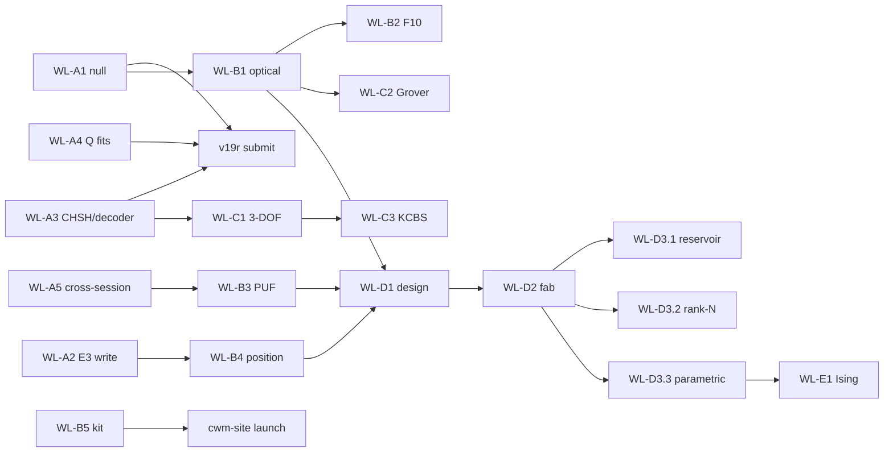

# Full-Potential Experiment Worklist

**Companion to [ROADMAP_FULL_POTENTIAL.md](ROADMAP_FULL_POTENTIAL.md).** Every experiment required by Phases A–E, in execution order. Each entry has: objective, bench procedure, agent prompt (copy-paste to start the session), success/kill criteria, and required hardware. Consolidated bill of materials in §7.

**ID convention:** `WL-<phase><number>`. Cross-references to the v19r worklist (E-W\*) and the build plan (E1–E8) noted per entry.

**Standing bench config** (verify before every session):

- Pico NCO: `/dev/cu.usbmodem113301`, 115200 baud — `F1:<freq>`..`F4:<freq>`, `Foff`, `SWEEP:<start>,<stop>,<step>,<dwell_ms>`
- Relay mux: `/dev/cu.usbserial-11310` — `RelayMux.open()` then `.select(N)`; map: 1→100mm NW, 2→100mm NE, 5→25mm NW, 6→25mm NE (7 dead)
- PicoScope 2204A: ChA DC ±1V, ChB off, trigger source=5 (free-run), timebase 7 (50–350 kHz) / timebase 5 (>350 kHz), N_SAMPLES=8064
- All RX → Board A preamp (×11) → ChA

---

## 1. Phase A — Validation Closeout

### WL-A1 — PZT-Lifted Null on Pico NCO Topology _(= E-W1, CRITICAL)_

**Objective:** Direct feedthrough measurement on the current (June 2+) topology. Closes peer-review Fatal Issue #1.

**Bench procedure:**

1. Confirm 100mm plate SW TX PZT wired GP2–GP4 via 220Ω, no shared breadboard with RX path.
2. Capture baseline FFTs at the 4 standard modes (35,840 / 54,920 / 57,037 / 97,011 Hz), relays 1 and 2.
3. Lift TX PZT off the plate (wires connected, acoustic contact broken — slide a paper shim or unstick the mount; do NOT cut wires).
4. Re-drive the same 4 modes, re-capture both relays.
5. Re-seat PZT, capture once more to confirm baseline recovery.

**Agent prompt:**

> Run the E-W1 null test. Use tools/pico_nco to drive each of 35840, 54920, 57037, 97011 Hz in turn; for each, capture FFTs on relay 1 and relay 2 (20 averages, timebase 7, N_SAMPLES 8064). Save mode-bin magnitudes to data/results/lab/null_test_nco/. I will tell you when the PZT is lifted/re-seated between passes. After all three passes (coupled → lifted → re-seated), report lifted/coupled ratio per mode per relay and the baseline-recovery delta.

**Success:** lifted/coupled < 1% at all 4 modes. **Kill:** > 5% at any mode ⇒ stop all publication work, re-isolate signal path.
**Time:** 30 min. **Hardware:** existing only.

---

### WL-A2 — E3 Perturbation Encoding (WRITE Mechanism) _(= E3, gate G1)_

**Objective:** Demonstrate Rayleigh mass-loading shifts: Δf/f = −ΔM_eff/2M, position-dependent across modes. This is the single result that elevates the architecture above "a sensor."

**Bench procedure:**

1. Weigh 3 putty dots on the 0.001g scale: 10 mg, 25 mg, 50 mg. Record exact masses.
2. 25mm plate: capture baseline census (relays 5, 6; sweep 50–350 kHz, 100 Hz steps).
3. Apply 50 mg dot at plate center. Re-sweep. Remove, verify return to baseline (< 0.5σ residual shift).
4. Repeat at corner and quarter-point positions.
5. Repeat the center position with 25 mg and 10 mg dots (dose–response).
6. Repeat steps 2–4 on the 100mm plate (relays 1, 2; sweep 30–120 kHz).

**Agent prompt:**

> Run E3 perturbation encoding per BUILD_AND_EXPERIMENT_PLAN.md. For each placement I announce ("baseline", "50mg center", "removed", ...), run a fine sweep via the Pico NCO SWEEP command and capture per-step FFT mode magnitudes on both relays for the active plate. Track the top 8 modes' center frequencies via Lorentzian peak fit. Save to data/results/lab/25mm_plate/e3/ (or 100mm_plates/e3/). After all placements: report Δf per mode per position with σ from baseline repeats, compare to Rayleigh prediction using mode shapes sin(mπx/L)sin(nπy/W), and test position-dependence (different positions must produce distinguishable shift vectors).

**Success:** shifts > 3σ at ≥10 mg; shift vector differs by position; clean reversal on removal.
**Kill:** shifts < 3σ at 10 mg on both plates ⇒ WRITE mechanism dead at macro; demote sensor use case; roadmap §3 rank 2 re-scoped to 50 mg+ regime or killed.
**Time:** 2–3 h. **Hardware:** wax putty (on hand), precision scale (BOM #9 if not on hand).

---

### WL-A3 — Fixed-Angle CHSH + All-Decoder Table _(= E-W3 + E-W4, analysis only)_

**Objective:** Remove the two statistical-inflation critiques: optimizer selection bias (CHSH) and decoder cherry-picking (classification).

**Bench procedure:** none — re-analysis of existing E1 multi-pair data and the multilevel/binary datasets.

**Agent prompt:**

> Two analysis tasks, no bench. (1) Re-compute CHSH S for all 5 E1 mode pairs using FIXED Bell angles a1=0°, a2=45°, b1=22.5°, b2=67.5° — no optimization. Report fixed-angle S alongside optimized S per pair, plus the complex-tomography concurrence with its full CI, labeled INCONCLUSIVE if CI spans the separable bound. (2) Build the all-decoder sensitivity table on data/results/multilevel/ and the binary discrimination data: classifiers {nearest-centroid Mahalanobis, kNN, linear SVM, logistic regression, random forest, naive peak threshold} × features {raw FFT magnitude, peak heights, peak ratios, phase-included, envelope}. Report the FULL accuracy matrix. Write both outputs as paper-ready markdown tables + JSON in data/results/reanalysis/.

**Success:** fixed-angle S > 2.0 on ≥4/5 pairs; ≥3 decoder pipelines > 95%.
**Kill:** fixed-angle S < 2.0 ⇒ CHSH section becomes descriptive geometry only (no inequality language). Only one pipeline > 95% ⇒ report it as decoder-dependent.
**Time:** 2–3 h analysis.

---

### WL-A4 — Lorentzian Q Fits _(= E-W5/E2)_

**Objective:** Q with R² > 0.95 via steady-state bandwidth method (replaces failed ringdown fits, R² < 0.1).

**Bench procedure:** fine sweeps ±2 kHz in 10 Hz steps around the 4 strongest modes of each plate (100mm: relays 1–2; 25mm: relays 5–6). Check first whether the June 2 T5 fine-sweep data already covers this.

**Agent prompt:**

> Run E2 Q-factor measurement. First check data/results/ for existing June 2 T5 fine-sweep data (Q_loaded≈473) — reuse if step size ≤ 20 Hz. Otherwise drive fine sweeps (±2 kHz, 10 Hz steps, 50 ms dwell) around each of the top 4 modes per plate using SWEEP, capturing mode-bin magnitude per step. Fit Lorentzians; report f₀, FWHM, Q=f₀/Δf, fit R², and 5-trial spread. Save to data/results/plate_q/lorentzian/. Flag any mode where R² < 0.95 and propose the physical cause (mode overlap, drift during sweep).

**Success:** R² > 0.95 on ≥3 modes per plate. **Kill:** none — an honest "loaded Q with caveats" restatement is an acceptable outcome.
**Time:** 1 h bench + 1 h analysis.

---

### WL-A5 — Cross-Session Discrimination _(= E-W2/E4, gate G2)_

**Objective:** Prove the fingerprint is a device property, not a session artifact. Gates the PUF arc.

**Bench procedure:** identical 4-pattern × 20-rep discrimination run on 3 separate days; power-cycle everything between sessions; log ambient temperature each session.

**Agent prompt:**

> Run the standard 4-mode binary discrimination protocol (same modes, drive levels, and capture settings as the 80/80 run). Label today's output data/results/lab/cross_session/day<N>/. After day 3: train centroids on day 1 only, test on days 2–3; report cross-session accuracy with Wilson CI, per-mode frequency drift vs temperature, and within- vs cross-session confusion matrices.

**Success:** cross-session ≥ 95% (Wilson lower bound). **Kill:** < 95% ⇒ PUF use case killed as stated; pivot to temperature-compensated fingerprinting only if drift is monotonic in T.
**Time:** 3 × 15 min over 3 days.

---

## 2. Phase B — Bench Ceiling

### WL-B1 — Optical Deflection Readout (build + validate) _(gate G3)_

**Objective:** Non-contact readout: break the rank-2 bottleneck, expose intrinsic Q, recover PZT-mass-damped high-order modes.

**Build (knife-edge deflection, budget path):**

1. Mount the 650nm laser module (BOM #1) on the articulating arm (BOM #4) aimed at the plate at ~45° incidence, spot near a known antinode.
2. Place photodiode (BOM #2) in the reflected beam path. Fix a razor blade (knife edge) half-occluding the beam at the photodiode — plate deflection converts to intensity modulation.
3. Photodiode → transimpedance stage: use the spare OPA2134 half on Board A (Rf = 100 kΩ, Cf = 10 pF) → PicoScope ChA.
4. Validate on the 100mm plate's strongest mode (35.8 kHz): drive via NCO, confirm a peak at the drive frequency that vanishes when the beam is blocked (optical null) and when the drive is off (acoustic null).
5. If knife-edge SNR < 20 dB after alignment effort, escalate to the quadrant photodiode module (BOM #3).
6. Scan protocol: move the spot to 8 predefined positions (3×3 grid minus center) using the arm's lockable joints; mark positions with a printed alignment grid taped under the plate.

**Agent prompt:**

> We're validating the optical knife-edge readout. Drive the 100mm plate at its strongest mode via the NCO; capture ChA FFT with the photodiode signal. Run the three nulls I announce (beam blocked / drive off / PZT lifted) and report mode-bin SNR for each. Then for the 8-spot scan: at each position I announce, capture a full sweep (30–120 kHz); afterwards build the 8×M spot×mode amplitude matrix, compute its rank (SVD, threshold at 1% of σ₁), and compare mode count + Q (Lorentzian fits) against the PZT-readout baseline. Save to data/results/lab/optical_readout/.

**Success:** SNR ≥ 20 dB at known strong modes; ≥8 usable spots; effective rank ≥ 6; new modes or higher Q vs PZT readout.
**Kill:** SNR < 20 dB after 2 weeks ⇒ fall back to miniature PZTs (BOM #6) on the 100mm plates; rank-8 arc deferred to MEMS.
**Time:** 2–3 sessions build/align + 1 session scan. **Hardware:** BOM #1–#5 (~$60 budget path).

---

### WL-B2 — F10 Resolution: Eigenmode Redistribution Matrix _(gate G4)_

**Objective:** Determine whether the Apr 24 observation (drive at 29.3 kHz → 101× energy at 41.7 kHz) is (a) artifact, (b) harmonic/IM arithmetic, or (c) genuine nonlinear mode coupling. If (c), the macro plate is not purely linear.

**Bench procedure:** single session, 100mm plate, fixed RX (relay 1). Drive-frequency sweep 10–120 kHz in 500 Hz steps; at each step capture the full spectrum. Then three nulls: PZT lifted (electrical path), half drive amplitude (nonlinearity scales superlinearly; harmonics scale predictably), and drive at f/2 and f/3 of each hot mode (harmonic bookkeeping).

**Agent prompt:**

> Run the F10 redistribution experiment. Sweep NCO drive 10–120 kHz in 500 Hz steps, 100 ms dwell; at each step capture the full FFT on relay 1 and store the complete spectrum (not just the drive bin) to data/results/lab/f10_matrix/. Build the drive-frequency × response-frequency energy matrix. Identify all off-diagonal hot spots > 10× local noise. For each hot spot, test: is f_response = n·f_drive (harmonic), n·f_drive ± m·f_other (IM), or neither? Then repeat the sweep at half amplitude and with the PZT lifted when I announce. Verdict per hot spot: ARTIFACT / HARMONIC-IM / GENUINE COUPLING, with amplitude-scaling exponent.

**Success (either way):** every hot spot classified.
**Kill:** all hot spots explained by harmonic/IM arithmetic ⇒ close F10, plate confirmed linear at bench, document in v19r supplement.
**If GENUINE:** new top-priority bench arc — characterize the coupling coefficient vs drive level; this reopens a computation primitive at macro scale.
**Time:** 1 focused week (1 long automated sweep ≈ 4 h + nulls + analysis).

---

### WL-B3 — Multi-Plate PUF Study _(= E-W6 extended; feeds paper #1)_

**Objective:** Standard PUF metrics across ≥4 devices: uniqueness (inter-device Hamming distance ≈ 50%), reliability (intra-device > 95%).

**Bench procedure:**

1. Devices: 100mm plates I and H (on bench), 25mm plate, + 2 new 100mm plates (BOM #7) with PZTs (BOM #6) superglued in the same SW-TX / NW-NE-RX layout. Cyanoacrylate, 24 h cure, identical 10mm PZT positions marked with the alignment grid.
2. Per device: full mode census (3 repeats), then the 4-mode discrimination protocol, then a repeat census after a power cycle.
3. Enroll each device; attempt cross-acceptance (query device A against device B's template) for all pairs.

**Agent prompt:**

> Run the PUF study. For the device I name, run: census sweep ×3 → 4-mode discrimination → power-cycle census. Save under data/results/lab/puf/<device_id>/. After all 5 devices: define a binary fingerprint (mode presence + quantized frequency offsets), compute inter-device and intra-device fractional Hamming distances, false-accept/false-reject rates across all 20 ordered pairs, and the standard PUF uniqueness/reliability/uniformity metrics. Produce the paper-ready table and histogram figure.

**Success:** inter-HD 40–60%, intra-HD < 5%, zero cross-acceptance.
**Kill:** inter-device frequencies match within intra-device variation ⇒ fingerprints are geometry-dominated, not variance-dominated ⇒ PUF paper killed; salvage as device-ID-by-serial-number only.
**Time:** 1 session per device + 1 analysis day. **Hardware:** BOM #6, #7 (~$80).

---

### WL-B4 — Multi-Mode Position Inference (sensor paper) _(E3 extension; feeds paper #2)_

**Objective:** Invert the k-dimensional mode-shift vector for perturbation mass _and position_ — the defensible "write/read" demonstration.

**Bench procedure:** 100mm plate, 25 mg putty dot, 5×5 position grid (20mm pitch, printed grid under plate). At each position: place dot, fine-sweep top 8 modes, remove, verify baseline.

**Agent prompt:**

> Run position-inference mapping. For each grid position I announce, capture the 8-mode shift vector (Lorentzian center fits vs running baseline). Save to data/results/lab/position_inference/. After ≥20 positions: fit the forward model Δf_k(x,y) ∝ −φ_k(x,y)² with φ from plate eigenmode theory, then invert via least squares on held-out positions. Report position-recovery error (mm, median + 90th percentile) and mass-recovery error. Compare against the Rayleigh prediction from WL-A2.

**Success:** median position error < 10 mm (one grid cell) on held-out points.
**Kill:** error ≥ quarter-plate (50 mm) ⇒ modes too degenerate for inversion at rank achievable; sensor paper reduces to scalar mass sensing.
**Time:** 2 sessions. **Hardware:** existing + putty + scale.

---

### WL-B5 — $50 CHSH Replication Kit Validation _(feeds paper #3 + cwm-site)_

**Objective:** Prove a naive builder, with only the kit BOM and the written guide, measures S > 2. The public-engagement centerpiece.

**Bench procedure:**

1. Assemble the kit strictly from BOM #8 (no lab equipment: microscope-slide glass plate or any rigid plate, 2× PZT discs, audio-out signal source or cheap signal-gen module, 2-ch USB scope or even a stereo audio line-in).
2. Follow only the draft guide (companion/) — log every ambiguity encountered.
3. Run the 20-line CHSH script on the kit's captures.

**Agent prompt:**

> We're validating the replication kit as a naive builder. Using only the kit hardware (audio line-in capture at 96 kHz, two PZT pickups), capture the two-receiver spectra for the drive tones in the guide, then run the fixed-angle CHSH computation (same code path as WL-A3, fixed Bell angles). Report S with bootstrap CI. Separately, list every step where the guide was ambiguous or the measurement deviated from the lab-bench equivalent, so we can revise the guide.

**Success:** S > 2.0 on kit hardware with fixed angles. **Kill:** S < 2.0 on kit hardware ⇒ kit needs a scope-class ADC; revise kit price target and guide before site launch.
**Time:** 1 day build + 1 session. **Hardware:** BOM #8 (~$50 target).

---

### WL-B6 — Multi-Level Ceiling (8 → 16 → 27 levels/mode)

**Objective:** Find the true amplitude-resolution ceiling (predicted 27 levels/mode ⇒ 19 bits over 4 modes).

**Bench procedure:** none beyond standard config; pure automated bench time on the 100mm plate.

**Agent prompt:**

> Extend T3.4: run the multi-level encoding protocol at 16 levels × 4 modes, then 27 × 4 if 16 passes. Same capture settings as the May 27 run. For each level count report per-level separation in σ, worst-case adjacent-level confusion, and total error-free bits. Stop and report the first level count with any decoding error. Save to data/results/multilevel/ceiling/.

**Success:** ≥16 levels error-free (16 bits). **Kill:** none — the measured ceiling is the result.
**Time:** 1 automated session.

---

## 3. Phase C — Quantum-Like, Done Honestly

### WL-C1 — Three-DOF Non-Separability (GHZ-analog structure)

**Objective:** Extend the Qian–Eberly construction to frequency × space × drive-phase. Tri-partite non-separability witness in a single classical plate.

**Bench procedure:** requires 2-phase drive — use NCO `PHASE:<deg>` on two phase-locked channels (GP2+GP3) into two TX PZTs (add a second TX to the 100mm plate, BOM #6). Measure the 2×2×2 intensity tensor: {f₁,f₂} × {NW,NE} × {φ=0°,90°}.

**Agent prompt:**

> Run the 3-DOF non-separability measurement. For each of the 8 tensor settings (two modes from the validated CHSH pairs × relays 1,2 × drive phase 0°/90° via PHASE command), capture 50-average mode-bin magnitudes. Build the 2×2×2 intensity tensor, compute the tri-partite negativity / GHZ-witness value against the best biseparable model (numerical optimization over all three bipartitions), with bootstrap CI. Hard rule: all language is "classical non-separability of DOFs" — no entanglement claims. Save to data/results/quantum_bridge/three_dof/.

**Success:** witness exceeds all three biseparable bounds with CI clearance. **Kill:** witness < separable bound ⇒ drive-phase DOF is separable from the others; document, fall back to 2-DOF.
**Time:** 1 bench session + 1 analysis day. **Hardware:** 1 extra PZT.

---

### WL-C2 — Grover-Analog Amplitude Amplification

**Objective:** Phased re-drive as oracle+diffusion over N templates stored in mode amplitudes; measure amplification scaling vs classical lookup. Limit stated up front: classical waves give the N-dimensional-space version, not exponential resources.

**Bench procedure:** encode N=4 (then 8) templates as amplitude patterns over modes; the "oracle" is a phase-inverted re-drive of the target's pattern; "diffusion" is a uniform re-drive. Iterate k cycles, measuring target-mode contrast after each.

**Agent prompt:**

> Run the Grover-analog experiment. Phase-calibrate first: measure per-mode phase transfer (drive phase → response phase) at the 4 working modes; store the calibration. Then for N=4 patterns: drive superposition, apply oracle (target pattern, phase-inverted via PHASE) and diffusion drives for k=1..4 iterations, capturing target vs non-target mode energy contrast after each. Plot contrast vs k against the cos²((2k+1)θ) prediction and against a no-phase-calibration control. Save to data/results/quantum_bridge/grover_analog/. Honest framing throughout: this is wave-interference search in an N-dim mode space.

**Success:** monotone contrast growth matching interference prediction for k≤2. **Kill:** no amplification beyond noise after phase calibration ⇒ phase control at bench is insufficient (consistent with the killed phase-channel result); arc deferred to MEMS where per-element drive exists.
**Time:** 2 sessions (calibration is the hard part).

---

### WL-C3 — KCBS Contextuality Test

**Objective:** Five-setting KCBS-type inequality on plate modes — the third pillar of the quantum-structure triad (non-separability, interference search, contextuality).

**Bench procedure:** analysis-heavy; uses the same capture machinery as CHSH with 5 projection settings (pentagram angles) over one validated mode pair.

**Agent prompt:**

> Implement the KCBS measurement on the strongest CHSH mode pair. Define 5 projectors at pentagram angles in the 2-D frequency-space; for each, compute projected intensity from the measured state matrix M (same construction as chsh tools). Evaluate the KCBS sum Σ⟨P*i P*{i+1}⟩ against the non-contextual bound. Fixed angles only — no optimization. Bootstrap CI. Save to data/results/quantum_bridge/kcbs/. Language rule: "classical analog of contextuality structure."

**Success:** KCBS sum exceeds the non-contextual bound with CI clearance. **Kill:** bound not exceeded at fixed angles ⇒ report negative, keep CHSH as the sole inequality result.
**Time:** 1 session + analysis.

---

### WL-C4 — Quantum-Acoustics Bridge Review _(scholarship, no bench)_

**Agent prompt:**

> Write the bridging review section: same architecture (high-Q acoustic modes in low-loss dielectric) from 300 K classical (our bench) to 10 mK quantum (Chu et al. 2017 hBAR, qubit-coupled). Map which information-processing structures survive at each ħω/kT regime, with citations. Target: §discussion of the Phase C paper + book ch. 13 update.

**No kill criterion** — scholarship deliverable.

---

## 4. Phase D — MEMS Realization

### WL-D1 — MEMS Design Study _(simulation + paper, gate G5 input)_

**Objective:** Complete, falsifiable device design: 1×1 mm × 50 µm fused-silica plate, 8–16 element AlN transducer array, phononic-crystal anchors, Q ≥ 10⁴ target, full thermal-noise and energy budgets extrapolated from measured macro data with error bars.

**Agent prompt:**

> Build the MEMS design study. Extend simulations/mems_q_model.py and fem_validation.py: (1) eigenmode spectrum of 1×1mm×50µm fused silica (target 3.5–35 MHz, validate the 16× scaling law against the 25mm plate measurements); (2) AlN transducer array layout — 8 and 16 element variants, per-element coupling computed from mode shapes, resulting H-matrix rank; (3) anchor-loss model with phononic-crystal isolation (literature Q·f anchors); (4) thermal noise floor and J/operation from measured macro SNR scaled by validated laws — propagate measurement uncertainty into error bars on every projection; (5) the kill-criteria table for WL-D3. Output: paper-ready design chapter + parameter JSON. Every number labeled MEASURED / DERIVED / PROJECTED.

**Success:** internally consistent design with Q ≥ 10⁴ plausible under documented assumptions; design review passes.
**Kill:** model shows τ < 50 µs even at Q = 10⁴ for any feasible geometry ⇒ temporal-reservoir target needs re-scoping before any fab spend.
**Time:** 3–4 weeks simulation/writing. **Hardware:** none.

---

### WL-D2 — Fabrication Partnership _(logistics)_

Deliverable: 1 wire-bonded die, vacuum-capped or in chamber (BOM #10). Primary: university fab (Scranton thread). Backup: MEMS multi-project wafer run. Gate G5 requires: WL-D1 review passed + ≥1 accepted paper + partner committed.

---

### WL-D3.1 — MEMS Temporal Reservoir _(gate G6)_

**Objective:** The headline experiment: NARMA-10 and spoken-digit at ≥3 kHz symbol rate on the MEMS die, where τ = Q/πf ≈ 100–320 µs finally exceeds the symbol interval.

**Bench procedure:** die in vacuum chamber, drive/readout via existing PicoScope + NCO (symbol rates ≤10 kHz are within current DAQ); multi-element readout via the AlN array.

**Agent prompt:**

> Run the MEMS reservoir benchmark. Measure memory capacity (MC) first: random input stream at 1/3/5/10 kHz symbol rates, linear readout regression on delayed inputs, MC = Σ r². Then NARMA-10 and the spoken-digit task at the best symbol rate. Compare against (a) the macro-bench negative result (MC=1.67) and (b) a software ESN of matched readout dimension. Report MC, NRMSE, and accuracy with CIs. Save to data/results/mems/reservoir/.

**Success:** MC ≥ 3 at ≥3 kHz. **Kill:** MC < 3 ⇒ acoustic reservoirs dead at MEMS scale too; publish the negative result — it closes the question for the field.

---

### WL-D3.2 — Rank-N Physical Feature Map

**Objective:** Re-run the L3 experiment with rank-16 H. The plate must beat random projections on _energy per inference_, not accuracy.

**Agent prompt:**

> Re-run l3_train_through_h.py with the MEMS 16-element H (measured, not simulated). Controls: random H of equal rank, learned dense layer of equal dimension. Metrics: perplexity AND measured J/inference for the physical path (drive energy × duration / token) vs the digital matmul equivalent on this machine. Save to data/results/mems/l3_rank16/.

**Success:** physical H distinguishable from random at rank 16, or energy advantage > 10×. **Kill:** indistinguishable AND no energy win ⇒ close the physical-layer arc permanently.

---

### WL-D3.3 — Parametric Threshold _(gate G7 — the Phase E gate)_

**Objective:** Pump a mode at 2f_m, search for parametric oscillation threshold. Crossing it opens the Ising-machine frontier.

**Bench procedure:** NCO pump at 2f_m (within NCO range for modes ≤ ~5 MHz; above that needs the RF source, BOM #11), slow amplitude ramp, watch for sub-harmonic response at f_m with the characteristic threshold knee and 0/π bistability (phase flips between runs).

**Agent prompt:**

> Run the parametric threshold search on the MEMS die. For each of the top 4 modes: pump at 2f₀ with amplitude ramped in 20 steps to max safe drive; at each step capture the f₀ bin amplitude and phase. Identify threshold (knee in amplitude vs pump curve) and verify bistability: 20 repeated ramps, record settled phase at f₀ — expect bimodal 0/π distribution above threshold. Save to data/results/mems/parametric/. Safety: abort ramp if any mode amplitude exceeds the linearity bound from WL-D1.

**Success:** threshold knee + bimodal phase distribution at Q ≈ 10⁴. **Kill:** no oscillation at max safe drive ⇒ Phase E requires Q > 10⁵ (cryo/crystalline) — re-scope or hand off; document the measured distance-to-threshold.

---

## 5. Phase E — Phononic Parametric Ising Machine _(contingent on WL-D3.3)_

### WL-E1 — Two-Spin Proof of Principle

Two modes pumped above threshold + engineered coupling (shared anchor / pump cross-term) = 2-spin Ising system. Verify: settled phase configuration tracks the sign of the coupling (ferro/antiferro). Then 4-spin MaxCut on a square graph.

**Agent prompt (draft — refine after D3.3 data):**

> Pump modes 1 and 2 above threshold simultaneously. Map the 2-spin phase configuration statistics over 100 settle cycles for each coupling configuration I set. Report P(↑↑/↑↓/↓↑/↓↓) vs the Ising prediction for the measured J sign and magnitude. Then encode the 4-node MaxCut instance and report ground-state hit rate vs simulated annealing baseline.

**Success:** configuration statistics follow the Ising model; MaxCut hit rate > random. **Kill:** phases uncorrelated with engineered coupling ⇒ coupling mechanism insufficient; characterize J achievable and publish the bound.

---

## 6. Execution Order & Dependencies

Parallel-safe now: WL-A1 → WL-A3/A4 (same week), WL-A2 + WL-A5 interleaved, WL-B5 anytime.

---

## 7. Consolidated Bill of Materials

Prices approximate, June 2026. Items already on the bench (PicoScope 2204A, Pico H NCO, relay mux, Board A/D preamps, plates I/H, 25mm plate, PZTs installed, wax putty) are **not** listed.

| #   | Item                                                                                                                                        | For                   | Qty          | Est. cost  | Source                                                                                                                                                                                                                                                    |
| --- | ------------------------------------------------------------------------------------------------------------------------------------------- | --------------------- | ------------ | ---------- | --------------------------------------------------------------------------------------------------------------------------------------------------------------------------------------------------------------------------------------------------------- |
| 1   | Laser diode module, 650 nm 5 mW, TTL                                                                                                        | WL-B1                 | 1 (+1 spare) | ~$9 ea     | [Adafruit #1054](https://www.adafruit.com/product/1054)                                                                                                                                                                                                   |
| 2   | Si photodiode BPW34                                                                                                                         | WL-B1 (knife-edge)    | 4            | ~$1 ea     | [Digi-Key — BPW34](https://www.digikey.com/en/products/result?keywords=BPW34)                                                                                                                                                                             |
| 3   | Quadrant photodiode module (escalation path)                                                                                                | WL-B1                 | 1            | $60–120    | search "quadrant photodiode amplifier module" — budget: [Amazon](https://www.amazon.com/s?k=quadrant+photodiode+module); lab-grade: [Thorlabs PDQ80A](https://www.thorlabs.com/thorproduct.cfm?partnumber=PDQ80A) (~$1k, only if budget path fails twice) |
| 4   | Articulating/magic arm with clamps (laser + PD mounts)                                                                                      | WL-B1                 | 2            | ~$15 ea    | [Amazon — articulating magic arm clamp](https://www.amazon.com/s?k=articulating+magic+arm+clamp+11+inch)                                                                                                                                                  |
| 5   | Razor blades + slotted mount, alignment grid printout                                                                                       | WL-B1                 | —            | ~$5        | hardware store / on hand                                                                                                                                                                                                                                  |
| 6   | PZT discs 10 mm (e.g., Murata 7BB-20-6 class or 10mm discs)                                                                                 | WL-B3, WL-C1          | 10           | ~$1–2 ea   | [Digi-Key — 7BB-20-6L0](https://www.digikey.com/en/products/result?keywords=7BB-20-6L0) or [Amazon — piezo disc 10mm](https://www.amazon.com/s?k=piezo+disc+10mm)                                                                                         |
| 7   | Fused-silica plates 100×100×1 mm                                                                                                            | WL-B3 (2 new devices) | 2            | $30–60 ea  | [MTI Corp](https://www.mtixtl.com) (search "fused silica substrate 100x100"), or [University Wafer](https://www.universitywafer.com)                                                                                                                      |
| 8   | **CHSH kit** (complete): glass plate or microscope slides, 3× PZT disc, USB audio adapter w/ stereo line-in (96 kHz), 3.5mm cables, CA glue | WL-B5                 | 1 kit        | ~$50 total | slides: [Amazon](https://www.amazon.com/s?k=glass+microscope+slides); USB audio: [Amazon — USB audio interface line in 96kHz](https://www.amazon.com/s?k=usb+audio+interface+line+in); PZTs from #6                                                       |
| 9   | Precision scale, 0.001 g                                                                                                                    | WL-A2, WL-B4          | 1            | ~$25       | [Amazon — milligram scale 0.001g](https://www.amazon.com/s?k=milligram+scale+0.001g) (if not on hand)                                                                                                                                                     |
| 10  | Small vacuum chamber + 2-stage pump (MEMS die testing)                                                                                      | WL-D3.\*              | 1            | ~$150–250  | [Amazon — vacuum chamber degassing 2 stage pump](https://www.amazon.com/s?k=vacuum+chamber+degassing+kit+2+stage+pump) — defer purchase to gate G5                                                                                                        |
| 11  | RF signal generator ≥30 MHz (MEMS drive above NCO range)                                                                                    | WL-D3.3               | 1            | ~$60–120   | search "FY6900 60MHz DDS signal generator" — defer to gate G5                                                                                                                                                                                             |
| 12  | CA glue (fresh), isopropyl, swabs                                                                                                           | WL-B3, WL-B5          | —            | ~$10       | hardware store                                                                                                                                                                                                                                            |

**Spend now (Phases A–B):** items 1–9, 12 ≈ **$200–300** total.
**Defer to gate G5 (MEMS):** items 10–11. Fab cost is partnership-dependent and excluded.

Link rot warning: search-style links above are stable; exact product listings change. Verify specs (fused silica ≥99.9% SiO₂, plates polished both faces; USB audio must expose true stereo _line-in_, not mic mono).
