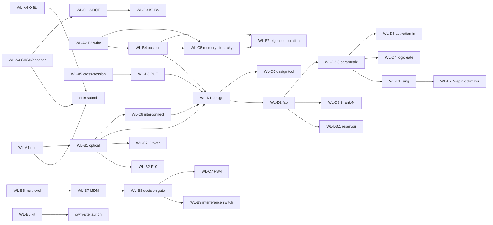

# Full-Potential Experiment Worklist

**Companion to [ROADMAP_FULL_POTENTIAL.md](ROADMAP_FULL_POTENTIAL.md).** Every experiment required by Phases A–E, in execution order. Each entry has: objective, bench procedure, agent prompt (copy-paste to start the session), success/kill criteria, and required hardware. Consolidated bill of materials in §7.

**ID convention:** `WL-<phase><number>`. Cross-references to the v19r worklist (E-W\*) and the build plan (E1–E8) noted per entry.

**Standing bench config** (verify before every session):

- Pico NCO: `/dev/cu.usbmodem113301`, 115200 baud — `F1:<freq>`..`F4:<freq>`, `Foff`, `SWEEP:<start>,<stop>,<step>,<dwell_ms>`
- Relay mux: `/dev/cu.usbserial-11310` — `RelayMux.open()` then `.select(N)`; map: 1→100mm NW, 2→100mm NE, 5→25mm NW, 6→25mm NE (7 dead)
- PicoScope 2204A: ChA DC ±1V, ChB off, trigger source=5 (free-run), timebase 7 (50–350 kHz) / timebase 5 (>350 kHz), N_SAMPLES=8064
- All RX → Board A preamp (×11) → ChA

---

## 1. Phase A — Validation Closeout

### WL-A1 — PZT-Lifted Null on Pico NCO Topology _(= E-W1, CRITICAL)_

**Objective:** Direct feedthrough measurement on the current (June 2+) topology. Closes peer-review Fatal Issue #1.

**Bench procedure:**

1. Confirm 100mm plate SW TX PZT wired GP2–GP4 via 220Ω, no shared breadboard with RX path.
2. Capture baseline FFTs at the 4 standard modes (35,840 / 54,920 / 57,037 / 97,011 Hz), relays 1 and 2.
3. Lift TX PZT off the plate (wires connected, acoustic contact broken — slide a paper shim or unstick the mount; do NOT cut wires).
4. Re-drive the same 4 modes, re-capture both relays.
5. Re-seat PZT, capture once more to confirm baseline recovery.

**Agent prompt:**

> Run the E-W1 null test. Use tools/pico_nco to drive each of 35840, 54920, 57037, 97011 Hz in turn; for each, capture FFTs on relay 1 and relay 2 (20 averages, timebase 7, N_SAMPLES 8064). Save mode-bin magnitudes to data/results/lab/null_test_nco/. I will tell you when the PZT is lifted/re-seated between passes. After all three passes (coupled → lifted → re-seated), report lifted/coupled ratio per mode per relay and the baseline-recovery delta.

**Success:** lifted/coupled < 1% at all 4 modes. **Kill:** > 5% at any mode ⇒ stop all publication work, re-isolate signal path.
**Time:** 30 min. **Hardware:** existing only.

---

### WL-A2 — E3 Perturbation Encoding (WRITE Mechanism) _(= E3, gate G1)_

**Objective:** Demonstrate Rayleigh mass-loading shifts: Δf/f = −ΔM_eff/2M, position-dependent across modes. This is the single result that elevates the architecture above "a sensor."

**Bench procedure:**

1. Weigh 3 putty dots on the 0.001g scale: 10 mg, 25 mg, 50 mg. Record exact masses.
2. 25mm plate: capture baseline census (relays 5, 6; sweep 50–350 kHz, 100 Hz steps).
3. Apply 50 mg dot at plate center. Re-sweep. Remove, verify return to baseline (< 0.5σ residual shift).
4. Repeat at corner and quarter-point positions.
5. Repeat the center position with 25 mg and 10 mg dots (dose–response).
6. Repeat steps 2–4 on the 100mm plate (relays 1, 2; sweep 30–120 kHz).

**Agent prompt:**

> Run E3 perturbation encoding per BUILD_AND_EXPERIMENT_PLAN.md. For each placement I announce ("baseline", "50mg center", "removed", ...), run a fine sweep via the Pico NCO SWEEP command and capture per-step FFT mode magnitudes on both relays for the active plate. Track the top 8 modes' center frequencies via Lorentzian peak fit. Save to data/results/lab/25mm_plate/e3/ (or 100mm_plates/e3/). After all placements: report Δf per mode per position with σ from baseline repeats, compare to Rayleigh prediction using mode shapes sin(mπx/L)sin(nπy/W), and test position-dependence (different positions must produce distinguishable shift vectors).

**Success:** shifts > 3σ at ≥10 mg; shift vector differs by position; clean reversal on removal.
**Kill:** shifts < 3σ at 10 mg on both plates ⇒ WRITE mechanism dead at macro; demote sensor use case; roadmap §3 rank 2 re-scoped to 50 mg+ regime or killed.
**Time:** 2–3 h. **Hardware:** wax putty (on hand), precision scale (BOM #9 if not on hand).

---

### WL-A3 — Fixed-Angle CHSH + All-Decoder Table _(= E-W3 + E-W4, analysis only)_

**Objective:** Remove the two statistical-inflation critiques: optimizer selection bias (CHSH) and decoder cherry-picking (classification).

**Bench procedure:** none — re-analysis of existing E1 multi-pair data and the multilevel/binary datasets.

**Agent prompt:**

> Two analysis tasks, no bench. (1) Re-compute CHSH S for all 5 E1 mode pairs using FIXED Bell angles a1=0°, a2=45°, b1=22.5°, b2=67.5° — no optimization. Report fixed-angle S alongside optimized S per pair, plus the complex-tomography concurrence with its full CI, labeled INCONCLUSIVE if CI spans the separable bound. (2) Build the all-decoder sensitivity table on data/results/multilevel/ and the binary discrimination data: classifiers {nearest-centroid Mahalanobis, kNN, linear SVM, logistic regression, random forest, naive peak threshold} × features {raw FFT magnitude, peak heights, peak ratios, phase-included, envelope}. Report the FULL accuracy matrix. Write both outputs as paper-ready markdown tables + JSON in data/results/reanalysis/.

**Success:** fixed-angle S > 2.0 on ≥4/5 pairs; ≥3 decoder pipelines > 95%.
**Kill:** fixed-angle S < 2.0 ⇒ CHSH section becomes descriptive geometry only (no inequality language). Only one pipeline > 95% ⇒ report it as decoder-dependent.
**Time:** 2–3 h analysis.

---

### WL-A4 — Lorentzian Q Fits _(= E-W5/E2)_

**Objective:** Q with R² > 0.95 via steady-state bandwidth method (replaces failed ringdown fits, R² < 0.1).

**Bench procedure:** fine sweeps ±2 kHz in 10 Hz steps around the 4 strongest modes of each plate (100mm: relays 1–2; 25mm: relays 5–6). Check first whether the June 2 T5 fine-sweep data already covers this.

**Agent prompt:**

> Run E2 Q-factor measurement. First check data/results/ for existing June 2 T5 fine-sweep data (Q_loaded≈473) — reuse if step size ≤ 20 Hz. Otherwise drive fine sweeps (±2 kHz, 10 Hz steps, 50 ms dwell) around each of the top 4 modes per plate using SWEEP, capturing mode-bin magnitude per step. Fit Lorentzians; report f₀, FWHM, Q=f₀/Δf, fit R², and 5-trial spread. Save to data/results/plate_q/lorentzian/. Flag any mode where R² < 0.95 and propose the physical cause (mode overlap, drift during sweep).

**Success:** R² > 0.95 on ≥3 modes per plate. **Kill:** none — an honest "loaded Q with caveats" restatement is an acceptable outcome.
**Time:** 1 h bench + 1 h analysis.

---

### WL-A5 — Cross-Session Discrimination _(= E-W2/E4, gate G2)_

**Objective:** Prove the fingerprint is a device property, not a session artifact. Gates the PUF arc.

**Bench procedure:** identical 4-pattern × 20-rep discrimination run on 3 separate days; power-cycle everything between sessions; log ambient temperature each session.

**Agent prompt:**

> Run the standard 4-mode binary discrimination protocol (same modes, drive levels, and capture settings as the 80/80 run). Label today's output data/results/lab/cross_session/day<N>/. After day 3: train centroids on day 1 only, test on days 2–3; report cross-session accuracy with Wilson CI, per-mode frequency drift vs temperature, and within- vs cross-session confusion matrices.

**Success:** cross-session ≥ 95% (Wilson lower bound). **Kill:** < 95% ⇒ PUF use case killed as stated; pivot to temperature-compensated fingerprinting only if drift is monotonic in T.
**Time:** 3 × 15 min over 3 days.

---

## 2. Phase B — Bench Ceiling

### WL-B1 — Optical Deflection Readout (build + validate) _(gate G3)_

**Objective:** Non-contact readout: break the rank-2 bottleneck, expose intrinsic Q, recover PZT-mass-damped high-order modes.

**Build (knife-edge deflection, budget path):**

1. Mount the 650nm laser module (BOM #1) on the articulating arm (BOM #4) aimed at the plate at ~45° incidence, spot near a known antinode.
2. Place photodiode (BOM #2) in the reflected beam path. Fix a razor blade (knife edge) half-occluding the beam at the photodiode — plate deflection converts to intensity modulation.
3. Photodiode → transimpedance stage: use the spare OPA2134 half on Board A (Rf = 100 kΩ, Cf = 10 pF) → PicoScope ChA.
4. Validate on the 100mm plate's strongest mode (35.8 kHz): drive via NCO, confirm a peak at the drive frequency that vanishes when the beam is blocked (optical null) and when the drive is off (acoustic null).
5. If knife-edge SNR < 20 dB after alignment effort, escalate to the quadrant photodiode module (BOM #3).
6. Scan protocol: move the spot to 8 predefined positions (3×3 grid minus center) using the arm's lockable joints; mark positions with a printed alignment grid taped under the plate.

**Agent prompt:**

> We're validating the optical knife-edge readout. Drive the 100mm plate at its strongest mode via the NCO; capture ChA FFT with the photodiode signal. Run the three nulls I announce (beam blocked / drive off / PZT lifted) and report mode-bin SNR for each. Then for the 8-spot scan: at each position I announce, capture a full sweep (30–120 kHz); afterwards build the 8×M spot×mode amplitude matrix, compute its rank (SVD, threshold at 1% of σ₁), and compare mode count + Q (Lorentzian fits) against the PZT-readout baseline. Save to data/results/lab/optical_readout/.

**Success:** SNR ≥ 20 dB at known strong modes; ≥8 usable spots; effective rank ≥ 6; new modes or higher Q vs PZT readout.
**Kill:** SNR < 20 dB after 2 weeks ⇒ fall back to miniature PZTs (BOM #6) on the 100mm plates; rank-8 arc deferred to MEMS.
**Time:** 2–3 sessions build/align + 1 session scan. **Hardware:** BOM #1–#5 (~$60 budget path).

---

### WL-B2 — F10 Resolution: Eigenmode Redistribution Matrix _(gate G4)_

**Objective:** Determine whether the Apr 24 observation (drive at 29.3 kHz → 101× energy at 41.7 kHz) is (a) artifact, (b) harmonic/IM arithmetic, or (c) genuine nonlinear mode coupling. If (c), the macro plate is not purely linear.

**Bench procedure:** single session, 100mm plate, fixed RX (relay 1). Drive-frequency sweep 10–120 kHz in 500 Hz steps; at each step capture the full spectrum. Then three nulls: PZT lifted (electrical path), half drive amplitude (nonlinearity scales superlinearly; harmonics scale predictably), and drive at f/2 and f/3 of each hot mode (harmonic bookkeeping).

**Agent prompt:**

> Run the F10 redistribution experiment. Sweep NCO drive 10–120 kHz in 500 Hz steps, 100 ms dwell; at each step capture the full FFT on relay 1 and store the complete spectrum (not just the drive bin) to data/results/lab/f10_matrix/. Build the drive-frequency × response-frequency energy matrix. Identify all off-diagonal hot spots > 10× local noise. For each hot spot, test: is f_response = n·f_drive (harmonic), n·f_drive ± m·f_other (IM), or neither? Then repeat the sweep at half amplitude and with the PZT lifted when I announce. Verdict per hot spot: ARTIFACT / HARMONIC-IM / GENUINE COUPLING, with amplitude-scaling exponent.

**Success (either way):** every hot spot classified.
**Kill:** all hot spots explained by harmonic/IM arithmetic ⇒ close F10, plate confirmed linear at bench, document in v19r supplement.
**If GENUINE:** new top-priority bench arc — characterize the coupling coefficient vs drive level; this reopens a computation primitive at macro scale.
**Time:** 1 focused week (1 long automated sweep ≈ 4 h + nulls + analysis).

---

### WL-B3 — Multi-Plate PUF Study _(= E-W6 extended; feeds paper #1)_

**Objective:** Standard PUF metrics across ≥4 devices: uniqueness (inter-device Hamming distance ≈ 50%), reliability (intra-device > 95%).

**Bench procedure:**

1. Devices: 100mm plates I and H (on bench), 25mm plate, + 2 new 100mm plates (BOM #7) with PZTs (BOM #6) superglued in the same SW-TX / NW-NE-RX layout. Cyanoacrylate, 24 h cure, identical 10mm PZT positions marked with the alignment grid.
2. Per device: full mode census (3 repeats), then the 4-mode discrimination protocol, then a repeat census after a power cycle.
3. Enroll each device; attempt cross-acceptance (query device A against device B's template) for all pairs.

**Agent prompt:**

> Run the PUF study. For the device I name, run: census sweep ×3 → 4-mode discrimination → power-cycle census. Save under data/results/lab/puf/<device_id>/. After all 5 devices: define a binary fingerprint (mode presence + quantized frequency offsets), compute inter-device and intra-device fractional Hamming distances, false-accept/false-reject rates across all 20 ordered pairs, and the standard PUF uniqueness/reliability/uniformity metrics. Produce the paper-ready table and histogram figure.

**Success:** inter-HD 40–60%, intra-HD < 5%, zero cross-acceptance.
**Kill:** inter-device frequencies match within intra-device variation ⇒ fingerprints are geometry-dominated, not variance-dominated ⇒ PUF paper killed; salvage as device-ID-by-serial-number only.
**Time:** 1 session per device + 1 analysis day. **Hardware:** BOM #6, #7 (~$80).

---

### WL-B4 — Multi-Mode Position Inference (sensor paper) _(E3 extension; feeds paper #2)_

**Objective:** Invert the k-dimensional mode-shift vector for perturbation mass _and position_ — the defensible "write/read" demonstration.

**Bench procedure:** 100mm plate, 25 mg putty dot, 5×5 position grid (20mm pitch, printed grid under plate). At each position: place dot, fine-sweep top 8 modes, remove, verify baseline.

**Agent prompt:**

> Run position-inference mapping. For each grid position I announce, capture the 8-mode shift vector (Lorentzian center fits vs running baseline). Save to data/results/lab/position_inference/. After ≥20 positions: fit the forward model Δf_k(x,y) ∝ −φ_k(x,y)² with φ from plate eigenmode theory, then invert via least squares on held-out positions. Report position-recovery error (mm, median + 90th percentile) and mass-recovery error. Compare against the Rayleigh prediction from WL-A2.

**Success:** median position error < 10 mm (one grid cell) on held-out points.
**Kill:** error ≥ quarter-plate (50 mm) ⇒ modes too degenerate for inversion at rank achievable; sensor paper reduces to scalar mass sensing.
**Time:** 2 sessions. **Hardware:** existing + putty + scale.

---

### WL-B5 — $50 CHSH Replication Kit Validation _(feeds paper #3 + cwm-site)_

**Objective:** Prove a naive builder, with only the kit BOM and the written guide, measures S > 2. The public-engagement centerpiece.

**Bench procedure:**

1. Assemble the kit strictly from BOM #8 (no lab equipment: microscope-slide glass plate or any rigid plate, 2× PZT discs, audio-out signal source or cheap signal-gen module, 2-ch USB scope or even a stereo audio line-in).
2. Follow only the draft guide (companion/) — log every ambiguity encountered.
3. Run the 20-line CHSH script on the kit's captures.

**Agent prompt:**

> We're validating the replication kit as a naive builder. Using only the kit hardware (audio line-in capture at 96 kHz, two PZT pickups), capture the two-receiver spectra for the drive tones in the guide, then run the fixed-angle CHSH computation (same code path as WL-A3, fixed Bell angles). Report S with bootstrap CI. Separately, list every step where the guide was ambiguous or the measurement deviated from the lab-bench equivalent, so we can revise the guide.

**Success:** S > 2.0 on kit hardware with fixed angles. **Kill:** S < 2.0 on kit hardware ⇒ kit needs a scope-class ADC; revise kit price target and guide before site launch.
**Time:** 1 day build + 1 session. **Hardware:** BOM #8 (~$50 target).

---

### WL-B6 — Multi-Level Ceiling (8 → 16 → 27 levels/mode)

**Objective:** Find the true amplitude-resolution ceiling (predicted 27 levels/mode ⇒ 19 bits over 4 modes).

**Bench procedure:** none beyond standard config; pure automated bench time on the 100mm plate.

**Agent prompt:**

> Extend T3.4: run the multi-level encoding protocol at 16 levels × 4 modes, then 27 × 4 if 16 passes. Same capture settings as the May 27 run. For each level count report per-level separation in σ, worst-case adjacent-level confusion, and total error-free bits. Stop and report the first level count with any decoding error. Save to data/results/multilevel/ceiling/.

**Success:** ≥16 levels error-free (16 bits). **Kill:** none — the measured ceiling is the result.
**Time:** 1 automated session.

---

### WL-B7 — Phononic Mode-Division Multiplexing _(Akhetonics analog: wavelength-division multiplexing)_

**Objective:** Drive all 4 strongest modes simultaneously at independent amplitudes and verify that each mode's readout is independent — the phononic equivalent of WDM. Confirms that the multiplexed write channel works under simultaneous excitation, which is a prerequisite for any parallel computation architecture.

**Physics basis:** Measured T2.2 (zero IM products) + T2.3 (zero cross-mode coupling) prove linear superposition holds. This experiment operationalizes that linearity as a multiplexed channel.

**Bench procedure:**

1. 100mm plate (relay 1 and 2); NCO channels F1, F2, F3 driving three of the four strongest modes simultaneously at programmed amplitude ratios (e.g., 1:2:3 pattern).
2. Capture FFT on both relays; fit mode-bin amplitudes for all 4 modes (including the undriven 4th as a crosstalk check).
3. Repeat for 8 distinct amplitude patterns (2 bits/mode × 4 modes = 16 patterns total, drawn from the T3.4 set).
4. Compare recovered pattern vs programmed pattern. Report per-mode independence (off-mode contamination in σ from baseline).

**Agent prompt:**

> Run the mode-division multiplexing test. Drive the three NCO channels simultaneously at the top 3 modes of the 100mm plate using F1/F2/F3 with amplitude ratios I specify (pattern encoded as ratio integers, e.g., "1,3,1"). For each of 8 patterns: capture 20-average FFT on relays 1 and 2; extract mode-bin amplitudes for all 4 standard modes. Report: (a) recovered ratio vs programmed ratio for each mode in σ units; (b) off-mode crosstalk in the undriven 4th mode vs baseline; (c) worst-case mode confusion across all 8 patterns. Save to data/results/lab/mdm/.

**Success:** off-mode contamination < 2σ at all 8 patterns; recovered amplitude ratio error < 0.5 levels across all modes.
**Kill:** crosstalk > 5σ on any mode ⇒ simultaneous drive corrupts the channel; architecture must be strictly time-division multiplexed (document constraint, not a fundamental failure).
**Time:** 1 automated session. **Hardware:** existing only.

---

### WL-B8 — Phononic Decision Gate (Analog-to-Digital Bridge) _(Akhetonics analog: all-optical ADC bridging analog and digital domains)_

**Objective:** Implement the missing bridge between CWM's analog eigenmode output and digital control flow. A mode amplitude above a calibrated threshold triggers a discrete action (relay switch, NCO frequency change, or flag in software). This is the phononic analog of Akhetonics' all-optical ADC — it doesn't live in the glass but in the readout layer, and it must be formally defined and validated before any state-machine or conditional logic can be built on top.

**Physics basis:** T3.4 proved 8 amplitude levels at ≥9σ separation. The decision gate is a 1-bit quantizer with threshold set between levels 4 and 5. No new physics required — this is an engineering formalism.

**Bench procedure:**

1. Define threshold T₁ for each of the 4 working modes as the midpoint between the 4th and 5th amplitude levels from T3.4 data.
2. Drive 50 trials at level 3 (below threshold) and 50 at level 5 (above threshold) for each mode.
3. Apply the threshold rule in software after each capture; measure false-positive and false-negative rates.
4. Extend: use the threshold output to gate a conditional NCO command (if mode 1 > T₁: drive mode 2 at level 7; else: drive mode 2 at level 1). Run 20 conditional cycles; verify the conditional branching works end-to-end.

**Agent prompt:**

> Implement and validate the phononic decision gate. First load the T3.4 level calibration from data/results/multilevel/ (or re-run if stale). Compute per-mode thresholds T₁ (midpoint between levels 4 and 5). Then: (1) for 50 sub-threshold and 50 supra-threshold trials on each of 4 modes, measure FP and FN rate; (2) implement the conditional logic: after each capture, if mode 1 amplitude > T₁ drive mode 2 at level 7, else level 1; run 20 conditional cycles and report the action taken each cycle vs the ground-truth classification. Save threshold table, FP/FN rates, and conditional cycle log to data/results/lab/decision_gate/.

**Success:** FP + FN < 2% per mode; all 20 conditional cycles take the correct action.
**Kill:** FP + FN > 10% on any mode ⇒ SNR is insufficient for threshold-based control at this amplitude resolution; the analog-to-digital bridge requires a hardware comparator stage (note in roadmap for Phase D).
**Time:** 1 session. **Hardware:** existing only.

---

### WL-B9 — Phononic Interference Switch _(Akhetonics analog: all-optical switch — gating one beam with another)_

**Objective:** Test whether driving mode B can suppress or amplify the response at mode A via constructive/destructive interference of the drive field — the simplest phononic analog of an all-optical switch. Uses the NCO phase-lock capability (`PHASE:<deg>`) already validated in T5.2b (CHSH session).

**Physics basis:** The plate is a linear medium at bench drive levels. Therefore, two co-frequency drive contributions (e.g., direct TX and re-excitation via mode coupling) superpose vectorially. If a second drive at the same frequency can be phase-adjusted to cancel or reinforce the response at mode A, we have a phase-controlled switch. This is distinct from the nonlinear switch Akhetonics uses — it is a linear coherent switch, accessible at bench scale today.

**Bench procedure:**

1. 100mm plate, mode A = 35,840 Hz. Drive at mode A via GP2 (F1). Capture baseline amplitude at relay 1.
2. Add second drive channel GP3 (F2) at the same frequency, same amplitude, phase = 0°. Capture new amplitude.
3. Sweep GP3 phase 0°→360° in 10° steps (NCO `PHASE:<deg>` command). Capture amplitude at each step.
4. Report: maximum amplitude (constructive interference), minimum amplitude (destructive interference), and the contrast ratio (max/min). Repeat on mode B = 57,037 Hz.
5. Null control: lift one TX PZT off the plate; confirm phase sweep no longer modulates the amplitude (purely electrical interference, not acoustic).

**Agent prompt:**

> Run the phononic interference switch experiment. Drive mode A (35840 Hz) with GP2 (F1) at baseline level. Then add GP3 (F2) at the same frequency with PHASE command sweeping 0° to 350° in 10° steps — at each step capture 20-average FFT on relay 1 and extract the mode-A bin amplitude. Report: max amplitude, min amplitude, contrast = max/min, phase of max and min. Repeat for mode B (57037 Hz). Then run the null: I will lift one PZT; re-run the phase sweep and report contrast. If acoustic contrast > 5× the lifted-PZT (electrical) contrast, the effect is acoustic. Save to data/results/lab/interference_switch/. Language: "constructive/destructive acoustic interference," not "optical switch."

**Success:** acoustic contrast ratio ≥ 3× (i.e., max amplitude ≥ 3× min at some phase pair), and acoustic contrast > 5× null contrast.
**Kill:** contrast < 1.5× or indistinguishable from electrical null ⇒ phase control at macro bench is insufficient; arc deferred to MEMS where per-element phase control enables genuine switching. Document the measured phase sensitivity.
**Time:** 1 session. **Hardware:** existing only.

---

## 3. Phase C — Quantum-Like, Done Honestly

### WL-C1 — Three-DOF Non-Separability (GHZ-analog structure)

**Objective:** Extend the Qian–Eberly construction to frequency × space × drive-phase. Tri-partite non-separability witness in a single classical plate.

**Bench procedure:** requires 2-phase drive — use NCO `PHASE:<deg>` on two phase-locked channels (GP2+GP3) into two TX PZTs (add a second TX to the 100mm plate, BOM #6). Measure the 2×2×2 intensity tensor: {f₁,f₂} × {NW,NE} × {φ=0°,90°}.

**Agent prompt:**

> Run the 3-DOF non-separability measurement. For each of the 8 tensor settings (two modes from the validated CHSH pairs × relays 1,2 × drive phase 0°/90° via PHASE command), capture 50-average mode-bin magnitudes. Build the 2×2×2 intensity tensor, compute the tri-partite negativity / GHZ-witness value against the best biseparable model (numerical optimization over all three bipartitions), with bootstrap CI. Hard rule: all language is "classical non-separability of DOFs" — no entanglement claims. Save to data/results/quantum_bridge/three_dof/.

**Success:** witness exceeds all three biseparable bounds with CI clearance. **Kill:** witness < separable bound ⇒ drive-phase DOF is separable from the others; document, fall back to 2-DOF.
**Time:** 1 bench session + 1 analysis day. **Hardware:** 1 extra PZT.

---

### WL-C2 — Grover-Analog Amplitude Amplification

**Objective:** Phased re-drive as oracle+diffusion over N templates stored in mode amplitudes; measure amplification scaling vs classical lookup. Limit stated up front: classical waves give the N-dimensional-space version, not exponential resources.

**Bench procedure:** encode N=4 (then 8) templates as amplitude patterns over modes; the "oracle" is a phase-inverted re-drive of the target's pattern; "diffusion" is a uniform re-drive. Iterate k cycles, measuring target-mode contrast after each.

**Agent prompt:**

> Run the Grover-analog experiment. Phase-calibrate first: measure per-mode phase transfer (drive phase → response phase) at the 4 working modes; store the calibration. Then for N=4 patterns: drive superposition, apply oracle (target pattern, phase-inverted via PHASE) and diffusion drives for k=1..4 iterations, capturing target vs non-target mode energy contrast after each. Plot contrast vs k against the cos²((2k+1)θ) prediction and against a no-phase-calibration control. Save to data/results/quantum_bridge/grover_analog/. Honest framing throughout: this is wave-interference search in an N-dim mode space.

**Success:** monotone contrast growth matching interference prediction for k≤2. **Kill:** no amplification beyond noise after phase calibration ⇒ phase control at bench is insufficient (consistent with the killed phase-channel result); arc deferred to MEMS where per-element drive exists.
**Time:** 2 sessions (calibration is the hard part).

---

### WL-C3 — KCBS Contextuality Test

**Objective:** Five-setting KCBS-type inequality on plate modes — the third pillar of the quantum-structure triad (non-separability, interference search, contextuality).

**Bench procedure:** analysis-heavy; uses the same capture machinery as CHSH with 5 projection settings (pentagram angles) over one validated mode pair.

**Agent prompt:**

> Implement the KCBS measurement on the strongest CHSH mode pair. Define 5 projectors at pentagram angles in the 2-D frequency-space; for each, compute projected intensity from the measured state matrix M (same construction as chsh tools). Evaluate the KCBS sum Σ⟨P*i P*{i+1}⟩ against the non-contextual bound. Fixed angles only — no optimization. Bootstrap CI. Save to data/results/quantum_bridge/kcbs/. Language rule: "classical analog of contextuality structure."

**Success:** KCBS sum exceeds the non-contextual bound with CI clearance. **Kill:** bound not exceeded at fixed angles ⇒ report negative, keep CHSH as the sole inequality result.
**Time:** 1 session + analysis.

---

### WL-C4 — Quantum-Acoustics Bridge Review _(scholarship, no bench)_

**Agent prompt:**

> Write the bridging review section: same architecture (high-Q acoustic modes in low-loss dielectric) from 300 K classical (our bench) to 10 mK quantum (Chu et al. 2017 hBAR, qubit-coupled). Map which information-processing structures survive at each ħω/kT regime, with citations. Target: §discussion of the Phase C paper + book ch. 13 update.

**No kill criterion** — scholarship deliverable.

---

### WL-C5 — Phononic Memory Hierarchy Protocol _(Akhetonics analog: explicit volatile + non-volatile optical memory tiers)_

**Objective:** Formalize and verify the CWM memory hierarchy as two distinct, named tiers — volatile and non-volatile — with measured write/read/erase/verify latencies and retention times. Akhetonics explicitly distinguishes volatile local/stack memory (intermediate results) from non-volatile code/global memory (stored programs and data). CWM has the physical substrates for both but has never run them as an integrated protocol.

**Physics basis:**

- **Volatile phononic memory:** mode energy decays with τ = Q/(πf). At bench (Q≈400, f≈80 kHz): τ ≈ 1.6 ms. Information persists only during and briefly after drive. Gated on WL-B1 optical readout raising τ to measurable duration (intrinsic Q >> loaded Q).
- **Non-volatile phononic memory:** eigenfrequency shift via Rayleigh mass loading (WL-A2/B4). Information persists indefinitely until mass is removed. Verified in E3 as shift > 3σ; here formalized as an addressable memory cell.

**Bench procedure (non-volatile tier — runnable now):**

1. **WRITE:** place 25 mg putty dot at calibrated position (from B4 position map) on the 100mm plate. Record mode-shift vector as the stored "address+data."
2. **READ:** sweep top 8 modes; recover shift vector; decode position+mass using the B4 inverse model.
3. **ERASE:** remove putty; verify all modes return to baseline within 0.5σ.
4. **WRITE₂ (overwrite test):** place a different mass at a different position. Read back. Confirm overwrite is clean (no ghost from prior write).
5. Repeat steps 1–4 four times; report write/erase latency, read error, and retention (leave in place 30 min, re-read).

**Bench procedure (volatile tier — gated on WL-B1 intrinsic Q):**

6. After WL-B1 optical readout validates intrinsic Q ≥ 2,000: drive a burst (50 ms) at a mode; use the optical readout to capture ringdown. Measure τ_intrinsic. Verify that driving a second burst (same mode, 90° phase) at t = τ/2 constructively interferes (volatile "write" into decaying state). Then verify that driving at τ erases the state (amplitude returns to noise).

**Agent prompt:**

> Run the phononic memory hierarchy protocol. Non-volatile tier: (1) WRITE — I will place putty and announce the position; capture mode-shift vector using the B4 sweep protocol. (2) READ — apply the B4 inverse model to recover the stored (position, mass) pair. (3) ERASE — I will remove putty; re-sweep; confirm baseline return < 0.5σ. Repeat 4 write/erase cycles with different positions/masses. For each cycle report write-shift vector (σ above noise), read-recovery error (mm, mg), and erase residual. Log all to data/results/lab/memory_hierarchy/nonvolatile/. Volatile tier (after WL-B1): drive a mode burst via NCO, capture ringdown with the optical readout, fit τ. Then test burst-at-τ/2 interference. Save to data/results/lab/memory_hierarchy/volatile/. Report the full memory spec table: write latency, read latency, erase latency, retention, capacity.

**Success (non-volatile):** 4/4 write/erase cycles clean; read recovery ≤ 10 mm position error; retention stable > 30 min.
**Kill (non-volatile):** erase residual > 1σ on any mode ⇒ non-volatile memory is write-once-with-drift; note in roadmap as limited-endurance.
**Time:** 2 sessions (non-volatile runnable immediately; volatile requires WL-B1). **Hardware:** existing + putty.

---

### WL-C6 — Two-Plate Phononic Interconnect _(Akhetonics analog: optical waveguides and chip-to-chip interconnects)_

**Objective:** Test acoustic energy routing between two plates through a **mechanical coupling medium** (foam/rigid bridge) — the phononic equivalent of an optical waveguide or chip interconnect. This is distinct from the P6 cascade already demonstrated on 2026-06-03.

**Relationship to P6 Physical Cascade (PASS, Jun 3):** P6 used an **electrical jumper** (Plate I NE RX → wire → Plate H SW TX PZT). Energy transfer was 100% electrical re-injection: signal picked up by Plate I's RX PZT, sent as a voltage along a wire, and re-driven acoustically into Plate H by its TX PZT. P6 confirmed rank expansion (1.73×) and spectral reshaping, but the coupling path was driven — it was a two-stage amplifier chain, not a waveguide.

WL-C6 asks a different question: can acoustic energy transfer **passively** between two physically proximate plates through their shared elastic medium, with no wires or re-driving? This is the distinction between a **coaxial cable** (P6) and a **waveguide** (WL-C6). If passive acoustic coupling works, it enables:

- Proximity-based multi-plate arrays (no PZT wiring between nodes)
- Phononic crystal routing at MEMS scale (shaped coupling, mode-selective)
- Physically compact multi-plate PUF arrays

**Physics basis:** Elastic coupling through a rigid or semi-rigid bridge transfers energy between resonators. Coupling strength and mode selectivity depend on bridge geometry relative to both plates' mode shapes. P6's 0.37% coupling efficiency was electrical injection, not acoustic leakage — the acoustic floor between plates was not measured.

**Bench procedure:**

1. Position the 100mm plate (I) and 25mm plate side-by-side with no electrical connection between them. Read the 25mm plate via relays 5 and 6.
2. **Null baseline:** Drive plate I via GP2 (F1) at 41.2 kHz. Confirm 25mm plate shows zero signal above noise (no electrical coupling path exists). This is the key separation from P6.
3. **Mechanical bridge test:** Place a narrow rigid bridge (wooden coffee-stirrer) between the NE corner of plate I and the NW corner of the 25mm plate. Re-drive plate I; measure transferred energy at 25mm plate relays.
4. Report: coupling gain vs null (dB), and whether the coupled modes are the same as plate I's modes or the 25mm plate's own resonances (mode-selective transfer vs broadband injection).
5. If passive coupling gain < 3 dB: note that P6's electrical cascade (0.37% coupling, Board D-amplified path) remains the only viable inter-plate signal route at bench scale. Document the passive acoustic floor as a bound for MEMS phononic crystal design.

**Agent prompt:**

> Run the phononic passive-acoustic interconnect test. (A) Null: drive plate I at 41.2 kHz via F1, read relays 5 and 6 — confirm 25mm plate is below 2σ (no electrical path, no bridge). (B) Foam bridge: I will place the bridge; re-drive; report signal at relay 5/6. (C) Rigid bridge (stirrer stick): same. For each condition, extract energy at 41.2 kHz ±2 bins and full 25mm mode census. Report coupling gain vs null (dB). Compare against P6's electrical cascade (0.37% = −48 dB) — is passive acoustic transfer detectable above that floor? Build the 5-frequency transfer matrix (41.2, 47.9, 57.1, 72.2, 80.3 kHz from plate I) if any coupling is found. Save to data/results/lab/interconnect/.

**Success:** ≥ 6 dB coupling gain above null with rigid bridge; at least one frequency shows mode-selective transfer (energy at drive freq >> off-modes on plate B).
**Kill / Reframe:** Passive acoustic coupling < 3 dB above null ⇒ plates are acoustically isolated at bench scale; the P6 electrical cascade is the only feasible inter-plate route; document the passive floor and note that MEMS phononic crystal coupling requires sub-mm proximity or shared substrate (not air-gap coupling). **This is a useful negative result** — it bounds the MEMS design space.
**Time:** 1 session. **Hardware:** foam offcuts + wooden stirrer sticks (on hand).

---

### WL-C7 — Phononic Finite State Machine (Minimal Control Flow) _(Akhetonics analog: URISC digital control flow, lambda calculus-based ISA)_

**Objective:** Demonstrate the minimum viable phononic control-flow unit: a 3-state FSM where the plate's measured mode amplitude determines which mode is driven next. This is CWM's first step toward general-purpose computation — the phononic equivalent of Akhetonics' URISC, which turns linear optical components into a Turing-complete processor by adding conditional branching.

**Physics basis:** Requires WL-B8 (decision gate validated) as prerequisite. The FSM state is determined by reading mode amplitudes and applying the threshold logic. The state transition is implemented in software as a control loop driving the NCO. The glass substrate is the "memory" (current mode amplitudes); the control loop is the "processor." This is honest: the intelligence is in the loop, not the glass — but the loop uses the glass's stable eigenmode structure as its state register.

**FSM design (3-state, 3-mode):**

| State | Condition (from WL-B8 threshold) | Action                                   |
| ----- | -------------------------------- | ---------------------------------------- |
| S0    | All modes below T₁               | Drive mode 1 at level 5; next read       |
| S1    | Mode 1 above T₁                  | Drive mode 2 at level 3; next read       |
| S2    | Mode 2 above T₁                  | Drive mode 3 at level 7, then Foff; → S0 |

The FSM executes a simple conditional chain. When initialized from S0 it should visit S1, then S2, then reset — a 3-step program demonstrable in 10 cycles.

**Bench procedure:**

1. Prerequisites: WL-B8 threshold table on disk; NCO + PicoScope configured.
2. Initialize: Foff all channels. S0: read all modes (all below T₁) → drive mode 1 at level 5.
3. Read after 100 ms: mode 1 is now above T₁ → S1: drive mode 2 at level 3.
4. Read after 100 ms: mode 2 is now above T₁ → S2: drive mode 3 at level 7, Foff → S0.
5. Run 10 FSM cycles. Log each state transition, actual vs expected mode amplitude at each step.
6. Perturbation test: during one cycle, manually block the plate drive mid-sequence; verify FSM stays in current state (no spurious transition) and recovers when drive resumes.

**Agent prompt:**

> Run the phononic FSM experiment. Use the WL-B8 threshold table. Implement the control loop: READ all 4 modes → compare to T₁ → take the FSM action per the state table → wait 100 ms → repeat. For 10 cycles: log state ID, mode amplitudes at read, threshold decision, action taken, and whether the transition matched the FSM design. Also run the perturbation test: I will block the plate mid-cycle; confirm the FSM does not transition spuriously. Save full cycle log to data/results/lab/fsm/. Report: fraction of correct state transitions, any unexpected states, and a state-diagram figure showing the observed vs designed transition graph.

**Success:** ≥ 9/10 cycles follow the designed FSM; no spurious transitions during perturbation test.
**Kill:** mode amplitudes are too noisy for consistent threshold decisions (> 3 incorrect transitions) ⇒ FSM requires hardware comparator; note as open engineering task for Phase D integration.
**Time:** 1 session (after WL-B8). **Hardware:** existing only.

---

## 4. Phase D — MEMS Realization

### WL-D1 — MEMS Design Study _(simulation + paper, gate G5 input)_

**Objective:** Complete, falsifiable device design: 1×1 mm × 50 µm fused-silica plate, 8–16 element AlN transducer array, phononic-crystal anchors, Q ≥ 10⁴ target, full thermal-noise and energy budgets extrapolated from measured macro data with error bars.

**Agent prompt:**

> Build the MEMS design study. Extend simulations/mems_q_model.py and fem_validation.py: (1) eigenmode spectrum of 1×1mm×50µm fused silica (target 3.5–35 MHz, validate the 16× scaling law against the 25mm plate measurements); (2) AlN transducer array layout — 8 and 16 element variants, per-element coupling computed from mode shapes, resulting H-matrix rank; (3) anchor-loss model with phononic-crystal isolation (literature Q·f anchors); (4) thermal noise floor and J/operation from measured macro SNR scaled by validated laws — propagate measurement uncertainty into error bars on every projection; (5) the kill-criteria table for WL-D3. Output: paper-ready design chapter + parameter JSON. Every number labeled MEASURED / DERIVED / PROJECTED.

**Success:** internally consistent design with Q ≥ 10⁴ plausible under documented assumptions; design review passes.
**Kill:** model shows τ < 50 µs even at Q = 10⁴ for any feasible geometry ⇒ temporal-reservoir target needs re-scoping before any fab spend.
**Time:** 3–4 weeks simulation/writing. **Hardware:** none.

---

### WL-D2 — Fabrication Partnership _(logistics)_

Deliverable: 1 wire-bonded die, vacuum-capped or in chamber (BOM #10). Primary: university fab (Scranton thread). Backup: MEMS multi-project wafer run. Gate G5 requires: WL-D1 review passed + ≥1 accepted paper + partner committed.

---

### WL-D3.1 — MEMS Temporal Reservoir _(gate G6)_

**Objective:** The headline experiment: NARMA-10 and spoken-digit at ≥3 kHz symbol rate on the MEMS die, where τ = Q/πf ≈ 100–320 µs finally exceeds the symbol interval.

**Bench procedure:** die in vacuum chamber, drive/readout via existing PicoScope + NCO (symbol rates ≤10 kHz are within current DAQ); multi-element readout via the AlN array.

**Agent prompt:**

> Run the MEMS reservoir benchmark. Measure memory capacity (MC) first: random input stream at 1/3/5/10 kHz symbol rates, linear readout regression on delayed inputs, MC = Σ r². Then NARMA-10 and the spoken-digit task at the best symbol rate. Compare against (a) the macro-bench negative result (MC=1.67) and (b) a software ESN of matched readout dimension. Report MC, NRMSE, and accuracy with CIs. Save to data/results/mems/reservoir/.

**Success:** MC ≥ 3 at ≥3 kHz. **Kill:** MC < 3 ⇒ acoustic reservoirs dead at MEMS scale too; publish the negative result — it closes the question for the field.

---

### WL-D3.2 — Rank-N Physical Feature Map

**Objective:** Re-run the L3 experiment with rank-16 H. The plate must beat random projections on _energy per inference_, not accuracy.

**Agent prompt:**

> Re-run l3_train_through_h.py with the MEMS 16-element H (measured, not simulated). Controls: random H of equal rank, learned dense layer of equal dimension. Metrics: perplexity AND measured J/inference for the physical path (drive energy × duration / token) vs the digital matmul equivalent on this machine. Save to data/results/mems/l3_rank16/.

**Success:** physical H distinguishable from random at rank 16, or energy advantage > 10×. **Kill:** indistinguishable AND no energy win ⇒ close the physical-layer arc permanently.

---

### WL-D3.3 — Parametric Threshold _(gate G7 — the Phase E gate)_

**Objective:** Pump a mode at 2f_m, search for parametric oscillation threshold. Crossing it opens the Ising-machine frontier.

**Bench procedure:** NCO pump at 2f_m (within NCO range for modes ≤ ~5 MHz; above that needs the RF source, BOM #11), slow amplitude ramp, watch for sub-harmonic response at f_m with the characteristic threshold knee and 0/π bistability (phase flips between runs).

**Agent prompt:**

> Run the parametric threshold search on the MEMS die. For each of the top 4 modes: pump at 2f₀ with amplitude ramped in 20 steps to max safe drive; at each step capture the f₀ bin amplitude and phase. Identify threshold (knee in amplitude vs pump curve) and verify bistability: 20 repeated ramps, record settled phase at f₀ — expect bimodal 0/π distribution above threshold. Save to data/results/mems/parametric/. Safety: abort ramp if any mode amplitude exceeds the linearity bound from WL-D1.

**Success:** threshold knee + bimodal phase distribution at Q ≈ 10⁴. **Kill:** no oscillation at max safe drive ⇒ Phase E requires Q > 10⁵ (cryo/crystalline) — re-scope or hand off; document the measured distance-to-threshold.

---

### WL-D4 — Phononic Logic Gate via Nonlinear Mode Coupling _(Akhetonics analog: all-optical logic gates — AND, OR, NOT in PIC)_

**Objective:** Using the MEMS die (Q ≥ 10⁴), demonstrate two-input phononic AND and OR gates via intermodulation or parametric mode coupling. At bench scale, T2.2 confirmed the plate is purely linear (zero IM products). At MEMS scale with Q ≥ 10⁴ and drive amplitudes nearer to the nonlinear threshold, intermodulation products become accessible. This is the physical primitive that unlocks phononic digital logic and — by extension — a programmable phononic ISA.

**Physics basis:** Duffing nonlinearity in a mode at displacement $x_0$ when driven near resonance: effective spring constant $k_{eff} = k + \beta x_0^2$. At Q = 10⁴ and f = 10 MHz, the critical displacement (Duffing bifurcation) is $x_c = f_0\sqrt{m/(3\beta Q)}$. Literature values for fused silica place this at nm-scale for 1 mm devices — achievable with piezo drive voltages of 1–10 V. Two-input logic: if input A at f₁ and input B at f₂ both exceed threshold, their nonlinear mixing generates a detectable product at f₁ ± f₂ or 2f₁ ± f₂. This is the nonlinear AND: output exists iff both inputs present.

**Bench procedure:**

1. Drive mode 1 (f₁) and mode 2 (f₂) independently; verify zero IM at moderate amplitude (linear regime baseline).
2. Increase both drive amplitudes simultaneously in 5 steps toward the estimated Duffing threshold. At each step: capture the full spectrum; report energy at f₂−f₁, 2f₁, 2f₁−f₂, f₁+f₂.
3. At each amplitude pair (A on/off) × (B on/off), record IM product energy → builds the truth table for the "AND" response.
4. Null test: if IM products appear, verify they scale superlinearly with amplitude (nonlinear signature) vs linearly (harmonic artifact from the NCO clock chain).
5. OR gate: define output = "mode 3 above 3σ." Drive mode 3 weakly; show it is amplified when either f₁ OR f₂ is driven near threshold (parametric pumping at f₁ + f₂ ≈ 2f₃ for a chosen triplet).

**Agent prompt:**

> Run the MEMS phononic logic gate experiment. First establish the linear baseline: drive F1 and F2 at 5% max amplitude; confirm IM products are below 2σ. Then for 5 amplitude steps (10%, 20%, 40%, 70%, 100% max): drive (A only), (B only), (A and B), (neither). At each step capture full spectrum; extract energy at f₂−f₁, 2f₁, 2f₁−f₂, f₁+f₂, and f₁+f₂ (±2 bins). For the (A and B) condition only, report the IM product energy as a fraction of input energy and fit the power-law exponent vs amplitude. Build the AND truth table: output = (f₁+f₂ energy > 3σ baseline). Save to data/results/mems/logic_gates/. If OR behavior found (mode 3 amplified), report separately. Safety: abort if any mode amplitude exceeds 110% of the WL-D3.3 safe drive level.

**Success:** AND truth table correct (output present iff both inputs present) with > 5σ discrimination; amplitude scaling exponent > 1.5 (nonlinear, not harmonic). **Kill:** zero IM above 2σ at max safe drive ⇒ Duffing threshold is above drive capability; publish the measured distance-to-threshold; logic gate requires a different coupling mechanism (e.g., phononic crystal defect coupling).
**Time:** 1 long session. **Hardware:** MEMS die (from WL-D2).

---

### WL-D5 — Phononic Activation Function (Duffing Saturation) _(Akhetonics analog: optical activation function for deep-learning acceleration)_

**Objective:** Map the input drive amplitude → output mode amplitude characteristic on the MEMS die in the Duffing regime. A sigmoid-like saturation curve (output clips at high input) is the phononic analog of the optical activation function that Akhetonics uses to create all-optical neural network layers. Even without true nonlinear logic, a saturating activation function enables analog neural network computation without digital readout.

**Physics basis:** The Duffing oscillator's amplitude-frequency curve becomes multi-valued (bifurcation) above the critical drive. On the rising branch: the input-output slope is supralinear (amplification); on the saturating branch: output clips at the bifurcation amplitude. This is a natural hard-clipping nonlinearity, equivalent to a ReLU with a maximum. The exact shape (soft saturation vs hard clip) depends on the Q and Duffing coefficient β.

**Bench procedure:**

1. Pick the mode with highest measured Q on the MEMS die. Drive at f₀ (resonance). Ramp input amplitude 1%→120% in 40 steps. At each step: capture mode-bin amplitude via the optical readout (or AlN array); also capture phase (to detect bifurcation: phase jumps by π at the threshold).
2. Plot: drive amplitude vs response amplitude. Fit to Duffing response curve (3 parameters: Q, f₀, β). Mark the saturation region.
3. Compare against a mode driven off-resonance (f₀ + 5 × FWHM): this gives the linear reference (no saturation). Overlay on the same plot.
4. Demonstrate network layer: encode 4-class input as 4 drive amplitudes; pass through the Duffing activation; read out the clipped amplitudes; verify that a linear classifier post-readout still achieves > 80% accuracy on a test set (vs 95% without activation, to measure any clipping distortion).

**Agent prompt:**

> Run the phononic activation function mapping. Drive the highest-Q mode at resonance (F1 at f₀). Ramp amplitude from 1% to 120% of WL-D1 safe max in 40 equal steps, 50 ms dwell each; capture 20-average mode-bin amplitude and phase at each step. Separately drive at f₀ + 5×FWHM (off-resonance control) with the same ramp. Fit the on-resonance curve to the Duffing amplitude response (scipy.optimize.curve_fit); report Q, f₀, β, saturation amplitude, and bifurcation point. Plot both curves overlaid. Then build the 4-class activation demo: encode class as [c1,c2,c3,c4] amplitude levels, apply to the plate, read back clipped amplitudes, train linear logistic regression on first 80% of samples, test on remaining 20%; report accuracy with and without passing through the saturation region. Save to data/results/mems/activation_function/.

**Success:** Duffing fit R² > 0.95; identifiable saturation (output varies < 10% over top 30% of input range); 4-class accuracy > 70% through saturation (confirms usable nonlinear activation despite clipping).
**Kill:** response is linear to max safe drive ⇒ MEMS die does not reach Duffing regime at available drive; publish linear operating range; activation function requires drive voltage amplification stage (note for next iteration).
**Time:** 1 session. **Hardware:** MEMS die.

---

### WL-D6 — Phononic Compute-Graph Design Tool _(Akhetonics analog: AtetDesigner VLSI tool — RTL-to-GDSII phononic layout)_

**Objective:** Build a design methodology — and a minimal Python tool — for specifying a target phononic computation as a graph of coupled modes, mapping it to transducer placement and drive schedules, and verifying the mapping against FEM simulations. This is the CWM architectural equivalent of Akhetonics' AtetDesigner: it turns a high-level computation description into a physical layout.

**Scope (Phase D deliverable, simulation-only):** Not a full VLSI tool. The tool takes a JSON computation graph (nodes = modes, edges = desired coupling strengths, labels = drive/readout roles) and outputs: (1) recommended transducer positions on a 1×1 mm fused-silica plate based on mode shapes from the MEMS design study; (2) the predicted H-matrix rank for the proposed layout; (3) a drive schedule (which NCO channels at what frequencies) for a named computation (template-match, FSM step, Ising edge). The output is human-readable YAML + a matplotlib mode-overlap figure.

**Physics basis:** Mode shapes $\phi_{mn}(x,y)$ are analytically known for rectangular plates. Transducer coupling to mode $(m,n)$ scales as $\int_{A_{PZT}} \phi_{mn}(x,y)\, dA$. Placing a transducer at an antinode of mode $(m,n)$ and a node of mode $(p,q)$ gives selective coupling. The design tool automates this overlap integral for any user-specified 2D transducer layout.

**Deliverable:**

1. Extend `simulations/mems_q_model.py` with a `PhononicGraph` class: nodes (modes), edges (coupling coefficients), `to_transducer_layout()` method, `predict_h_rank()`.
2. Implement `design_computation(target: str)` for three named targets: `"template_match"`, `"fsm_3state"`, `"ising_4spin"`.
3. Validate: for each design, compare predicted H-matrix rank against the WL-D3.2 measured rank; flag any discrepancy > 20% as a simulation error.
4. Write a 2-page design note (paper appendix material) documenting the methodology.

**Agent prompt:**

> Build the phononic compute-graph design tool. Create/extend simulations/mems_q_model.py with a PhononicGraph class. The class takes: a list of mode indices (m,n) for the target plate geometry, desired inter-mode coupling strengths, and a list of transducer roles (TX/RX). Methods: (1) compute_mode_shapes(plate_geometry) — analytical rectangular plate modes; (2) optimize_transducer_layout(graph) — gradient-free optimizer (scipy.optimize.minimize Nelder-Mead) over 2D transducer positions, maximizing coupling to target modes while minimizing cross-coupling to non-target modes; (3) predict_h_rank(layout) — SVD rank of the coupling matrix; (4) to_yaml(filename) — export layout + schedule. Implement for three targets: template_match (4 readout modes, 1 TX, H rank ≥ 4), fsm_3state (3 modes, 2 TX + 2 RX, coupling chain), ising_4spin (4 degenerate modes near f₀, 4 pump + 4 readout transducers). Output YAML + matplotlib figure per target. Save to simulations/compute_graphs/. Compare predicted ranks against WL-D3.2 data once available; flag discrepancies.

**Success:** all 3 compute graphs generate valid YAML + figure; predicted H-ranks internally consistent with mode theory; design note complete.
**Kill:** none — this is a design/methodology deliverable; if FEM comparison shows > 20% rank discrepancy, the model needs correction before use in WL-D2 fab spec.
**Time:** 2–3 weeks (simulation). **Hardware:** none.

---

## 5. Phase E — Phononic Parametric Ising Machine _(contingent on WL-D3.3)_

### WL-E1 — Two-Spin Proof of Principle

Two modes pumped above threshold + engineered coupling (shared anchor / pump cross-term) = 2-spin Ising system. Verify: settled phase configuration tracks the sign of the coupling (ferro/antiferro). Then 4-spin MaxCut on a square graph.

**Agent prompt (draft — refine after D3.3 data):**

> Pump modes 1 and 2 above threshold simultaneously. Map the 2-spin phase configuration statistics over 100 settle cycles for each coupling configuration I set. Report P(↑↑/↑↓/↓↑/↓↓) vs the Ising prediction for the measured J sign and magnitude. Then encode the 4-node MaxCut instance and report ground-state hit rate vs simulated annealing baseline.

**Success:** configuration statistics follow the Ising model; MaxCut hit rate > random. **Kill:** phases uncorrelated with engineered coupling ⇒ coupling mechanism insufficient; characterize J achievable and publish the bound.

---

### WL-E2 — N-Spin Phononic Optimizer (N ≥ 8, MaxCut and 3-SAT) _(Akhetonics analog: RPU for reasoning, AI, and operations research — "hardest problems in logic and optimization")_

**Objective:** Scale the phononic Ising machine from the 4-spin WL-E1 proof to N ≥ 8 spins and demonstrate ground-state optimization on benchmark combinatorial problems (MaxCut and 3-SAT). This is CWM's answer to Akhetonics' "Reasoning Processing Unit" — the claim that the physical substrate can naturally solve NP-hard optimization problems more efficiently than classical simulated annealing at equivalent problem size.

**Physics basis (gated on WL-E1):** A parametric oscillator above threshold exhibits Ising spin behavior (0/π bistability). N such oscillators coupled through engineered acoustic coupling constants $J_{ij}$ evolve toward the minimum energy state of the Ising Hamiltonian $H = -\sum_{i<j} J_{ij} \sigma_i \sigma_j$. Coupling $J_{ij}$ is set by the physical coupling between modes i and j (shared anchor phononic crystal, controlled foam bridge, or injection via the drive pump cross-term). Precedent: NTT coherent Ising machine (optical parametric oscillators), Toshiba SBM (electronic), Goto KPO. The CWM phononic version is differentiated by the acoustic platform and 300 K operation.

**Bench procedure (requires WL-E1 PASS + MEMS die with ≥ 8 resolvable parametric modes):**

1. Verify N = 8 modes can each be independently pumped above threshold and their settled phases read via the AlN array.
2. Implement coupling graph: encode a known MaxCut-8 instance (benchmark graph from DIMACS library) as coupling constants. Set $J_{ij}$ via the inter-mode injection amplitude (pump cross-term or shared anchor adjustment).
3. Run 100 settle cycles; record 8-spin configuration after each settle.
4. Compare: (a) hit rate of known global optimum vs random baseline (12.5% for 8-spin); (b) time-to-solution vs classical simulated annealing (same laptop, 100 runs).
5. Repeat with a random 3-SAT instance (12 variables → 8 Ising spins via reduction). Report satisfiability rate.
6. Scaling: if time permits, run N = 4, 6, 8 to plot hit rate vs N (verify Ising behavior holds at scale).

**Agent prompt:**

> Run the N-spin phononic optimizer benchmark. Load the 8-spin MaxCut test graph from data/experiments/ising/maxcut8.json (create from the Petersen graph if not present — it is a well-studied 8-node MaxCut instance with known ground state). Implement the coupling protocol: for each J_ij in the graph, set the inter-mode injection amplitude proportional to |J_ij| via the pump drive cross-term; inject with appropriate sign (constructive/destructive pump phase = ferro/antiferro). For 100 settle cycles: pump all modes above threshold, wait 3 settle times, read 8-spin configuration from the AlN array phases. Report: ground-state hit rate with 95% CI (Wilson), time-per-settle-cycle, and Boltzmann temperature extracted from the configuration histogram. Run the same 100 instances on a classical simulated annealer (scipy.optimize.dual_annealing) and report its wall-clock time. Compare time-to-solution for matched 95% success probability. Repeat for the 3-SAT-12 instance in data/experiments/ising/sat12.json. Save to data/results/mems/optimizer/.

**Success:** MaxCut hit rate > 50% (> 4× random); satisfiability rate > 80%; phononic time-to-solution competitive with (within 10×) classical simulated annealing at 95% success.
**Kill:** hit rate ≤ 15% (indistinguishable from random) ⇒ coupling constants are too weak or noisy for optimization; publish the measured J range and the performance bound.
**Time:** 2 sessions. **Hardware:** MEMS die + AlN 8-element array (from WL-D2).

---

### WL-E3 — Phononic Eigencomputation (Self-Localization in Mode Space) _(Akhetonics analog: analog acceleration for eigenvalue-dominated AI workloads — PCA, SVD, attention)_

**Objective:** Demonstrate that the glass resonator naturally "finds" the dominant eigenmodes of a matrix encoded as a mass-loading pattern. Drive the plate with broadband white noise; the modes that survive (accumulate energy above the noise floor) are the dominant eigenvectors of the effective mass-spring system perturbation — a physics-native power-iteration eigenvalue solver. This is a new computation primitive with no existing CWM experiment.

**Physics basis:** A plate with mass perturbation pattern $\delta m(x,y)$ has eigenfrequencies shifted by $\Delta\omega_k \propto \langle\phi_k|\delta m|\phi_k\rangle$ (Rayleigh, first order). If the perturbation encodes a matrix $M$ as a 2D mass distribution (pixel mass proportional to matrix element), then the modes that shift most are the ones most strongly coupled to $M$ — i.e., the dominant eigenmodes of $M$. White-noise drive excites all modes equally; the Q-weighted response gives higher energy to the dominant (shifted) modes. Reading the mode energy vector after steady-state drive = reading the eigenspectrum of $M$ encoded in the mass pattern.

**This is strictly a first-order result:** full SVD computation requires more sophistication than a single plate; this experiment demonstrates the concept (1 eigenvalue ± error) and validates the scaling law.

**Bench procedure (macro bench, runnable after WL-B4 position mapping):**

1. Encode a 3×3 target matrix $M$ (e.g., a 2D Gaussian covariance) as a mass-loading pattern on the 100mm plate: nine 25 mg putty dots on a 3×3 grid, with masses proportional to matrix elements $M_{ij}$ (scale: 1 unit = 25 mg).
2. Drive with broadband white noise (NCO SWEEP across full mode range, fast, 10 ms dwell/step) for 60 seconds. Capture FFT snapshot every 5 s.
3. Extract steady-state mode energy spectrum. Identify the mode with maximum energy — this is the predicted dominant eigenvector direction.
4. Compare: compute the true dominant eigenvector of $M$ by numpy/scipy; project it onto the plate mode shapes $\phi_{mn}$; identify which plate mode it most closely matches. Report overlap (dot product of theoretical eigenvector with the measured mode-energy vector, normalized).
5. Null test: replace the encoding mass pattern with a uniform mass (same total mass, equal dots everywhere = identity matrix). Verify mode energy spectrum is flat (identity matrix has degenerate eigenvectors → no preferred mode).

**Agent prompt:**

> Run the phononic eigencomputation demo. (1) I will place putty dots per a 3×3 matrix encoding I specify; you confirm I am ready. (2) Drive SWEEP 30–120 kHz, 10 ms dwell, continuously for 60 s; capture FFT snapshots every 5 s. (3) Fit Lorentzian centers and amplitudes for all resolved modes at each snapshot; report steady-state mode energy vector (last 3 snapshots averaged). (4) Identify the mode with peak energy. (5) Load the target matrix from the encoding I specified; compute numpy.linalg.eig(M); project the dominant eigenvector onto the analytical mode shapes sin(mπx/L)sin(nπy/W) for each detected plate mode; find the mode with highest eigenvector overlap. (6) Report: measured peak mode vs theoretical dominant mode — match or mismatch; overlap coefficient. (7) Repeat for the uniform-mass null: confirm mode energies are within 20% of each other (flat spectrum). Save to data/results/lab/eigencomputation/.

**Success:** measured peak-energy mode matches theoretical dominant eigenvector projection ± 1 mode index; null test flat spectrum within 20%.
**Kill:** peak-energy mode is random or matches no theoretical prediction ⇒ steady-state mode selection under white noise drive is dominated by transducer coupling efficiency, not eigenvalue encoding; this computation primitive requires MEMS where the mass encoding is a lithographic feature (not putty) and the coupling efficiency is uniform across modes.
**Time:** 2 sessions (1 for mass encoding + measurement, 1 for analysis). **Hardware:** precision scale + putty (existing).

---

## 6. Execution Order & Dependencies

Parallel-safe now: WL-A1 → WL-A3/A4 (same week), WL-A2 + WL-A5 interleaved, WL-B5 anytime, WL-B6/B7/B8 after validation closeout. WL-B9 and WL-C5/C6/C7 after Phase B. E3 runnable at bench (no MEMS needed).

---

## 7. Consolidated Bill of Materials

Prices approximate, June 2026. Items already on the bench (PicoScope 2204A, Pico H NCO, relay mux, Board A/D preamps, plates I/H, 25mm plate, PZTs installed, wax putty) are **not** listed.

| #   | Item                                                                                                                                        | For                   | Qty          | Est. cost  | Source                                                                                                                                                                                                                                                    |
| --- | ------------------------------------------------------------------------------------------------------------------------------------------- | --------------------- | ------------ | ---------- | --------------------------------------------------------------------------------------------------------------------------------------------------------------------------------------------------------------------------------------------------------- |
| 1   | Laser diode module, 650 nm 5 mW, TTL                                                                                                        | WL-B1                 | 1 (+1 spare) | ~$9 ea     | [Adafruit #1054](https://www.adafruit.com/product/1054)                                                                                                                                                                                                   |
| 2   | Si photodiode BPW34                                                                                                                         | WL-B1 (knife-edge)    | 4            | ~$1 ea     | [Digi-Key — BPW34](https://www.digikey.com/en/products/result?keywords=BPW34)                                                                                                                                                                             |
| 3   | Quadrant photodiode module (escalation path)                                                                                                | WL-B1                 | 1            | $60–120    | search "quadrant photodiode amplifier module" — budget: [Amazon](https://www.amazon.com/s?k=quadrant+photodiode+module); lab-grade: [Thorlabs PDQ80A](https://www.thorlabs.com/thorproduct.cfm?partnumber=PDQ80A) (~$1k, only if budget path fails twice) |
| 4   | Articulating/magic arm with clamps (laser + PD mounts)                                                                                      | WL-B1                 | 2            | ~$15 ea    | [Amazon — articulating magic arm clamp](https://www.amazon.com/s?k=articulating+magic+arm+clamp+11+inch)                                                                                                                                                  |
| 5   | Razor blades + slotted mount, alignment grid printout                                                                                       | WL-B1                 | —            | ~$5        | hardware store / on hand                                                                                                                                                                                                                                  |
| 6   | PZT discs 10 mm (e.g., Murata 7BB-20-6 class or 10mm discs)                                                                                 | WL-B3, WL-C1          | 10           | ~$1–2 ea   | [Digi-Key — 7BB-20-6L0](https://www.digikey.com/en/products/result?keywords=7BB-20-6L0) or [Amazon — piezo disc 10mm](https://www.amazon.com/s?k=piezo+disc+10mm)                                                                                         |
| 7   | Fused-silica plates 100×100×1 mm                                                                                                            | WL-B3 (2 new devices) | 2            | $30–60 ea  | [MTI Corp](https://www.mtixtl.com) (search "fused silica substrate 100x100"), or [University Wafer](https://www.universitywafer.com)                                                                                                                      |
| 8   | **CHSH kit** (complete): glass plate or microscope slides, 3× PZT disc, USB audio adapter w/ stereo line-in (96 kHz), 3.5mm cables, CA glue | WL-B5                 | 1 kit        | ~$50 total | slides: [Amazon](https://www.amazon.com/s?k=glass+microscope+slides); USB audio: [Amazon — USB audio interface line in 96kHz](https://www.amazon.com/s?k=usb+audio+interface+line+in); PZTs from #6                                                       |
| 9   | Precision scale, 0.001 g                                                                                                                    | WL-A2, WL-B4          | 1            | ~$25       | [Amazon — milligram scale 0.001g](https://www.amazon.com/s?k=milligram+scale+0.001g) (if not on hand)                                                                                                                                                     |
| 10  | Small vacuum chamber + 2-stage pump (MEMS die testing)                                                                                      | WL-D3.\*              | 1            | ~$150–250  | [Amazon — vacuum chamber degassing 2 stage pump](https://www.amazon.com/s?k=vacuum+chamber+degassing+kit+2+stage+pump) — defer purchase to gate G5                                                                                                        |
| 11  | RF signal generator ≥30 MHz (MEMS drive above NCO range)                                                                                    | WL-D3.3               | 1            | ~$60–120   | search "FY6900 60MHz DDS signal generator" — defer to gate G5                                                                                                                                                                                             |
| 12  | CA glue (fresh), isopropyl, swabs                                                                                                           | WL-B3, WL-B5          | —            | ~$10       | hardware store                                                                                                                                                                                                                                            |
| 13  | Foam offcuts (~5×5×10 mm blocks) + wooden coffee-stirrer sticks                                                                             | WL-C6                 | 10 pcs       | ~$3        | on hand / craft store — for phononic interconnect coupling bridge tests                                                                                                                                                                                   |
| 14  | Hardware comparator IC (e.g., LM393 DIP-8) + breadboard components                                                                          | WL-B8 escalation      | 2            | ~$2 ea     | [Digi-Key — LM393](https://www.digikey.com/en/products/result?keywords=LM393) — only needed if software threshold (WL-B8) shows FP+FN > 10%                                                                                                               |
| 15  | Ising coupling injection resistor network (10× 1 kΩ precision ±0.1% resistors)                                                              | WL-E2                 | 1 strip      | ~$5        | [Digi-Key — resistor 1k 0.1%](https://www.digikey.com/en/products/result?keywords=1k+0.1+resistor) — for coupling constant injection circuit                                                                                                              |

**Spend now (Phases A–B):** items 1–9, 12–14 ≈ **$200–310** total.
**Defer to gate G5 (MEMS):** items 10–11, 15. Fab cost is partnership-dependent and excluded.

Link rot warning: search-style links above are stable; exact product listings change. Verify specs (fused silica ≥99.9% SiO₂, plates polished both faces; USB audio must expose true stereo _line-in_, not mic mono).
