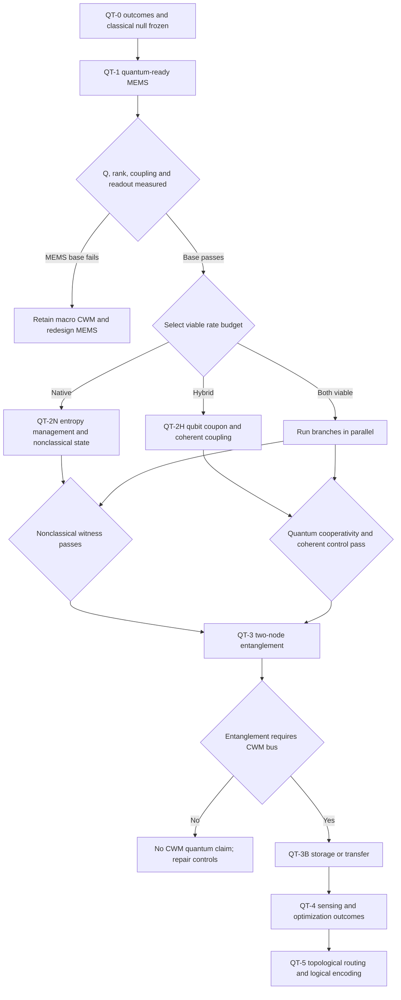

# CWM Outcome-First Quantum Transition Roadmap

**Date:** July 2026
**Status:** EXPLORATORY RESEARCH PROGRAM. CWM is not currently quantum hardware.
**Relationship to the current program:** This roadmap extends, but does not replace, the classical [Full-Potential Roadmap](ROADMAP_FULL_POTENTIAL.md), [experiment worklist](FULL_POTENTIAL_WORKLIST.md), [phononic processor architecture](CWM_PHONONIC_PROCESSOR_ARCHITECTURE.md), and [claims ledger](../paper/CLAIMS_STATUS.md).

This document works backward from useful quantum outcomes and meets the existing CWM architecture at the MEMS scale. It does not assume that a quantum CWM must operate cryogenically. Temperature is an experimental variable. The actual requirements are initialization, coherent control, isolation or active entropy removal, nonclassical measurement, and error suppression.

The governing question is not:

> Can CWM resemble a familiar quantum computer?

It is:

> Can a CWM device perform a useful information-processing task using a physical resource that cannot be reproduced by a classical wave model with the same energy, bandwidth, latency, and number of controlled modes?

---

## 1. Governing Rules

1. **Outcome first.** Begin with memory, sensing, optimization, or protected communication. Specify the output and benchmark before selecting a qubit implementation.
2. **Cold is not a definition.** Refrigeration is one method of entropy management. Optical initialization, measurement feedback, reservoir engineering, protected subspaces, large energy gaps, and active error correction are also valid if measured end to end.
3. **A useful answer is not proof of quantumness.** Classical machines can find good cuts, recognize patterns, and estimate small signals. A quantum claim additionally requires a nonclassical witness and fair resource accounting.
4. **Classical topology is not a topological qubit.** A disorder-resistant phononic edge mode may be a useful interconnect, but it does not by itself encode quantum information nonlocally.
5. **No result is upgraded by vocabulary.** Classical amplitude and phase remain classical until a measurement rejects the best applicable classical stochastic-wave model.
6. **Every claim has a dephased control.** Where possible, compare the coherent protocol with the same physical device after deliberate phase randomization or dephasing.
7. **Every result includes the whole machine.** Pumps, lasers, feedback electronics, postselection, calibration, and digital decoding count in energy and latency.

### Status language

| Label     | Meaning                                              |
| --------- | ---------------------------------------------------- |
| MEASURED  | Direct result from built hardware                    |
| DERIVED   | Calculated from measured inputs and stated equations |
| SIMULATED | Reproduced in a software model only                  |
| PROJECTED | Extrapolated to an unbuilt device                    |
| OPEN      | Claim-gating experiment has not passed               |
| KILLED    | Tested and rejected or explicitly closed             |

No experiment in this roadmap changes the current status of CWM until its gate is passed.

---

## 2. Work Backward From the Outcomes

| Desired outcome               | Operational result                                                 | Minimum quantum proof                                                                                      | CWM MEMS meeting point                                                | What is not enough                                                |
| ----------------------------- | ------------------------------------------------------------------ | ---------------------------------------------------------------------------------------------------------- | --------------------------------------------------------------------- | ----------------------------------------------------------------- |
| Quantum memory / interconnect | Store or transfer an unknown qubit state                           | Average state fidelity above the classical limit and preservation of entanglement with an external ancilla | High-Q modal memory, mode-selective routing, rank-N readout           | A long classical ringdown or transfer of a known tone             |
| Quantum-enhanced sensing      | Estimate mass, force, strain, or phase more precisely per resource | Beat the optimized classical/SQL protocol at matched energy, bandwidth, time, and readout chain            | High-Q perturbation sensing plus squeezed or entangled probes         | Better sensitivity caused only by more drive power or averaging   |
| Coherent optimization         | Improve time-to-solution for a declared instance family            | Coherent device beats its deliberately dephased twin and fair classical baselines as size grows            | Parametric 0/pi modes and programmable coupling matrix J              | Solving a small MaxCut instance with a classical Ising oscillator |
| Protected quantum routing     | Move a state through a fabrication-tolerant channel                | Quantum process fidelity and retained entanglement degrade less than in a matched trivial channel          | Topological phononic edge channel plus a genuine qubit interface      | Robust transmission of classical power alone                      |
| Fault-tolerant logical qubit  | Logical information outlives its physical components               | Repeated syndrome extraction and logical error decreasing with code distance                               | CWM modes as bosonic cells, bus, control fabric, or syndrome channels | One protected classical mode or one long-lived physical qubit     |

### Recommended order

The clearest first proof is **CWM-mediated entanglement followed by quantum state storage or transfer**. It tests whether CWM has a causal quantum role without requiring an immediate claim of computational speedup. Quantum-enhanced sensing is the first likely useful outcome after that. Optimization and topological logical encoding require more scale and follow later.

---

## 3. The Starting Point and the Room-Temperature Gap

### 3.1 What CWM already contributes

| Resource                             | Current or MEMS status  | Quantum-program role                                            |
| ------------------------------------ | ----------------------- | --------------------------------------------------------------- |
| Stable acoustic eigenmodes           | MEASURED at macro scale | Candidate buses, memories, and bosonic cells                    |
| Coherent amplitude and phase control | MEASURED classically    | Control primitive and classical null model                      |
| Frequency x space non-separability   | MEASURED, CLASSICAL     | Tomography and control rehearsal; not entanglement              |
| Rank-8 to rank-16 spatial readout    | PROJECTED for MEMS      | Multi-node addressing and syndrome/readout channels             |
| Q >= 10^4 at 3.5-35 MHz              | PROJECTED for MEMS      | Temporal memory and parametric threshold                        |
| Parametric 0/pi phase states         | SIMULATED / OPEN        | Classical Ising spins; possible precursor to bosonic cat states |
| Phononic bandgap routing             | OPEN design target      | Potential robust interconnect; not a qubit by itself            |

### 3.2 Thermal occupation is the central room-temperature number

For a mode of frequency `f` at temperature `T`,

$$
\bar n_{\mathrm{th}} = \frac{1}{\exp(hf/k_B T)-1}.
$$

At 300 K, the projected CWM MEMS band has:

| Frequency | Thermal occupation, `n_th` | Required Q for bare-mode screen (`Q ~= n_th`) | Gap from Q = 10^4 |
| --------: | -------------------------: | --------------------------------------------: | ----------------: |
|   3.5 MHz |                1.79 x 10^6 |                                   1.79 x 10^6 |              179x |
|    10 MHz |                6.25 x 10^5 |                                   6.25 x 10^5 |             62.5x |
|    35 MHz |                1.79 x 10^5 |                                   1.79 x 10^5 |             17.9x |

The common screening relation

$$
Qf > \frac{k_B T}{h} \approx 6.25 \times 10^{12}\ \mathrm{Hz}\quad\text{at 300 K}
$$

asks whether a bare oscillator can complete roughly one coherent cycle before thermal decoherence. It is a design screen, not proof of quantum operation and not a universal prohibition. A driven hybrid protocol can instead win by making its control, measurement, or engineered-dissipation rate exceed the thermal decoherence rate.

The MEMS target `Q = 10^4` is therefore sufficient to investigate classical temporal and parametric CWM, but it is not by itself a room-temperature mechanical quantum state. The quantum program must add at least one of:

1. a much larger `Qf` product;
2. active mode cooling or reservoir engineering;
3. a quantum subsystem that can be initialized independently of the thermal mode;
4. a thermally insensitive geometric or dark-state protocol;
5. repeated measurement and active error correction.

### 3.3 The rates that decide feasibility

Every design study and hardware run must report:

| Quantity      | Definition / role                                                        |
| ------------- | ------------------------------------------------------------------------ |
| `gamma_m`     | Mechanical energy-decay rate, `omega_m / Q`, from linewidth and ringdown |
| `Gamma_up`    | Thermal excitation rate, `gamma_m * n_th`                                |
| `Gamma_down`  | Thermal relaxation rate, `gamma_m * (n_th + 1)`                          |
| `Gamma_Sigma` | Symmetrized bath rate used for screening, `Gamma_up + Gamma_down`        |
| `g`           | Coherent qubit-mode or mode-mode coupling rate                           |
| `K`           | Single-quantum Kerr/nonlinear rate for a native oscillator path          |
| `Gamma_meas`  | Quantum measurement rate                                                 |
| `Gamma_eng`   | Engineered cooling or dissipation rate                                   |
| `gamma_q`     | Qubit decoherence rate                                                   |
| `C_q`         | Quantum cooperativity under the frozen roadmap convention below          |

All rates are angular rates unless explicitly divided by `2 pi`. This roadmap freezes the conservative screening convention

$$
\Gamma_\Sigma = \gamma_m(2\bar n_{\mathrm{th}}+1),
\qquad
C_q = \frac{4g^2}{\gamma_q\Gamma_\Sigma}.
$$

`C_q > 1` is the initial interaction gate. Passing it does not itself prove entanglement; it says coherent interaction is faster than the combined decoherence budget under this convention. A state-specific theory may use a different decoherence functional, but it must be frozen before the run and reported alongside this common screen.

At 300 K and 10 MHz, the coupling needed for `C_q = 1` is already severe:

| Mechanical Q | `Gamma_Sigma / 2 pi` | Required `g / 2 pi` if `gamma_q / 2 pi = 1 kHz` | At 10 kHz | At 100 kHz |
| -----------: | -------------------: | ----------------------------------------------: | --------: | ---------: |
|         10^4 |            1.250 GHz |                                         559 kHz | 1.768 MHz |  5.591 MHz |
|         10^5 |            125.0 MHz |                                         177 kHz |   559 kHz |  1.768 MHz |
|         10^6 |            12.50 MHz |                                        55.9 kHz |   177 kHz |    559 kHz |

In the high-temperature limit these thermal rates are nearly frequency-independent at fixed Q. Higher frequency still helps by lowering `n_th`, but Q, coupling, qubit coherence, and active entropy removal must be evaluated together. No known interface is assumed to meet this table; QT-0C exists to test candidate values before quantum-specific fabrication money is committed.

---

## 4. Architecture Hypothesis

The common base is a quantum-ready CWM MEMS die with:

- 1 mm x 1 mm x 50 um fused-silica resonators;
- 8-16 independently driven and read AlN transducer elements;
- paired resonators and tunable coupling structures;
- a conventional and a topological phononic routing path on the same die;
- optical access and strain hot spots for optional quantum-defect integration;
- reference resonators that receive no quantum subsystem;
- on-die thermometry and pump-heating monitors;
- phase-coherent RF control through at least 70 MHz for pumping 35 MHz modes at `2f`.

Two branches then compete. The program does not need both to succeed.

### Branch N: native mechanical quantum CWM

The parametric 0/pi latch is developed from a classical bifurcation into a quantum nonlinear oscillator:

`classical parametric oscillation -> calibrated squeezing -> sub-vacuum squeezing -> Wigner negativity -> cat state -> entangled oscillator pair -> bosonic code`

This is the most direct continuation of CWM, and the hardest room-temperature path. It requires mode preparation and readout fast enough to beat `Gamma_up` and the state-specific decoherence rate, plus a nonlinearity `K` large enough to resolve states at the single-quantum scale.

At 300 K the bare mode-occupation reduction needed to reach `n_eff < 1` is approximately `1.8 x 10^5` to `1.8 x 10^6` across 35-3.5 MHz. No cooling mechanism is presumed to supply that reduction. Branch N does not advance beyond design work unless QT-0C identifies a closed rate budget or a direct nonclassical-state protocol that bypasses this intermediate target.

### Branch H: hybrid quantum subsystem plus CWM phononic bus

An independently initialized room-temperature qubit, for example a screened diamond or SiC defect-spin candidate, supplies the two-level quantum state. CWM supplies strain coupling, multimode routing, memory, interference, and eventually protected communication.

The progression is:

`room-temperature qubit coupon -> strain coupling -> integrated single-node control -> two-node CWM-mediated gate -> entanglement -> memory/transfer -> sensing or logical encoding`

This is the recommended primary route because the qubit does not require the entire MHz acoustic mode to begin in its ground state. It still must beat thermally induced gate error, optical heating, spectral diffusion, and crosstalk.

### Topology is a later protection layer

A topological phononic channel may suppress backscatter from fabrication disorder. First prove that with classical S-parameters. Then prove it preserves a transported quantum state. Only an encoded logical qubit with decreasing logical error, or a material with demonstrated non-Abelian fusion and braiding, earns the term **topological qubit**.

---

## 5. Phase and Gate Summary

Phases overlap because MEMS design, quantum-interface screening, and classical baseline work can proceed in parallel.

| Phase                                         | Indicative time | Question                                                                   | Exit gate                                                                                      |
| --------------------------------------------- | --------------- | -------------------------------------------------------------------------- | ---------------------------------------------------------------------------------------------- |
| QT-0: Outcomes, null model, and rate envelope | 0-3 months      | What result would matter, and can either branch close its rate budget?     | Frozen metrics, fair baselines, predictive classical model, and quantitative go/no-go envelope |
| QT-1: Quantum-ready MEMS base                 | 3-18 months     | Does the CWM die provide the required Q, rank, coupling, and nonlinearity? | Measured parameter budget on multiple dies                                                     |
| QT-2N / QT-2H: Quantum crossover              | 12-30 months    | Can either native or hybrid hardware beat its decoherence budget?          | Native nonclassical witness or hybrid `C_q > 1` with coherent control                          |
| QT-3: First quantum CWM operation             | 24-42 months    | Does CWM causally mediate a quantum operation?                             | Two-node entanglement and state transfer/storage                                               |
| QT-4: Useful outcome                          | 30-48 months    | Does the resource improve sensing or optimization?                         | Fair, preregistered advantage over matched controls                                            |
| QT-5: Protected scaling                       | 42+ months      | Does protection improve as the system grows?                               | Entanglement-preserving topological route and/or decreasing logical error with distance        |

### Preliminary existing-data pass (July 2026)

The first [offline preliminary analysis](../data/results/quantum_transition/preliminary_existing_data/report.md) reuses saved phase, intermodulation, H-matrix, and Q-factor data and runs the existing MEMS/Mathieu models. It establishes classical bounds only:

- 18 phase sweeps: median leave-one-phase-out first-harmonic `R2 = 0.791`, and only 50% reach `R2 >= 0.8`; QT-0B is seeded, not closed.
- 46 controlled intermodulation comparisons: maximum positive excess `1.46 sigma`, with zero products at or above `3 sigma`; references differ by source control and no calibrated power bound or estimate of `K` is justified.
- simultaneous readout matrix: algebraic rank 2, entropy-effective rank 1.049; current captures cannot test rank 8.
- best measured macro mode: `Qf/(k_B T/h) = 9.63e-6` at 300 K.
- existing 1 mm fused-silica rod proxy: modeled `Q = 5.1e4-6.6e4`, still 33-43x below the bare 300 K Qf screen. This is a geometry sensitivity proxy, not the proposed plate prediction.
- classical Mathieu threshold falls from `0.94%` fractional stiffness modulation at measured median loaded Q to `0.020%` at `Q = 1e4`; easier classical bifurcation does not imply lower thermal occupation.

Reproduce with `python3 tools/quantum_transition_preliminary.py`. Machine-readable details are in [summary.json](../data/results/quantum_transition/preliminary_existing_data/summary.json).

---

## 6. Experiment Specifications

All new results go under `data/results/quantum_transition/<experiment_id>/`. Raw captures are immutable. Processed results identify the source files and analysis commit.

### QT-0A: Outcome contracts and resource ledger

**Objective:** Freeze what success means before selecting favorable outputs.

**Procedure:**

1. Select one primary near-term outcome: quantum memory/transfer is recommended.
2. Select one secondary outcome: quantum-enhanced mass/strain sensing is recommended.
3. Define the input ensemble, output metric, permitted calibration, stopping rule, and failure threshold.
4. Define the optimized classical comparator using the same physical bandwidth, energy, latency, and number of modes.
5. Define what is included in energy and latency: pumps, optics, feedback, readout, postselection, and decoder.

**Required data:** benchmark specification, classical baseline implementation, resource-counting worksheet, analysis plan, and claim language.

**Success:** each outcome has one primary metric, one nonclassical witness, one fair baseline, and one falsifier accepted in a design review.

**Kill / redirect:** an outcome that cannot be paired with a quantum witness is retained only as a classical CWM target.

---

### QT-0B: Classical stochastic-wave null model

**Objective:** Build the strongest classical explanation before looking for quantum residuals.

**Hypothesis:** A driven Langevin plus Duffing/parametric model should predict all present CWM amplitude, phase, CHSH-style, noise, and bifurcation measurements.

**Procedure:**

1. Fit linear transfer functions and correlated noise from raw voltage time series demodulated into I/Q against the phase-coherent NCO reference.
2. Add measured nonlinear terms only when power-scaling and intermodulation data require them.
3. Fit on one set of drive sequences and predict held-out sequences, temperatures, phases, and pump powers.
4. Preserve this fitted model as the null for QT-2 through QT-4.

**Required data:** raw voltage and derived I/Q traces, transfer matrix `H`, noise power spectral densities and cross-spectra, drive phase, pump power, temperature, pressure, nonlinear response curves, and held-out predictions. Historical magnitude-only captures may seed a preliminary fit, but quantum-transition baselines require new phase-referenced captures.

**Controls:** electrical dummy load, lifted-transducer null, off-resonant drive, randomized phase, injected classical noise, and simulated detector nonlinearity.

**Success:** the model predicts all classical-regime validation data within preregistered uncertainty. Later quantum evidence must reject this model on held-out data.

**Kill / redirect:** failure means the classical model must be repaired before a residual is interpreted as nonclassical.

---

### QT-0C: Room-temperature feasibility envelope

**Objective:** Decide quantitatively whether either quantum branch deserves integration structures before fabrication.

**Procedure:**

1. Sweep frequency from 3.5-35 MHz, Q from `10^4-10^7`, and the intended 280-320 K operating range.
2. For Branch N, calculate `n_th`, `Gamma_up`, `Gamma_Sigma`, required cooling ratio, `x_zpf`, candidate `K`, `Gamma_meas`, `Gamma_eng`, and predicted state-preparation fidelity.
3. For Branch H, insert candidate-specific measured or literature distributions for `g0`, coherently enhanced `g`, `gamma_q`, readout fidelity, optical heating, and integration-induced Q loss.
4. Do not apply a `sqrt(N)` collective enhancement unless the participating defects are shown to remain spectrally and phase coherent for the gate duration.
5. Propagate uncertainty and show optimistic, median, and pessimistic `C_q` rather than a single best-case value.
6. Calculate the same budget after pump heating and transducer loading, not only for an undriven bare resonator.

**Required data:** parameter source and status, uncertainty distribution, geometry assumptions, `n_th`, all rates in both rad/s and Hz, cooling ratio, `C_q`, predicted gate error, heating, Q penalty, and sensitivity to each parameter.

**Branch N go condition:** a documented mechanism gives `Gamma_meas` or `Gamma_eng` above the applicable thermal rate with enough efficiency to predict a nonclassical witness, or a state-specific protocol directly predicts that witness under the full noise model.

**Branch H go condition:** at least one candidate has projected `C_q >= 0.1` under median assumptions and a single measurable design improvement can take it above 1.

**Kill / redirect:** if a branch remains more than two orders of magnitude from its next gate even under optimistic documented assumptions, omit its dedicated integration structures from the first die. Preserve generic optical access and strain metrology where they do not compromise the classical MEMS program.

---

### QT-1A: Quantum-ready MEMS design and fabrication set

**Objective:** Extend WL-D1/D2 so one fabrication run can test the classical CWM ceiling and both quantum branches.

**Required design outputs:**

- FEM mode spectrum, mode shapes, effective masses, strain hot spots, and zero-point motion;
- Q budget with uncertainty for anchor, surface, thermoelastic, gas, and transducer losses;
- predicted `n_th`, `Gamma_up`, `Gamma_Sigma`, `g`, `K`, `Gamma_meas`, and pump heating;
- rank and condition number for 8- and 16-element transducer layouts;
- conventional and topological routing test structures;
- one-resonator, paired-resonator, and reference-device variants;
- optional quantum-defect integration sites and optical access;
- safe-drive and failure limits.

**Fabrication sampling target:** at least 8 usable devices across at least two die locations, including reference and paired variants. Report every device; do not publish only the best die.

**Success:** Q >= 10^4 is plausible with error bars, rank >= 8 is predicted, all critical rates are reported, QT-0C has classified each quantum branch, and a fabrication partner passes the design review.

**Native stretch gate:** at 35 MHz, either projected Q approaches `1.8 x 10^5` or the design provides a credible `Gamma_meas` or `Gamma_eng` greater than `Gamma_up` under the full state-preparation model. Missing this gate pauses Branch N but does not kill Branch H.

---

### QT-1B: MEMS mechanical, thermal, and readout metrology

**Objective:** Replace every important MEMS projection with a measured distribution.

**Procedure:**

1. Measure full mode maps and transfer matrices on every usable die.
2. Measure Q by both linewidth and ringdown versus pressure, temperature, drive amplitude, and transducer loading.
3. Calibrate displacement, effective mass, thermal noise, readout imprecision, and backaction.
4. Measure transducer rank, crosstalk, phase stability, and added noise.
5. Repeat after sustained pump operation to quantify heating and drift.

**Minimum operating points:**

- at least 4 modes per die across the 3.5-35 MHz band;
- at least 3 pressures spanning ambient to the intended package pressure;
- at least 3 temperatures bracketing room temperature, for example 280, 300, and 320 K;
- at least 3 drive levels in the verified linear regime;
- at least 20 ringdowns per mode and condition;
- at least 3 dies for any architecture-level claim.

**Required data:** `f0`, linewidth-Q, ringdown-Q, `m_eff`, `x_zpf`, thermal PSD, `n_th`, `gamma_m`, `Gamma_up`, `Gamma_Sigma`, H-matrix singular values, rank, readout efficiency, added noise, pressure, temperature, drive, and confidence intervals.

**Controls:** unpatterned die, no-transducer reference, electrical dummy, pump-off capture, and blinded device ID during analysis.

**Success:** at least 3 dies show Q >= 10^4 on at least 3 usable modes, rank >= 8, stable phase control, and a closed thermal/readout budget.

**Kill / redirect:** Q < 10^3 or rank < 4 closes temporal/parametric use on that design revision but preserves static PUF/sensor studies.

---

### QT-1C: Parametric threshold and single-quantum nonlinearity estimate

**Objective:** Extend WL-D3.3 from a classical threshold test into a measured bridge toward Branch N.

**Procedure:**

1. For at least 4 modes, run 20 upward and downward pump ramps around `2f0`.
2. Record subharmonic amplitude, phase, linewidth, switching rate, hysteresis, and neighboring modes.
3. Fit the full below- and above-threshold response to a stochastic parametric/Duffing model.
4. Convert the measured nonlinear coefficient and `m_eff` into a single-quantum Kerr estimate `K`, with propagated uncertainty.
5. Measure how pump heating changes `n_th`, Q, and switching statistics.

**Required data:** raw I/Q per ramp, phase histograms, threshold power, detuning, hysteresis width, Duffing coefficient, `K`, mode coupling, intermodulation products, temperature rise, and model residuals.

**Controls:** pump detuned by at least 5 linewidths, electrical dummy, phase-randomized pump, one-tone controls, and detector-linearity sweep.

**Classical success:** threshold knee plus reproducible bimodal 0/pi phase distribution on at least one mode.

**Native-path gate:** a quantified route exists for `K`, measurement, or engineered dissipation to exceed the relevant decoherence rate. A classical 0/pi histogram alone is not quantum evidence.

**Kill / redirect:** no threshold at maximum safe drive closes the parametric design revision. Threshold without a viable quantum-rate budget retains a classical Ising machine but pauses Branch N.

---

### QT-2N-A: Native mode entropy management

**Objective:** Prepare one mechanical mode close enough to a pure state for a nonclassical witness.

**Candidate mechanisms:** measurement feedback, cavity-assisted cooling, defect-assisted cooling, dissipative reservoir engineering, dark modes, or a higher-frequency redesign. The mechanism is selected by the QT-1 rate budget, not by preference.

**Procedure:**

1. Calibrate absolute displacement and measurement efficiency independently of the cooling fit.
2. Measure occupancy from the integrated thermal PSD; use sideband asymmetry or an equivalent quantum thermometer when sensitivity permits.
3. Sweep cooling/control rate and verify the predicted occupancy and backaction scaling.
4. Turn the mechanism off and recover the thermal reference without changing the readout calibration.

**Required data:** raw sidebands or homodyne records, `n_eff`, uncertainty, readout efficiency, imprecision, backaction, `Gamma_meas`, `Gamma_eng`, `Gamma_up`, `Gamma_Sigma`, pump heating, and time-resolved reheating.

**Success:** upper 95% confidence bound `n_eff < 1`, or a later direct nonclassical witness that does not require this intermediate criterion.

**Kill / redirect:** after two design iterations, `n_eff > 10` and the best control-to-thermal-decoherence ratio remains below 0.1. Pause Branch N and concentrate on Branch H.

---

### QT-2N-B: Native nonclassical mechanical state

**Objective:** Produce evidence that cannot be explained by the QT-0B classical stochastic-wave model.

**Sequence:** calibrated quadrature squeezing, sub-vacuum squeezing, non-Gaussian state preparation, then Wigner or equivalent tomography.

**Required data:** unaveraged quadrature records, absolute vacuum/zero-point calibration, detector efficiency, loss budget, reconstructed covariance matrix, Wigner distribution or phonon statistics, state-preparation sequence, and all rejected-shot counts.

**Controls:** thermal state, coherent state, injected classical squeezed noise, phase scrambling, pump-off state, synthetic records passed through the same reconstruction, and loss-uncorrected as well as corrected results.

**Quantum success:** either:

- observed, loss-uncorrected quadrature variance below the zero-point reference by more than 3 standard errors; or
- Wigner negativity or sub-Poissonian statistics below the applicable classical bound by more than 3 standard errors.

**Cat-state gate:** parity-sensitive tomography resolves coherent interference between the 0 and pi components; a bimodal classical phase distribution is explicitly insufficient.

**Kill / redirect:** all observations remain reproducible by the frozen QT-0B model after independent review. Branch N remains a classical parametric architecture.

---

### QT-2H-A: Room-temperature quantum-subsystem coupon screen

**Objective:** Select a quantum subsystem by measured compatibility with CWM, not by reputation or convenience.

**Candidate classes:** diamond defect spins, SiC defect spins, or another independently initialized room-temperature two-level system with strain coupling and single-shot or repeated quantum readout.

**Procedure:**

1. Fabricate or obtain coupons with a simple mechanical strain structure before integrating a CWM die.
2. Measure initialization, control, readout, `T1`, `T2*`, echo `T2`, spectral diffusion, strain susceptibility, optical/microwave heating, and addressability.
3. Measure or bound single-defect `g0` and ensemble `gN` separately.
4. Project `C_q` using QT-1B mechanical data and measured uncertainty.

**Required data:** ODMR or equivalent raw spectra, Rabi/Ramsey/echo shots, readout confusion matrix, photon/count distributions, `T1`, `T2*`, `T2`, `g0`, `gN`, defect density, optical power, local temperature, and projected `C_q`.

**Controls:** no-defect coupon, off-resonant mechanical drive, microwave crosstalk test, laser-only heating test, and multiple spatial locations.

**Success:** one platform has reproducible room-temperature initialization/control/readout and a projected integrated `C_q >= 0.1` with a credible path above 1.

**Intermediate range:** for `0.01 <= C_q < 0.1`, run one coupling-enhancement coupon iteration but do not proceed to full CWM integration.

**Kill / redirect:** no candidate reaches projected `C_q >= 0.01` without destroying mechanical Q. Revisit geometry or pursue Branch N rather than integrating a weak interface.

---

### QT-2H-B: Integrated coherent qubit-mode coupling

**Objective:** Demonstrate that a CWM mode coherently and controllably affects a genuine qubit.

**Procedure:**

1. Integrate the selected subsystem at a measured strain hot spot.
2. Map qubit frequency and coherence versus mechanical detuning and drive.
3. Use time-domain pulse sequences to distinguish coherent phase accumulation or exchange from heating.
4. Measure `g`, `gamma_q`, `gamma_m`, `n_th`, and `C_q` in the same operating block.
5. Repeat with the CWM mode detuned, damped, and phase randomized.
6. Run a heating-only control with the pump on at matched power while the mechanical mode is detuned from the qubit.

**Required data:** raw single-shot qubit outcomes, mechanical I/Q, detuning sweeps, time-domain oscillations, coherence curves, heating, fitted rates, complete error budget, and likelihood comparison to incoherent models.

**Success:** `C_q > 1` with lower 95% confidence bound above 1, plus a coherent interaction signature that disappears in the detuned/damped control.

**Kill / redirect:** `C_q < 0.1` across all usable modes after one integration redesign, with no thermally insensitive gate protocol supported by the data.

---

### QT-3A: Two-node CWM-mediated entanglement

**Objective:** Earn the first defensible statement that CWM participates in a quantum operation.

**Procedure:**

1. Address two physically distinct qubits or native oscillator cells coupled through a declared CWM mode or route.
2. Prepare a Bell-state target with a preregistered pulse sequence.
3. Collect full two-node tomography in interleaved calibration blocks.
4. Repeat with the bus detuned, pump off, bus strongly damped, and interaction phase randomized.
5. Bound direct microwave, optical, and electrical crosstalk independently.

**Minimum sampling plan:** power analysis before the run; default floor of 10,000 shots per tomographic setting, at least 10 time-separated blocks, and replication on at least 2 devices before an architecture-level claim.

**Required data:** all raw single-shot outcomes, tomography settings, readout confusion matrices, calibration blocks, reconstructed density matrix, Bell fidelity, concurrence/negativity, witness value, leakage, heralding and rejection rates, and bootstrap or Bayesian intervals that respect block dependence.

**Success:** lower 95% confidence bound of Bell-state fidelity exceeds 0.5 and an entanglement measure remains above zero; all CWM-disabled controls fail the same witness. `S > 2` is a stronger optional test, not a requirement.

**Claim unlocked:** **CWM-mediated entanglement**, naming the actual qubits and mode. This is not a loophole-free Bell test and not yet a quantum advantage claim.

**Kill / redirect:** the state is separable after readout-error and drift analysis, or the same result survives when the CWM bus is disabled.

---

### QT-3B: Quantum state storage and transfer

**Objective:** Show that CWM preserves unknown quantum information rather than merely transmitting a known control waveform.

**Procedure:**

1. Randomize over the six cardinal qubit states and an additional held-out set selected after calibration is frozen.
2. Store in a CWM-associated mode/cell or transfer through a CWM route.
3. Reconstruct the output channel by process tomography or randomized benchmarking appropriate to the subsystem.
4. Send half of an entangled state through the same channel and test whether entanglement survives.
5. Compare with matched delay, direct-route, bus-detuned, and measure-and-prepare controls.

**Required data:** state-by-state input/output counts, process matrix, average and worst-case fidelity, storage time, transfer time, loss/leakage, energy, ancilla entanglement witness, and entanglement-breaking-channel test.

**Success:** lower 95% confidence bound of average fidelity exceeds the applicable classical measure-and-prepare limit, `2/3` for uniformly distributed pure qubit states, and the ancilla test rejects an entanglement-breaking channel.

**Claim unlocked:** **quantum memory** or **quantum interconnect**, scoped to the measured state set, duration, and fidelity.

---

### QT-4S: Quantum-enhanced perturbation sensing

**Objective:** Convert CWM's strongest natural application into a fair quantum-outcome test.

**Procedure:**

1. Select one parameter: deposited mass, local strain, or force.
2. Blind and randomize perturbation values across zero and near-threshold cases.
3. Compare a quantum probe with the optimized coherent/classical probe using identical mean energy, bandwidth, integration time, transducer, and readout chain.
4. Repeat after deliberate dephasing and with the nonclassical resource removed.
5. Replicate the primary result on at least 3 devices.

**Required data:** perturbation truth, raw measurement records, estimator, bias, variance, sensitivity spectral density, Fisher information where appropriate, false-positive/negative rate, energy, bandwidth, integration time, device ID, and full loss budget.

**Scientific success:** the lower 95% confidence bound shows improvement over the optimized classical/SQL comparator at matched resources.

**Program target:** at least 3 dB sensitivity or variance improvement, retained on 3 devices and absent after deliberate dephasing.

**Kill / redirect:** improvement disappears under resource matching or can be reproduced by classical squeezing/noise correlations in QT-0B.

---

### QT-4O: Coherent optimization scaling test

**Objective:** Determine whether quantum coherence adds anything to the classical parametric Ising architecture.

**Procedure:**

1. Freeze random and structured QUBO/MaxCut instance families before hardware runs.
2. Test increasing active-system sizes, initially N = 4, 8, 16, and 32 if yield permits.
3. Compare the coherent protocol to the same device with calibrated dephasing, the QT-0B stochastic oscillator model, simulated annealing, and best available problem-matched digital baselines.
4. Include programming, annealing, repetitions, readout, calibration, and host computation in time and energy.
5. Report time-to-solution at a fixed target success probability:

$$
\mathrm{TTS}_{99} = t_{\mathrm{run}}\frac{\ln(1-0.99)}{\ln(1-p_{\mathrm{success}})},
$$

where `p_success` is the success probability of one complete hardware run.

**Required data:** every problem instance, coupling matrix, schedule, raw outcomes, ground-state or approximation ratio, success probability, TTS, energy, active modes, qubits, couplers, calibration time, postselection, and scaling fits with uncertainty.

**Quantum-contribution gate:** coherent hardware outperforms its deliberately dephased twin at matched resources and the difference cannot be fit by the frozen classical model.

**Advantage gate:** favorable scaling persists across preregistered sizes against fair classical baselines. A small-N constant-factor win is reported as such, not as quantum speedup.

**Kill / redirect:** dephasing does not change performance within uncertainty. Continue as a classical room-temperature phononic Ising machine if it remains useful.

---

### QT-5P: Entanglement-preserving topological phononic route

**Objective:** Determine whether topological phononics protects a quantum interconnect from fabrication disorder.

**Procedure:**

1. Fabricate matched topological and trivial routes with equal nominal length, bandwidth, and coupling.
2. Characterize classical transmission, group delay, backscatter, and localization first.
3. Introduce preregistered disorder patterns or use a statistically characterized device ensemble.
4. Transfer one half of an entangled state through each route.
5. Compare process fidelity and retained entanglement versus disorder strength.

**Required data:** layout, disorder map, classical S-parameters, mode localization, group delay, quantum process matrices, entanglement witnesses, loss, added noise, and resource-matching table.

**Success:** the topological route retains higher quantum process fidelity and entanglement than the matched trivial route across the preregistered disorder range, with lower 95% confidence bound above zero improvement.

**Claim unlocked:** **topologically robust quantum phononic interconnect**. This still does not unlock **topological qubit**.

---

### QT-5Q: Logical encoding and code-distance scaling

**Objective:** Demonstrate protection of quantum information rather than protection of a classical mode shape.

A 16-64 mode die is not assumed to contain 16-64 usable physical qubits. For reference, a rotated surface code requires approximately `2d^2 - 1` data and syndrome qubits: 17 at `d = 3`, 49 at `d = 5`, and 97 at `d = 7`. QT-5Q therefore requires either a lower-overhead bosonic code first, a denser later device, or measured multi-die interconnects. The first MEMS die cannot by itself promise this phase.

**Sequence:**

1. Characterize physical gate, measurement, leakage, and correlated-error rates.
2. Demonstrate a repetition or bosonic cat-code primitive with repeated syndrome extraction.
3. Move to a two-dimensional topological stabilizer code if the physical error budget permits.
4. Compare at least code distances `d = 3` and `d = 5`; add `d = 7` when scale permits.
5. Hold physical operating conditions and decoder rules fixed across distances.

**Required data:** every syndrome round, physical and logical errors per cycle, leakage, erasure, correlated-error matrix, decoder version, latency, code distance, qubit count, and logical lifetime.

**Scaling success:** `p_L(d=5) < p_L(d=3)` with statistical confidence at matched physical error, followed by break-even where logical lifetime exceeds the best constituent physical lifetime.

**Claim unlocked:** **fault-tolerant logical qubit**. The term **topological qubit** is permitted only when the logical encoding is explicitly topological and the code-distance result passes.

**Separate intrinsic-anyonic route:** if a future CWM material is claimed to host non-Abelian excitations, it requires distinct fusion-rule, ground-state-degeneracy, and path-independent braiding experiments. Classical phononic topology cannot substitute for them.

---

## 7. Master Data Record

Every experiment directory must contain a machine-readable manifest with these fields. Unknown fields are recorded as `null`, not omitted.

### Device and environment

- device, wafer, die, resonator, and fabrication-run IDs;
- geometry, material stack, defect/implant process, transducer layout, and package;
- timestamp, operator, instrument IDs, software commit, and calibration IDs;
- local and ambient temperature, pressure, vibration, magnetic field, optical power, and RF power.

### Mechanical state

- `f0`, linewidth-Q, ringdown-Q, `m_eff`, `x_zpf`, mode shape, and strain field;
- thermal PSD, `n_th` or `n_eff`, `gamma_m`, `Gamma_up`, `Gamma_Sigma`, drift, and pump heating;
- Duffing coefficient, Kerr estimate `K`, parametric threshold, switching rate, and mode coupling.

### Control and readout

- waveform, phase, detuning, amplitude, timing, bandwidth, and channel map;
- readout efficiency, added noise, imprecision, backaction, dynamic range, and confusion matrix;
- all filters, exclusions, heralding rules, and postselection rates.

### Quantum subsystem

- initialization fidelity, readout fidelity, `T1`, `T2*`, echo `T2`, gate fidelity, leakage, and spectral diffusion;
- `g0`, collective `g` if used, `gamma_q`, cooperativity convention, `C_q`, and uncertainty;
- raw single-shot outcomes and tomography settings, not only averaged curves.

### Outcome and resources

- density/process matrix or declared witness with confidence interval;
- task output, baseline output, dephased-control output, and classical-model prediction;
- active physical modes, qubits, couplers, control channels, and detector channels;
- total energy, wall-clock latency, calibration time, repetitions, classical compute, and discarded trials.

---

## 8. Analysis and Replication Rules

1. Preregister the primary metric, witness, stopping rule, exclusions, and confidence method.
2. Preserve raw single-shot or raw I/Q data. Averaged spectra alone cannot support a quantum-state claim.
3. Report observed and efficiency/loss-corrected results side by side. A claim that exists only after a large correction is labeled model-dependent.
4. Use time-block or device-block resampling when shots share a calibration; do not treat every shot as an independent device realization.
5. Interleave target and control conditions to prevent drift from becoming an apparent quantum effect.
6. Blind perturbation values, device identities, or analysis labels whenever practical.
7. Replicate architecture-level claims on at least 2 devices for entanglement and 3 devices for sensing; report yield across the full fabrication set.
8. Give the frozen QT-0B classical model access to the same calibration data as the quantum analysis.
9. Require independent analysis of QT-2N-B, QT-3A, QT-3B, and QT-4 before changing public claim language.
10. Publish negative gates. A failed quantum branch does not erase a successful classical CWM result.

---

## 9. Claim Ladder

| Permitted phrase                              | Required gate                                                                                   |
| --------------------------------------------- | ----------------------------------------------------------------------------------------------- |
| Quantum-inspired / quantum-like classical CWM | Existing classical non-separability and interference results, with explicit classical qualifier |
| Quantum-ready CWM MEMS                        | QT-1B parameter budget measured; no quantum-state implication                                   |
| CWM coupled to a quantum subsystem            | QT-2H-B coherent interaction signature                                                          |
| Nonclassical mechanical state in CWM          | QT-2N-B nonclassical witness                                                                    |
| CWM-mediated entanglement                     | QT-3A                                                                                           |
| CWM quantum memory / interconnect             | QT-3B                                                                                           |
| Quantum-enhanced CWM sensor                   | QT-4S fair matched-resource result                                                              |
| Quantum contribution to CWM optimization      | QT-4O dephased-device and classical-model gate                                                  |
| Quantum advantage                             | QT-4O scaling gate against fair classical baselines and independent review                      |
| Topologically robust quantum interconnect     | QT-5P                                                                                           |
| Fault-tolerant / topological logical qubit    | QT-5Q code-distance and break-even gates                                                        |

Until these gates pass, the public [claims ledger](../paper/CLAIMS_STATUS.md) remains controlling.

---

## 10. First 90 Days

### Weeks 1-2: freeze the outcomes

- Complete QT-0A for quantum memory/transfer and perturbation sensing.
- Define the optimized classical comparators and whole-system resource ledger.
- Select an external quantum-information reviewer for the witness and statistics.

### Weeks 2-6: quantify the crossover

- Extend the MEMS parameter study to calculate `n_th`, `Gamma_up`, `Gamma_Sigma`, `x_zpf`, `K`, candidate `g`, `Gamma_meas`, and `C_q` with uncertainty.
- Add native and hybrid rate-budget tables for 3.5, 10, and 35 MHz.
- Fit QT-0B to existing amplitude, phase, noise, and parametric simulations.
- Complete QT-0C and classify each branch as go, one-iteration intermediate, or stop before quantum-specific layout is frozen.

### Weeks 4-8: choose the interface without committing the architecture

- Score room-temperature quantum-subsystem candidates on measured `T2`, strain coupling, readout fidelity, integration damage, and projected `C_q`.
- Define a coupon experiment for the two strongest candidates.
- Add optical-access and strain-hot-spot requirements to the MEMS design.

### Weeks 7-10: finish the quantum-ready test chip specification

- Add paired resonators, reference devices, conventional/topological route pairs, thermometry, and defect-integration sites.
- Freeze the test matrix, die count, package pressure, RF range, and safe-drive rules.
- Conduct physics, fabrication, controls, and statistics reviews separately.

### Weeks 11-12: gate the first spend

- Produce one parameter JSON and one uncertainty budget for the selected die.
- Preregister QT-1B and QT-1C.
- Proceed to fabrication only if the common classical MEMS goals remain valuable and at least one quantum branch has a measurable route to its next gate.

---

## 11. Program Decision Tree

The central program is successful before a universal quantum computer exists if it demonstrates one reproducible CWM-mediated quantum operation and one useful outcome under fair resource accounting. The topological-qubit goal remains conditional on physical-qubit quality and measured error suppression, not on analogy between classical mode shapes and quantum states.
