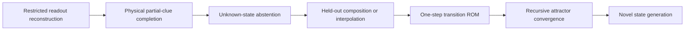

# CWM Wheel of Fortune Exploration

**Date:** July 13, 2026
**Status:** PRELIMINARY OFFLINE STRUCTURAL SURROGATE + PHYSICAL EXPERIMENT DESIGN
**Claim boundary:** No word understanding, physical missing-symbol completion, interpolation, generation, or quantum behavior has been demonstrated.

This exploration reads the newest open research proposals together with the July 11 offline debrief and asks what the phrase **physical Wheel-of-Fortune solver** can mean without outrunning the evidence.

The answer is useful, but narrower than the analogy first suggests:

> Current CWM data support latent physical-state reconstruction from a distributed modal response. They do not yet show that a physically incomplete query is completed, and the current decoder does not reliably recognize an unknown state as unknown.

The reproducible analysis is [wheel_of_fortune_surrogate.py](../tools/wheel_of_fortune_surrogate.py). Its [report](../data/results/wheel_of_fortune_surrogate/report.md) and [machine-readable results](../data/results/wheel_of_fortune_surrogate/summary.json) are the evidence base for this document.

---

## 1. What the Latest PRs Actually Say

The two latest repository PRs are open, protocol-only proposals with no reviewer comments. Neither changes the public claim ledger.

| PR                                             | Proposal                                 | Honest role                                                                                                                         |
| ---------------------------------------------- | ---------------------------------------- | ----------------------------------------------------------------------------------------------------------------------------------- |
| [#6](https://github.com/miketierce/cwm/pull/6) | Kaprekar attractor memory                | Test a hybrid transition ROM whose controller repeatedly queries stored successor cards and checks convergence to 6174              |
| [#7](https://github.com/miketierce/cwm/pull/7) | Associative completion versus generation | Use Wheel of Fortune to separate known-template retrieval, completion, interpolation, transition recall, generation, and abstention |

PR #7 supplies the controlling distinction:

```text
partial physical query
  -> distributed modal response
  -> similarity readout
  -> closest compatible enrolled state
```

This is associative completion only if the **physical query itself** is incomplete. If a complete state drives the plate and features are hidden afterward in software, the experiment instead measures latent-state reconstruction under restricted readout.

PR #6 is downstream of PR #7. Kaprekar is a compact test of transition recall and attractor convergence, not a separate compute primitive. The controller still sorts digits, performs subtraction, stores the current state, and sequences queries. CWM would supply a physical lookup step.

### Earlier PR sequence and measured outcome

| PR                                             | Initial direction                 | Outcome now available                                                                                               |
| ---------------------------------------------- | --------------------------------- | ------------------------------------------------------------------------------------------------------------------- |
| [#1](https://github.com/miketierce/cwm/pull/1) | Neural dynamical-system benchmark | Current physical NARMA readout does not beat software baselines                                                     |
| [#2](https://github.com/miketierce/cwm/pull/2) | Fair offline reanalysis           | Strong partial-readout and mode-dropout result; raw full-information classification loses to wire random projection |
| [#3](https://github.com/miketierce/cwm/pull/3) | Spectral page multiplexing        | Rejected for the current plate; useful information is distributed across bands                                      |
| [#4](https://github.com/miketierce/cwm/pull/4) | Drone recall coprocessor          | Application protocol only; strongest mapping is incomplete physical-sensor state recall                             |
| [#5](https://github.com/miketierce/cwm/pull/5) | Phononic working memory           | Offline emulator suggests only 4-8 robust coarse slots under noise                                                  |

The resulting architecture is not a page-addressed RAM or a generative model. It is a distributed physical feature map feeding a small content-addressable bank.

---

## 2. What Wheel of Fortune Tests

A clue such as:

```text
C _ M P U T _ R
```

admits four different operations:

1. **Retrieval:** select `COMPUTER` because that exact word is in the enrolled bank.
2. **Associative completion:** recover an enrolled word despite missing or corrupted positions.
3. **Compositional inference:** produce a valid word absent from enrollment using reusable symbol-position structure.
4. **Generation:** produce a structured novel output from a learned conditional model.

Current CWM evidence is closest to operations 1 and 2. PR #7 is valuable because it prevents those operations from being called generation.

There are also three clue classes that must be scored differently:

| Clue class             | Correct behavior                                                                    |
| ---------------------- | ----------------------------------------------------------------------------------- |
| Unique clue            | Return the one compatible enrolled codeword                                         |
| Ambiguous clue         | Return the compatible set or calibrated top-k distribution, not an arbitrary winner |
| Invalid / unknown clue | Abstain rather than force every query into the nearest enrolled card                |

The third row is where the current offline result fails.

---

## 3. Existing-Data Experiment

### 3.1 Dataset

The saved capture contains:

- 1,280 physical captures;
- 256 states with five repeats each;
- four state attributes: `x`, `y`, `vx`, `vy`;
- a complete `8 x 8 x 2 x 2` Cartesian grid;
- 28 direct axis-window features and 212 modal features.

The complete grid matters. It contains no dictionary of valid and invalid words. Every attribute combination is enrolled, so it cannot test valid unseen composition. Renaming the four Pong attributes as letters would add semantics that the experiment never contained.

### 3.2 Critical caveat

Every capture was acquired while all four state variables were present in the physical drive. The offline test can remove direct axis-window features from the decoder, but the modal response still contains consequences of the supposedly hidden drive variables.

Therefore:

```text
what was measured:
  full physical state -> modal response -> restricted decoder

what Wheel of Fortune requires:
  partial physical clue -> new modal response -> completion
```

The first is a prerequisite for the second, not proof of it.

### 3.3 Hidden-state reconstruction result

At `sigma = 1` standardized feature noise, modes alone recover one hidden attribute as follows:

| Hidden attribute | Levels | Accuracy | Chance |
| ---------------- | -----: | -------: | -----: |
| `x`              |      8 |    53.9% |  12.5% |
| `y`              |      8 |    50.8% |  12.5% |
| `vx`             |      2 |    98.0% |  50.0% |
| `vy`             |      2 |    93.8% |  50.0% |

With all four attributes hidden from the direct readout, modes alone recover the exact full state at **32.0%**, versus **0.39%** chance. Hidden-symbol accuracy is **73.8%**.

When one to three direct attribute blocks are hidden, `glass_readout_masked` retains a roughly 41-47 point hidden-tuple advantage over visible wire features at `sigma = 1`:

| Hidden blocks | Glass + visible blocks | Visible wire |   Difference |
| ------------: | ---------------------: | -----------: | -----------: |
|             1 |                  77.5% |        35.6% | +41.9 points |
|             2 |                  56.9% |        10.3% | +46.6 points |
|             3 |                  42.8% |         2.1% | +40.7 points |

This confirms that the modal response carries a distributed code for the full driven state. It does not establish a response to a physically omitted input.

### 3.4 Unknown-state result

The abstention proxy enrolls a deterministic half of the state grid and treats the other half as unknown. Under `sigma = 1`:

| Method              | Known exact retrieval | Known accepted | Unknown rejected |   AUC |
| ------------------- | --------------------: | -------------: | ---------------: | ----: |
| Glass, all features |                 58.9% |          93.4% |             6.9% | 0.517 |
| Modes only          |                 44.5% |          94.2% |             7.0% | 0.509 |
| Wire                |                 11.1% |          94.7% |             7.2% | 0.524 |

An AUC near 0.5 means nearest-template distance does not distinguish held-out states from enrolled ones under this noise condition. The system confidently maps most unknown states into the known bank.

This is the strongest Wheel-of-Fortune conclusion from existing data:

> CWM currently looks like a forced-choice distributed CAM, not a calibrated symbolic completer or generative system.

That is still useful when the application guarantees that every query belongs to a known physical-state library. It is unsafe when unknown conditions are common unless an external validity gate is added.

---

## 4. Why This Is Not Yet a Competitive Word Solver

A dictionary and Hamming-distance lookup solve a small Wheel puzzle exactly, cheaply, and transparently. CWM is unlikely to beat that software on accuracy. A word-game demonstration is valuable because humans can see partial-query completion immediately, not because word lookup is a compelling accelerator market.

The useful physical analogues are:

- a missing vibration sensor channel;
- a partial ultrasonic echo;
- a degraded machine-fault signature;
- an incomplete environmental state vector;
- a damaged subset of modal receivers.

In these cases, the input begins as a physical signal. A MEMS CWM device could potentially transform and compare it without first computing a large digital embedding. The commercial question is then total energy and latency, including transduction, ADC, FFT, calibration, and decoding.

---

## 5. The Physical Wheel Experiment

### 5.1 Codeword bank

Begin with eight four-symbol codewords, matching the current coarse-slot ceiling. Use a six-symbol alphabet and include both easy and minimal-pair cases:

```text
ABCD  ABCE  ABDE  ACDE
BCDE  FCDE  FADE  FADB
```

The symbols are deliberately meaningless. Natural-language probabilities would let the software vocabulary solve the puzzle before the physical substrate contributes anything.

Create these clue classes before capture:

- unique one-blank clues;
- unique two-blank clues;
- ambiguous clues such as `ABC_`;
- valid but unenrolled codewords;
- invalid or out-of-range drive patterns;
- noise-only and plate-disconnected nulls.

### 5.2 Encoding

Use four independently controlled tones, one per symbol position. Encode the six symbol values with the already demonstrated amplitude levels; use drive-off for a blank.

Scalar amplitude gives categorical symbols an artificial order. Control that risk by:

1. randomly permuting symbol-to-amplitude assignments;
2. repeating the experiment with at least three mappings;
3. requiring the result to survive mapping changes;
4. moving to balanced multi-tone symbol codes in a later array device.

### 5.3 Procedure

1. Capture at least eight repeats of every complete codeword for enrollment.
2. Split repeats before building centroids; never place captures of the same repeat block in train and test.
3. Physically turn blank-position drives off and recapture every clue.
4. Interleave full-word controls, partial clues, invalid clues, electrical nulls, and repeated calibration blocks.
5. Repeat on another day without silently rebuilding every threshold from the test set.

### 5.4 Baselines

Run identical splits through:

- exact constrained lookup;
- Hamming-distance nearest word;
- direct-wire features with the same decoder;
- no-glass electrical path;
- software random projection of equal dimension;
- CWM modal features;
- CWM modal plus direct features.

Hamming lookup is the correctness ceiling. Direct wire and equal-dimensional random projection determine whether the plate adds useful physical geometry.

### 5.5 Metrics

| Condition             | Primary metric                                                 |
| --------------------- | -------------------------------------------------------------- |
| Unique clues          | Exact codeword completion                                      |
| Ambiguous clues       | Compatible-set recall, top-k coverage, probability calibration |
| Valid unseen codeword | Independent symbol accuracy and endpoint-collapse rate         |
| Invalid / OOD         | AUROC, false-known rate, abstention at fixed known recall      |
| Cross-session         | Absolute accuracy and calibration loss                         |
| System comparison     | Total joules/query and end-to-end latency                      |

### 5.6 Gates

**Pass the physical-completion gate only if:**

- unique-clue completion is at least 80% with one or two symbol drives physically omitted;
- CWM exceeds direct wire by at least 10 percentage points under matched analog noise;
- invalid-state AUROC is at least 0.90;
- false-known rate is at most 10% at 90% known-clue recall;
- cross-session completion loses less than 10 percentage points;
- the result survives symbol-to-amplitude remapping.

**Reframe or stop if:**

- the advantage appears only when features are hidden after capture;
- direct wire or software random projection matches CWM;
- ambiguous clues are scored against an arbitrary single answer;
- every unknown clue is forced into the enrolled bank;
- amplitude ordering, session leakage, or a complex decoder creates the effect;
- whole-system energy exceeds the digital lookup without another system benefit.

---

## 6. Capability Ladder After the Wheel



Current saved data place CWM at **A**. The next bench experiment tests **B** and **C**. PR #7's interpolation experiments test **D**. PR #6's reduced Kaprekar graph tests **E** and **F**.

The sequence matters. A system that cannot abstain should not recursively feed its forced guesses back as trusted states.

### Kaprekar after Wheel of Fortune

The current noisy working-memory estimate supports only 4-8 robust coarse slots. A first Kaprekar experiment should therefore use a reduced transition graph or permutation classes with no more than eight active cards. Its strongest possible result is not arithmetic:

> A hybrid controller using CWM lookup reaches the correct attractor more often than matched direct-wire lookup after intermediate clues are corrupted.

If ordinary nearest-neighbor software does as well, Kaprekar remains an educational workload rather than a physical-compute advantage.

---

## 7. Quantum Relationship

Wheel of Fortune is a classical information-retrieval benchmark. It cannot demonstrate entanglement, nonclassicality, topological protection, or quantum advantage.

It can still serve the outcome-first quantum roadmap later: run the same completion task with coherent and deliberately dephased hardware at matched resources. Any quantum contribution would require a verified nonclassical resource and an advantage that disappears under dephasing. Better word-completion accuracy alone would not make the device quantum.

---

## 8. Decision

The Wheel-of-Fortune framing survives, with one precise meaning:

> CWM is a candidate physical associative completer for a small bank of known physical states.

The existing data show that the full driven state is redundantly recoverable from modal features, even after direct readout blocks are removed. They also show that the current nearest-template geometry does not know when a noisy state falls outside the enrolled bank.

The next decisive experiment is therefore not a larger vocabulary or a language model. It is an eight-codeword bench test with **physical drive omission and explicit abstention**.

The executable path from E3 mass sites to that test is [the physically written template-bank worklist](PHYSICALLY_WRITTEN_TEMPLATE_BANK_WORKLIST.md). It closes write/erase/rewrite first, tests whether one rewritten cell exposes a direct multitone match scalar, then requires logical identity to follow the mass pattern through cross-cell swaps before the Wheel claim is attempted.
