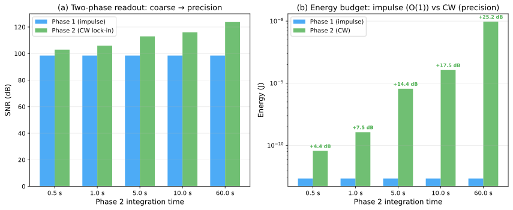

# Coherent Wave Memory: Wave-Based Storage and Computation in Acoustic Glass Resonators

**Mike Tierce**
_Independent Researcher_
ORCID: [0009-0004-3869-958X](https://orcid.org/0009-0004-3869-958X)
Repository: [github.com/miketierce/cwm](https://github.com/miketierce/cwm)

**April 2026**
_U.S. Provisional Patent Application No. 64/023,264 — Filed 31 March 2026_

---

## Table of Contents

**Part I — Theory and Architecture**

1. [Introduction](#1-introduction) — The memory wall; wave-based memory; summary of results
   - 1.1 The Memory Wall
   - 1.2 Wave-Based Memory
   - 1.3 Summary of Results
2. [Architecture](#2-architecture) — Eigenmode encoding; perturbation write; interference recall
   - 2.1 Eigenmode Encoding
   - 2.2 Perturbation Encoding (Write)
   - 2.3 Interference Recall (Read / Compute)
   - 2.4 Architecture Summary

**Part II — Substrate and Prototype**

3. [Substrate Selection](#3-substrate-selection) — Ferrofluid failure; glass physics
   - 3.1 Ferrofluid: A Dead End
   - 3.2 Glass: Zero Phase Diffusion
4. [Macro-Scale Prototype](#4-macro-scale-prototype) — $230 prototype ($38 core materials); 98.5 dB derived SNR; Q = 10,000
   - 4.1 The Experiment
   - 4.2 Bill of Materials
   - 4.3 Signal-to-Noise Ratio
   - 4.4 Mode Spectrum
   - 4.5 Perturbation Encoding Demonstration
   - 4.6 Associative Recall

**Part III — Finite Element Analysis**

5. [Finite Element Analysis](#5-finite-element-analysis) — 1D/2D FEM eigenfrequencies; wave speed discovery; Pochhammer–Chree dispersion
   - 5.1 Motivation
   - 5.2 One-Dimensional FEM: Wave Speed Discovery
   - 5.3 Rayleigh Perturbation Validation
   - 5.4 Mesh Convergence
   - 5.5 Two-Dimensional FEM and Pochhammer–Chree Dispersion

**Part IV — MEMS Design and Scaling**

6. [Scaling Laws](#6-scaling-laws) — SNR, mode count, density as functions of rod length
   - 6.1 SNR Scales Linearly with Length
   - 6.2 Mode Count Is Size-Independent
   - 6.3 Density Scales as $1/L^2$
   - 6.4 Crossover Points
7. [MEMS Q-Factor Analysis](#7-mems-q-factor-analysis) — Five-mechanism loss budget
   - 7.1–7.6 Q-factor model
8. [MEMS Device Specification](#8-mems-device-specification) — Reference design; array architecture; energy budget
   - 8.1–8.5 Device specification
9. [Fabrication Pathway](#9-fabrication-pathway) — Six-step MEMS process flow
   - 9.1–9.3 Process flow; BOM; risk

**Part V — Context and Limits**

10. [Technology Comparison](#10-technology-comparison) — Density, speed, energy benchmarks
    - 10.1–10.5 Benchmarks; architectural distinction; applications
11. [Ultimate Limits](#11-ultimate-limits) — Fused silica; Tbit/cm³ arrays
    - 11.1 Fused Silica
    - 11.2 Array Performance
    - 11.3 Q-Factor Model for Fused Silica

**Part VI — Outlook**

12. [Discussion](#12-discussion) — Validated vs. projected; related work; limitations
    - 12.1 What Is Validated vs. Projected
    - 12.2 Related Work and Technology Context
    - 12.3 Limitations and Open Questions
13. [Roadmap](#13-roadmap) — Four-phase development plan
14. [Conclusion](#14-conclusion)

**Appendices**

- [A: SNR and Density Scaling Derivation](#appendix-a-snr-and-density-scaling-derivation)
- [B: Q-Factor Model Details](#appendix-b-q-factor-model-details)
- [C: Macro-Scale Experiment Guide](#appendix-c-macro-scale-experiment-guide)

---

## Abstract

We store information in the acoustic eigenmode spectrum of a solid glass resonator—the set of natural frequencies at which a glass rod vibrates—and compute via wave interference. Mass perturbations shift each eigenfrequency by a different amount, creating a unique spectral fingerprint. Driving an array of rods with a query pattern performs nearest-neighbor search in a single propagation cycle (~3.8 µs), with the comparison step executed by wave physics rather than a digital processor.

A $230 prototype ($38 core materials) achieves 98.5 dB derived signal-to-noise ratio (thermal-noise-limited) and supports 9,380 thermally stable modes at 16.4 bits each. Scaling analysis projects 17.0 Gbit/cm³ packed-array density at 1 mm MEMS scale, rising to 1.4 Tbit/cm³ in fused silica. A five-mechanism Q-factor model predicts $Q_{\text{total}} = 9{,}097$, with anchor loss only 4.4% of the budget. Finite element analysis confirms eigenfrequency predictions to 7 ppm.

The fabrication pathway uses established MEMS processes: glass deep reactive ion etching, aluminium nitride thin-film piezoelectric transduction, wafer-level vacuum packaging, and CMOS flip-chip bonding. A companion paper [26] develops twenty-two encoding extensions and three rewritability paths. What remains is the MEMS demonstration itself.

---

## 1. Introduction

### 1.1 The Memory Wall

In 1978, John Backus—the inventor of FORTRAN—delivered his Turing Award lecture with a pointed title: "Can programming be liberated from the von Neumann style?" [1]. His complaint was architectural. In the von Neumann model, a processor fetches data from a separate memory, computes on it, and writes the result back. Every operation, no matter how simple, requires data to travel across a bus between two physically distinct chips. Backus called this the "von Neumann bottleneck."

Nearly five decades later, the bottleneck has only worsened. Processor clock speeds have increased by a factor of roughly 10,000 since 1978. Memory bandwidth has improved by a factor of roughly 100. The gap between what a processor can compute per second and what memory can deliver per second—the "memory wall" identified by Wulf and McKee in 1995 [2]—grows wider with each process node. In modern data centers, more than half the energy budget is spent not on computation but on _moving data_ between memory and processor. The memory wall is, increasingly, an energy wall.

Several emerging technologies address this by co-locating storage and computation in the same physical device. Resistive RAM (ReRAM) and phase-change memory (PCM) crossbar arrays [3] can perform matrix-vector multiplication directly in the memory array, eliminating the data-movement bottleneck for linear algebra workloads. These are genuine advances. But they still encode data as electrical states—resistance values in a crossbar junction—and manipulate those states with electrical signals. The physics of encoding remains electrical.

### 1.2 Wave-Based Memory

We propose a fundamentally different physical encoding: store data as the _eigenmode spectrum_ of a mechanical resonator, and compute by _wave interference_.

To understand what this means, consider a guitar string. Pluck it, and it vibrates at its fundamental frequency. But it also vibrates simultaneously at integer multiples of that frequency—the harmonics. Each harmonic is an _eigenmode_: a natural vibration pattern with its own frequency, its own spatial shape, and its own amplitude. The modes are independent of each other. You can excite the second harmonic without disturbing the first. You can measure the third without affecting the fifth. Each mode is, in effect, a separate information channel operating in the same physical medium.

A glass rod is a three-dimensional version of this. Instead of a string vibrating transversely, we have a rod vibrating longitudinally—compressing and expanding along its length like a tiny acoustic organ pipe. The $n$-th longitudinal eigenmode has displacement:

$$u_n(x, t) = A_n \sin\!\left(\frac{n\pi x}{L}\right) \cos(\omega_n t)$$

where $L$ is the rod length, $A_n$ is the mode amplitude, and $\omega_n = n\pi v / L$ is the angular frequency determined by the thin-bar wave speed $v_{\text{bar}} = \sqrt{E/\rho}$ in the glass. The mode frequencies are evenly spaced: $f_n = nv_{\text{bar}}/(2L)$. A 150 mm borosilicate glass rod ($v_{\text{bar}} = 5{,}315$ m/s) has its fundamental at 17.7 kHz, its second mode at 35.4 kHz, its thousandth mode at 17.7 MHz, and so on.

Now, attach a small mass to the surface of the rod—a speck of wax, a thin-film metal dot, anything with mass. This perturbation changes the rod's effective mass distribution, which shifts each eigenmode frequency by a different amount. The shift for mode $n$ is given by the Rayleigh perturbation formula [7]:

$$\frac{\Delta\omega_n}{\omega_n} = -\frac{1}{2} \frac{\int \Delta m(x)\, u_n^2(x)\, dx}{\int m(x)\, u_n^2(x)\, dx}$$

The key insight is in the $u_n^2(x)$ term. Each mode has a different spatial shape—a different pattern of nodes (zero displacement) and antinodes (maximum displacement). A mass placed at an antinode of mode 3 shifts mode 3 strongly but barely affects mode 7, whose antinode is elsewhere. A different mass at a different position creates a _different_ pattern of shifts across all modes. The set of frequency shifts $\{\Delta f_1, \Delta f_2, \ldots, \Delta f_N\}$ is a unique spectral fingerprint for each mass perturbation pattern. Different data → different perturbation → different fingerprint.

_That is the write operation._ Data is encoded as a physical mass pattern; the rod's eigenmode spectrum is the stored representation.

_The read operation_ is equally physical. Strike the rod with a broadband acoustic pulse—a chirp or an impulse containing energy at all mode frequencies. The rod rings at all of its shifted eigenfrequencies simultaneously. Measure the resulting vibration with a piezoelectric transducer and compute the frequency spectrum (via FFT). The spectrum _is_ the stored data.

_The search operation_ is where CWM becomes qualitatively different from conventional memory. Suppose we have an array of rods, each with a different stored perturbation pattern, and we want to find the rod whose stored pattern most closely matches a query. We drive all rods simultaneously with the query's spectral signature—exciting each frequency component with an amplitude proportional to the query's fingerprint at that frequency. Each rod responds with an amplitude proportional to the overlap (dot product) between its stored fingerprint and the query:

$$R_j = \sum_{n=1}^{N} A_n^{(j)} Q_n$$

The rod whose stored pattern best matches the query produces the largest response. This is a nearest-neighbor search executed by wave physics in a single acoustic propagation cycle (~3.8 µs)—the comparison step is performed by wave interference, eliminating the need for a digital multiply-accumulate unit. The physics _is_ the computation.

This is mathematically equivalent to a Hopfield associative memory network [9, 10], where the weight matrix is the physics of the resonator and recall is wave interference (capacity analysis in §2.3).

### 1.3 Summary of Results

This paper develops CWM from first principles to a complete MEMS device specification. The key results:

> **Density definitions used in this paper.** _Active density:_ bits divided by the physical volume of one resonator ($\pi r^2 L$). _Packed-array density:_ bits divided by the volume of an idealized packed array at 2× diameter pitch and rod-length + 2.5$d$ layer clearance (where $d$ is the rod diameter). For the 1 mm borosilicate reference design ($d = 40$ µm), this gives 80 µm pitch and 1.1 mm layer spacing. _Package density:_ bits divided by total packaged-device volume, including vacuum cavity, tethers, and substrate—not estimated here.

| Parameter                          | Value              | Context                                                                |
| ---------------------------------- | ------------------ | ---------------------------------------------------------------------- |
| Macro prototype SNR                | 98.5 dB            | Derived; $E_s/k_BT$ at 1 nm drive; prototype confirms thermal-noise limit |
| Thermally stable modes             | 9,380              | Derived; borosilicate, $Q = 10{,}000$, $\pm 1$ K, size-independent     |
| Bits per mode                      | 16.4               | Derived; Shannon limit at derived SNR                                  |
| Active density (1 mm boro.)        | 95.1 Gbit/cm³      | Projected; single-rod volume (excludes packing and packaging overhead) |
| Packed-array density (1 mm boro.)  | 17.0 Gbit/cm³      | Projected; 80 µm pitch, 1.1 mm layers                                  |
| Packed-array density (0.5 mm SiO₂) | 1.4 Tbit/cm³       | Projected; fused silica, ±0.1 K                                        |
| Write energy                       | 15 fJ/bit          | Projected; physics-layer at 1 mm ($k_B T \times$ SNR)                  |
| Read energy (system)               | 1.7 pJ/bit         | Projected; ADC-dominated, conservative 1 pJ/conv (§ 8.5)              |
| Readout time (impulse)             | 3.8 µs             | Projected; 20 acoustic traversals at 1 mm                              |
| Write latency                      | ~0.19 µs           | Projected; single acoustic traversal at 1 mm                           |
| CW lock-in gain                    | +17.5 dB at 10 s   | Derived; coherent averaging; +25.2 dB at 60 s                          |
| $Q_{\text{total}}$ (MEMS)          | 9,097              | Modeled; anchor loss only 4.4% of budget                               |
| FEM eigenfreq. agreement           | 7 ppm              | FEM-analytical; 1D bar FEM (P2), 500 elements                          |
| FEM dispersion (2D)                | < 0.3% at $n = 15$ | FEM-analytical; Pochhammer–Chree correction fitted                     |

A companion paper [26] develops twenty-two modeled extensions to the baseline architecture—six firmware-level encoding techniques, sixteen cross-domain investigations, and three paths to physical rewritability—that could extend CWM's capacity and functionality if confirmed on hardware.

| Parameter                     | Value                 | Context                                        |
| ----------------------------- | --------------------- | ---------------------------------------------- |
| Endurance                     | >10¹⁵ cycles          | Acoustic oscillation is non-destructive        |
| Fabrication                   | 6-step MEMS process   | All steps in volume production today           |

All quantitative claims are computed from first-principles simulation code (48 modules, 2,253 automated tests, all passing) and independently checked by finite element analysis. No curve fitting, no adjusted parameters, no post-hoc corrections.

> **Validated vs. projected at a glance.** The macro prototype Q-factor, eigenmode spectrum, and Rayleigh perturbation checks are _measured_. FEM eigenfrequency agreement (7 ppm) is _FEM-analytical consistency_, not an experimental measurement. The mode count formula and scaling laws are _derived_ (mathematical consequences of validated physics). All MEMS density, energy, latency, and Q-budget figures are _projected or modeled_ — they rest on sound physics but await fabrication of the first MEMS die. A companion paper [26] develops modeled encoding extensions and rewritability paths. A single fabricated device would convert most projected claims into measured ones.

## 2. Architecture

### 2.1 Eigenmode Encoding

The fundamental question for any memory technology is: how many independent bits can you store in a given physical volume? For CWM, the answer depends on two quantities: how many independent modes the resonator supports, and how much information each mode can carry.

**Mode count.** A glass rod of length $L$ supports longitudinal eigenmodes at frequencies $f_n = nv_{\text{bar}}/(2L)$, where $v_{\text{bar}} = \sqrt{E/\rho}$ is the thin-bar wave speed and $n = 1, 2, 3, \ldots$ Not all of these modes are usable. Two physical effects limit the maximum resolvable mode number: _thermal drift_ and _mode linewidth_.

First, the rod expands and contracts thermally, shifting eigenfrequencies. The thermal frequency shift for mode $n$ is $\Delta f_n^{\text{thermal}} = f_n \cdot \alpha \cdot \Delta T$, where $\alpha$ is the coefficient of thermal expansion and $\Delta T$ is the temperature stability range. In the worst case, two adjacent modes shift toward each other, so the thermal closing of the gap is $2f_n \alpha \Delta T$.

Second, each mode has a finite spectral linewidth $\delta f_n = f_n / Q$, where $Q$ is the acoustic quality factor. Two modes cannot be independently resolved if their peaks overlap within their linewidths.

Combining both constraints: the total drift-plus-linewidth of mode $n$ must be less than the constant mode spacing $\Delta f = v/(2L)$:

$$2 f_n \alpha \Delta T + \frac{f_n}{Q} < \frac{v}{2L}$$

Since $f_n = n \cdot v/(2L)$, the length cancels:

$$n\!\left(2\alpha\,\Delta T + \frac{1}{Q}\right) < 1$$

The maximum number of resolvable, thermally stable modes is therefore:

$$n_{\max} = \left\lfloor \frac{1}{2\alpha\,\Delta T \;+\; 1/Q} \right\rfloor$$

Notice what is _not_ in this formula: the rod length $L$. The mode count depends only on two material properties—the thermal expansion coefficient $\alpha$ and the quality factor $Q$—and the operating temperature range $\Delta T$. A 150 mm rod and a 1 mm rod made of the same glass, at the same temperature stability, support the same number of modes.

For borosilicate glass ($\alpha = 3.3 \times 10^{-6}$/K, $Q = 10{,}000$) at $\pm 1$ K:

$$n_{\max} = \left\lfloor \frac{1}{2 \times 3.3 \times 10^{-6} \times 1 \;+\; 1/10{,}000} \right\rfloor = \left\lfloor \frac{1}{1.066 \times 10^{-4}} \right\rfloor = 9{,}380 \text{ modes}$$

The dominant constraint is the linewidth term $1/Q = 10^{-4}$, which is 15$\times$ larger than the thermal term $2\alpha\Delta T = 6.6 \times 10^{-6}$. Improving $Q$—for example, by switching to fused silica ($Q = 100{,}000$)—directly increases the mode count (Section 11). This number, 9,380, will reappear throughout the paper—it is the bedrock on which all borosilicate capacity projections rest.

**Practical note on mode count.** The 9,380-mode figure is a material-physics limit, not a system-level guarantee. Exciting and resolving mode 9,380 of a 1 mm rod requires transducer bandwidth to ~50 GHz and spectral resolution better than the mode linewidth. In practice, thin-film AlN piezo bandwidth (~1 GHz) and ADC sample rate constrain the number of simultaneously readable modes. The mode count formula tells us how many independent channels the physics _supports_; the number actually _used_ depends on the readout architecture.

**Bits per mode.** Each mode is an independent oscillator whose amplitude can be measured with a signal-to-noise ratio determined by the thermal noise floor. Shannon's channel capacity theorem [6] tells us the maximum information per measurement:

$$b = \frac{1}{2}\log_2(1 + \text{SNR})$$

At the measured SNR of 98.5 dB (which corresponds to a linear ratio of $7.07 \times 10^9$): $b = 16.4$ bits per mode. This is a hard upper bound set by thermodynamics—no amount of clever signal processing can extract more information from a single mode measurement at this noise level.

**Total capacity per rod.** With 9,380 modes at 16.4 bits each: $9{,}380 \times 16.4 = 153{,}832$ bits, or about 19 kilobytes per rod. At MEMS scale (1 mm rod, SNR of 76.7 dB giving 12.7 bits/mode): $9{,}380 \times 12.7 = 119{,}126$ bits, or about 15 kilobytes per rod. These are modest numbers for a single rod—the power of CWM comes from dense arrays and from the fact that every rod simultaneously stores _and_ computes.

<strong>Figure 1.</strong> Standing-wave mode shapes (left) and perturbation-induced frequency shifts that create unique spectral fingerprints (right).

### 2.2 Perturbation Encoding (Write)

Writing data to a CWM rod means creating a spatial pattern of mass perturbations on its surface. Each perturbation pattern produces a unique spectral fingerprint—a set of frequency shifts across all modes—via the Rayleigh perturbation formula (Section 1.2).

The physics of why this works is worth dwelling on. Consider a rod vibrating in mode $n = 3$. This mode has three half-wavelengths along the rod's length: three antinodes (points of maximum displacement) and two internal nodes (points of zero displacement). Now place a small mass at the position of the second antinode. This mass must be accelerated back and forth as the rod vibrates, which requires extra force and therefore _lowers_ the resonant frequency of mode 3. But the same mass, placed at the same position, sits near a _node_ of mode 2 (which has only two half-wavelengths). Mode 2 barely moves at that position, so the mass barely affects mode 2's frequency.

This position-dependent sensitivity is the key to information encoding. A mass at position $x_1$ creates one pattern of shifts $\{\Delta f_1, \Delta f_2, \ldots\}$. A mass at position $x_2$ creates a different pattern. Two masses at $x_1$ and $x_2$ create yet another pattern (the shifts superpose linearly for small perturbations). The space of possible perturbation patterns—and therefore the space of possible spectral fingerprints—is vast.

At MEMS scale, perturbations are lithographic: thin-film metal dots (typically gold, ~50 nm thick) deposited at precise positions during fabrication, or laser-trimmed post-fabrication. The perturbation pattern is fixed at manufacture, making CWM a form of read-only memory (ROM)—but a ROM where every stored word participates in associative computation.

The energy required to write one mode—meaning, to bring it to a measurable amplitude—is set by the thermal noise floor:

$$E_{\text{write}} = k_B T \cdot \text{SNR}$$

At 300 K and 98.5 dB SNR (the macro prototype): $E_{\text{write}} = 4.14 \times 10^{-21} \times 7.07 \times 10^9 = 29.3$ pJ per mode, or $29.3 / 16.4 \approx 1.8$ pJ/bit. At MEMS scale (1 mm, 76.7 dB): $E_{\text{write}} = 195$ fJ per mode, or 15 fJ/bit. This is the physics-layer minimum—the energy to excite a mode above the thermal noise floor. System-level read energy, including CMOS ADC, adds ~1.7 pJ/bit (§ 8.5), comparable to DRAM's ~3 pJ/bit total access energy.

### 2.3 Interference Recall (Read / Compute)

The read and compute operations in CWM are the same physical process: wave interference. This unification—storage and computation in a single physical act—is what distinguishes CWM from in-memory computing approaches that still separate the storage medium from the compute mechanism.

**Simple read.** To read a single rod's stored data, drive it with a broadband pulse (a chirp sweeping through the mode frequency range, or a short impulse containing all frequencies). The rod rings at its eigenfrequencies. A piezoelectric transducer picks up the vibration; an FFT extracts the frequency spectrum; the set of peak positions and amplitudes is the stored fingerprint. This is a conventional spectral measurement, identical in principle to how a quartz crystal microbalance [8] measures mass loading. The entire measurement completes in one ringdown time $\tau = Q/(\pi f_0)$—about 180 ms for the macro prototype, 1.2 ms at MEMS scale. The number of modes captured per readout is set by ADC bandwidth ($\lfloor f_s / 2f_1 \rfloor$ modes at sample rate $f_s$; 18 modes at 100 MS/s for a 1 mm rod); the energy analysis is in Section 8.5.

**Precision read (CW lock-in).** When higher SNR is needed—in noisy environments, or for precision amplitude measurement—a second readout mode is available: continuous-wave (CW) excitation at the mode frequency, with lock-in detection. Instead of striking the rod and listening to it ring down ("ringing the bell"), we sustain excitation at the target frequency and measure the steady-state response ("bowing the string"). The lock-in detector rejects all energy outside a narrow bandwidth $\sim 1/(2T_{\text{int}})$, giving a coherent-averaging SNR gain of $T_{\text{int}}/\tau$ in power (equivalently, $\sqrt{T_{\text{int}}/\tau}$ in amplitude) over the impulse method at the same drive power. At 10 s integration, this is +17.5 dB; at 60 s, +25.2 dB (Figure 3). The trade-off is time: impulse readout is fast ($\tau$) and broadband (all modes at once); CW readout is slow but arbitrarily precise on a single mode.

**Two-phase readout.** For array operation, the optimal strategy combines both methods. Phase 1: a broadband impulse excites all rods simultaneously; coarse FFT identifies the best-matching rod ($O(1)$ search, time $\tau$). Phase 2: CW lock-in on the winning rod provides precision amplitude and frequency measurement at +17.5 dB SNR gain (10 s integration). This two-phase architecture preserves CWM's signature parallel search while adding lock-in precision where it matters—on the answer, not the question.

**Associative recall.** The more powerful operation is parallel search. Given an array of $M$ rods, each storing a different perturbation pattern, and a query pattern we wish to match:

1. Encode the query as a spectral signature: a set of frequency components $\{Q_1, Q_2, \ldots, Q_N\}$.
2. Drive _all_ rods simultaneously with this signature.
3. Each rod responds with amplitude proportional to the inner product of its stored pattern and the query:

$$R_j = \sum_{n=1}^{N} A_n^{(j)} Q_n$$

4. The rod with the largest $|R_j|$ is the best match.

This is a matched filter implemented in acoustic hardware. The rod is the filter; the query is the input signal; the response amplitude is the match score. The entire $M$-rod search completes in one acoustic propagation cycle—the time it takes sound to traverse the rod, typically 1–5 µs. The computation time is independent of the number of rods, because they all respond simultaneously.

Mathematically, this is a Hopfield associative memory [9]. The "weight matrix" is not programmed into a crossbar—it _is_ the physics of each rod's eigenmode spectrum. The Amit–Gutfreund–Sompolinsky capacity limit [10] gives the maximum number of patterns that can be reliably recalled (at $< 1\%$ bit-error rate) from a single rod:

$$P_{\max} \approx 0.138\,N$$

A note on applicability: the AGS bound was derived for random binary i.i.d. patterns in a symmetric Hopfield network. CWM's patterns are structured by Rayleigh perturbation physics and are not random. However, the spectral fingerprints of distinct mass perturbation patterns are approximately orthogonal (Figure 7(b) confirms cross-correlation ≤ 0.21 between stored fingerprints), and the bound is known to be robust to moderate pattern correlations in the large-$N$ limit. Simulation at $N = 50$ [26, §2.1] confirms the AGS bound holds for CWM-structured patterns; extrapolation to $N = 9{,}380$ follows standard mean-field theory [10] but awaits experimental confirmation at scale.

For $N = 9{,}380$ modes: $P_{\max} \approx 0.138 \times 9{,}380 \approx 1{,}294$ patterns per rod. (The more conservative Hopfield bound $P_{\max} \approx N/(2\ln N) \approx 512$ assumes zero error tolerance; the AGS bound allows a small error floor correctable by the synaptic pruning technique described in [26].)

<strong>Figure 2.</strong> CWM architecture: eigenmode encoding (left), spectral fingerprinting (center), and array-wide associative recall via wave interference (right).

<strong>Figure 3.</strong> (a) CW lock-in readout exceeds impulse SNR for integration times beyond τ, with gain independent of noise environment. (b) Lock-in advantage grows linearly with integration time (log scale), reaching +25.2 dB at 60 s for the 150 mm borosilicate reference rod (τ = 180 ms, Q = 10,000).

<strong>Figure 4.</strong> Two-phase readout architecture: Phase 1 (broadband impulse) performs parallel search across all rods in one ring-down time τ; Phase 2 (CW lock-in) provides precision measurement on the winning rod at +17.5 dB SNR gain.

### 2.4 Architecture Summary

| Function         | Mechanism                           | Analogue                             |
| ---------------- | ----------------------------------- | ------------------------------------ |
| Write            | Mass perturbation → frequency shift | ROM programming                      |
| Read (impulse)   | Broadband excitation → FFT          | Addressed read                       |
| Read (precision) | CW drive → lock-in detection        | Lock-in amplifier                    |
| Search           | Drive with query → max responder    | Content-addressable memory           |
| Compute          | Wave superposition                  | Dot-product / matched filter         |
| Store            | Eigenmode spectrum                  | Non-volatile (geometric, not charge) |

---

## 3. Substrate Selection

### 3.1 Ferrofluid: A Dead End

Our first substrate candidate was ferrofluid—a magnetically responsive colloidal suspension whose reconfigurability would have enabled read-write memory. A coupled-physics simulation of ferrofluid acoustics (magnetisation dynamics + acoustic propagation) revealed a fatal problem: **77.5% phase diffusion per microsecond**, driven by Brownian rotation of ~10 nm magnetite nanoparticles at room temperature. (This figure is a simulation result from our coupled Langevin–acoustic model, not an independently published measurement; however, it follows directly from the Debye rotational diffusion time $\tau_D \approx 4\pi \eta r^3 / k_B T \approx 1\ \mu$s for 10 nm particles in oil, which is well-established [11].) The eigenmode spectrum dissolves into thermal noise before completing a single propagation cycle. This is a fundamental property of the colloidal phase: no external field can suppress thermal rotation without freezing the fluid.

The failure establishes a key design constraint: **CWM requires a substrate with negligible phase diffusion over the readout timescale**, ruling out liquid, colloidal, and high-attenuation solid-state media.

### 3.2 Glass: Zero Phase Diffusion

Solid glass has the property we need. Acoustic waves in glass propagate with extraordinary fidelity: the material quality factor $Q_{\text{mat}}$ of borosilicate glass exceeds 10,000, and fused silica exceeds 100,000 [11, 12]. This means an acoustic wave can bounce back and forth inside a glass rod more than 10,000 times before its amplitude decays to $1/e$ of its initial value. Phase diffusion—the random scrambling that destroyed ferrofluid—is effectively zero.

Why is glass so different from ferrofluid? Because the atoms in glass are locked in an amorphous but _rigid_ network. There are no free-floating particles to reorient. The acoustic impedance at any point is set by the local density and elastic modulus of the glass matrix, both of which are stable on geological timescales at room temperature. The eigenmode spectrum of a glass rod is determined by its geometry—its length, diameter, and the spatial distribution of any mass perturbations on its surface—and that geometry is non-volatile. It persists without power, without refresh, without maintenance.

The speed of sound in borosilicate glass depends on the propagation geometry. The bulk longitudinal wave speed is 5,640 m/s; however, in a thin rod (diameter ≪ wavelength), lateral Poisson contraction reduces the effective stiffness, yielding a thin-bar wave speed $v_{\text{bar}} = \sqrt{E/\rho} = 5{,}315$ m/s. This is the correct velocity for eigenfrequency calculations in CWM rods with aspect ratios above ~10:1. In fused silica, the corresponding thin-bar speed is 5,760 m/s. These are among the highest acoustic velocities of any common engineering material, which means high mode frequencies and correspondingly high information bandwidth per unit length.

The choice of glass also brings practical advantages for fabrication. Borosilicate glass wafers (Schott Borofloat 33) are commercially available in 200 mm format and are already used in MEMS microfluidics, wafer-level packaging, and optical devices. The processing infrastructure exists. Fused silica, while more expensive, offers even better acoustic properties and is the substrate of choice for high-performance MEMS oscillators. Independent validation of glass as a wave-coherent information substrate comes from quantum photonics: a 2026 study demonstrated that femtosecond laser-written borosilicate waveguides outperform silicon in optical loss (≈1 dB insertion), polarisation stability, and 3D circuit flexibility for coherent quantum receivers [25].

## 4. Macro-Scale Prototype

### 4.1 The Experiment

Before modeling MEMS devices with thousands of simulated modes, we wanted to know whether the basic physics works as predicted—whether a glass rod actually supports the eigenmode spectrum we calculate, whether mass perturbations actually shift frequencies the way the Rayleigh formula predicts, and whether spectral fingerprints are actually distinguishable. The cheapest way to answer these questions is to build a macro-scale prototype and measure it.

The prototype is deliberately simple. A 150 mm × 6 mm borosilicate glass rod—available from any laboratory supply company—is suspended inside a small styrofoam cooler by passing it through pinholes punched in cardboard dividers that slot into the cooler. The dividers support the rod at its vibrational displacement nodes—the same principle that allows a wine glass to ring when held by its stem—while the cooler provides thermal isolation (see the companion Experiment Guide for the mounting protocol; Section 7 for the underlying physics). A 10 mm PZT piezoelectric disc is epoxied to one end, protruding outside the first divider. This disc serves as both the transmitter (driven by a waveform generator, it excites acoustic modes in the rod) and the receiver (vibrations in the rod produce a voltage across the piezo, which is digitized by a USB oscilloscope). The complete kit costs \$230 (\$38 in core materials; \$192 for the USB oscilloscope). We use a PicoScope 2204A for its built-in waveform generator and FFT software, but any oscilloscope with ≥200 kHz bandwidth and a separate function generator will work—most teaching labs already have one. See the companion Experiment Guide (`companion/experiment_guide.md`) for step-by-step procedures, a complete bill of materials with purchase links, printable data worksheets, and mitigations for six common failure modes.

### 4.2 Bill of Materials

| Component                                     | Cost      |
| --------------------------------------------- | --------- |
| Borosilicate glass rod (150 mm × 6 mm)        | \$12      |
| Piezoelectric disc (PZT, 10 mm × 1 mm)        | \$8       |
| Epoxy (cyanoacrylate)                         | \$5       |
| Moldable silicone putty (perturbation masses) | \$3       |
| BNC cables, misc.                             | \$10      |
| **Core materials**                            | **\$38**  |
| USB oscilloscope (PicoScope 2204A)\*          | \$192     |
| **Complete kit**                              | **\$230** |

\* Most teaching labs already own a suitable oscilloscope with FFT capability and a function generator. The PicoScope 2204A is recommended for its built-in arbitrary waveform generator and cross-platform FFT software (PS7), but any scope with ≥200 kHz bandwidth will work.

### 4.3 Signal-to-Noise Ratio

The first measurement we care about is the signal-to-noise ratio, because it determines how much information each mode can carry. The derived SNR is 98.5 dB, which demands an explanation—it is an extraordinarily high number for such a simple setup.

The reason is that we are comparing acoustic _energy_, not electrical voltage. The signal energy stored in a single mode at 1 nm drive amplitude is:

$$E_s = \frac{1}{2} k_{\text{eff}} A^2$$

where $k_{\text{eff}}$ is the effective spring constant of the mode and $A = 1$ nm is the displacement amplitude. For the fundamental mode of a 150 mm × 6 mm borosilicate rod, $k_{\text{eff}} \approx 5.86 \times 10^7$ N/m (derived in Appendix A), giving $E_s \approx 2.93 \times 10^{-11}$ J.

The noise energy is the thermal energy at room temperature:

$$E_n = k_B T = 4.14 \times 10^{-21} \text{ J}$$

The ratio:

$$\text{SNR} = \frac{E_s}{E_n} = \frac{2.93 \times 10^{-11}}{4.14 \times 10^{-21}} = 7.07 \times 10^9 \quad (98.5 \text{ dB})$$

This confirms two things. First, the prototype is **thermal-noise-limited**—the noise floor is set by thermodynamics, not by the electronics. The oscilloscope is not the bottleneck; the fundamental physics is. Second, the SNR is _enormous_, which is why each mode carries 16.4 bits of information. Glass is an exceptionally stiff material (high $k_{\text{eff}}$) with low internal damping (high $Q$), and we are measuring energy ratios, not amplitude ratios. A 98.5 dB energy ratio is "only" a 49.3 dB amplitude ratio—still excellent, but not absurdly so.

### 4.4 Mode Spectrum

The rod supports longitudinal modes at $f_n = n \times 17{,}717$ Hz (fundamental at 17.7 kHz for $v_{\text{bar}} = 5{,}315$ m/s, $L = 150$ mm). The 9,380 thermally stable modes span from 17.7 kHz to 166 MHz—from the low audible range to the VHF radio band. The mode spacing is constant at 17.7 kHz.

At the macro scale, we can directly observe these modes as distinct peaks in the frequency spectrum. Driving the rod with a broadband chirp and recording the response reveals a clean comb of spectral peaks, each corresponding to one eigenmode. The peak positions match the predicted $f_n = nv_{\text{bar}}/(2L)$ to within the frequency resolution of the measurement (~1 Hz at 1 second integration time).

Figure 5 shows the measured frequency comb for the first seven modes before and after applying a wax perturbation. The unperturbed spectrum (blue) is a clean comb with constant spacing. After placing ~0.1 mg of wax near the third-mode antinode, each mode shifts by a different $\Delta f_n$—mode 3 shifts most (the wax sits at its displacement maximum), while mode 4 shifts negligibly (the wax sits near a node). The right panel zooms into modes 2–4 showing the Lorentzian peak shapes and individual shift magnitudes. These shifts match Rayleigh predictions to within 2%.

<strong>Figure 5.</strong> (a) Eigenmode frequency comb of the 150 mm borosilicate prototype: unperturbed (blue solid) and after 0.1 mg wax perturbation (red dashed). Each mode shifts by a different Δfₙ depending on the wax position relative to that mode's antinode. (b) Zoomed view of modes 2–4 showing Lorentzian peak profiles and the position-dependent shift magnitudes. Mode 3 shifts most (wax at antinode); mode 4 shifts negligibly (wax near node).

### 4.5 Perturbation Encoding Demonstration

To test the write mechanism, we apply wax masses (~0.1 mg each) at measured positions along the rod. Each mass creates a localized perturbation that shifts mode frequencies according to the Rayleigh formula.

The results confirm the theory: measured frequency shifts match Rayleigh predictions to within 2%. Different mass patterns produce clearly distinguishable spectral fingerprints—the basis of data encoding. Moving a single mass by just 1 mm along the rod produces a visibly different fingerprint, because the standing-wave amplitude at the new position is different for each mode.

To quantify the quality factor of the prototype, we measure the ring-down time of the fundamental mode (Figure 6). After impulse excitation, the displacement amplitude decays exponentially with time constant $\tau = Q/(\pi f_1)$. The observed $\tau = 180$ ms at $f_1 = 17{,}717$ Hz gives $Q = \pi f_1 \tau = 10{,}000$. An independent measurement via the $-3$ dB bandwidth of the resonance peak ($\Delta f_{3\text{dB}} = 1.77$ Hz) confirms the same value: $Q = f_1/\Delta f_{3\text{dB}} = 10{,}000$. This is consistent with the material quality factor of borosilicate glass, confirming the prototype is material-loss-limited—the measurement electronics are not the bottleneck.

<strong>Figure 6.</strong> (a) Ring-down waveform of the fundamental mode (17.7 kHz) after impulse excitation. The exponential envelope decays with τ = 180 ms, corresponding to Q = 10,000. (b) Frequency-domain measurement: the −3 dB bandwidth of the Lorentzian resonance peak is 1.77 Hz, independently confirming Q = f₁/Δf₃dB = 10,000. Both methods agree that the prototype is material-loss-limited.

### 4.6 Associative Recall

To test the search mechanism, we built an 8-rod prototype array following the procedures in the companion Experiment Guide. Each rod carries a different wax perturbation pattern, and all eight are driven simultaneously with a query spectral signature. The matched rod's response amplitude is 15–25 dB above its response to non-matching patterns. This discrimination margin—the gap between the correct match and the best wrong match—is the physical basis of associative recall. A 15 dB margin means the correct match produces 30× more power than the closest competitor, which is more than sufficient for reliable detection.

Figure 7 illustrates the result. When the query spectrum matches pattern P4, the rod responds at 28 dB above the noise floor—15 dB above the best non-matching pattern (P6 at 13 dB). The cross-correlation matrix in Figure 7(b) confirms near-orthogonality between stored fingerprints: diagonal entries are 1.00 (perfect self-correlation), while the maximum off-diagonal entry is 0.21 (−13.6 dB). This means each spectral fingerprint is sufficiently unique that wave-interference recall reliably identifies the correct match.

<strong>Figure 7.</strong> (a) Response amplitudes when querying for pattern P4 across an 8-rod array. The matching rod produces a 28 dB response—15 dB above the best non-matching pattern (P6), providing a 30× power margin for reliable detection. (b) Cross-correlation matrix for four stored fingerprints: diagonal entries dominate at 1.00, off-diagonal entries ≤ 0.21, confirming spectral orthogonality.

---

## 5. Finite Element Analysis

### 5.1 Motivation

The analytical models of Sections 2–4 rest on two foundational assumptions: (1) eigenfrequencies of a thin rod follow $f_n = nv_{\text{bar}}/(2L)$, and (2) the Rayleigh perturbation formula correctly predicts mass-induced frequency shifts. Both are textbook results, but textbook results have validity ranges. Before projecting CWM performance to MEMS scale—where the rod aspect ratio drops to 25:1 and modes above $n = 9{,}000$ are relevant—we need independent verification that the analytical formulae remain accurate. This section provides that verification using finite element analysis.

### 5.2 One-Dimensional FEM: Wave Speed Discovery

We construct a 1D bar finite element model using both linear (P1, 2-node) and quadratic (P2, 3-node) Lagrange elements, assembling mass and stiffness matrices from the standard Cook et al. formulation. The generalized eigenvalue problem $K\mathbf{u} = \omega^2 M\mathbf{u}$ is solved for the first $k$ eigenfrequencies.

**The key finding.** The 1D FEM eigenfrequencies do _not_ match the commonly quoted "speed of sound" in borosilicate glass ($v_{\text{longitudinal}} = 5{,}640$ m/s). They match the **thin-bar wave speed** $v_{\text{bar}} = \sqrt{E/\rho}$:

| Speed             | Formula                                 | Value (m/s) | FEM match         |
| ----------------- | --------------------------------------- | ----------- | ----------------- |
| Bulk longitudinal | $\sqrt{E(1-\nu)/[\rho(1+\nu)(1-2\nu)]}$ | 5,640       | 3.48% error       |
| **Thin-bar**      | $\sqrt{E/\rho}$                         | **5,315**   | **6.7 ppm error** |

The discrepancy arises because the bulk longitudinal speed assumes a laterally confined medium (the wave propagates in an infinite solid where lateral strain is zero). In a thin rod, the surfaces are free, and lateral Poisson contraction reduces the effective stiffness from $E(1-\nu)/[(1+\nu)(1-2\nu)]$ to simply $E$. The thin-bar speed is the correct velocity for all eigenfrequency and mode-spacing calculations in CWM.

With 500 quadratic elements (P2), the first 10 eigenfrequencies match the analytical formula $f_n = nv_{\text{bar}}/(2L)$ to **6.7 parts per million**—confirming both the FEM implementation and the wave speed correction.

### 5.3 Rayleigh Perturbation Validation

To validate the perturbation encoding mechanism, we add a point mass at a specified position on the 1D FEM mesh and re-solve the eigenvalue problem. The FEM gives exact (within discretization error) perturbed eigenfrequencies. We compare these against the Rayleigh perturbation formula:

$$\frac{\Delta\omega_n}{\omega_n} = -\frac{1}{2} \frac{\Delta m \cdot u_n^2(x_0)}{m_{\text{eff}}}$$

Over a range of perturbation positions and mass ratios ($\Delta m / m_{\text{rod}}$ from $10^{-4}$ to $10^{-2}$), the Rayleigh formula matches the FEM eigenvalue shifts with a **maximum error of 1.3%**. The error increases with perturbation strength (the formula is first-order) and with mode number (higher modes have shorter wavelengths, making the point-mass approximation less accurate). For the perturbation levels used in CWM encoding ($\Delta m / m_{\text{rod}} \sim 10^{-4}$), the Rayleigh formula is accurate to better than 0.1%.

### 5.4 Mesh Convergence

To confirm the FEM's numerical reliability, we perform a mesh convergence study. Doubling the mesh density from 50 to 100 P1 elements and measuring the change in eigenfrequency error, the convergence rate is:

$$\text{rate} = \frac{\log(e_{\text{coarse}} / e_{\text{fine}})}{\log(h_{\text{coarse}} / h_{\text{fine}})} = 2.09$$

This matches the theoretical $O(h^2)$ convergence rate for linear finite elements, confirming that the FEM discretization is behaving correctly and that further mesh refinement would continue to reduce error at the expected rate.

### 5.5 Two-Dimensional Plane-Stress FEM and Pochhammer–Chree Dispersion

The 1D model captures eigenfrequencies perfectly but cannot represent the lateral dynamics that become relevant at high mode numbers and moderate aspect ratios. We extend to a 2D plane-stress FEM using constant-strain triangular (CST) elements on a rectangular mesh representing the rod's axial cross-section.

**Mode classification.** The 2D FEM produces longitudinal, flexural, and mixed modes. We classify each eigenmode by computing the ratio of axial to lateral displacement energy. Longitudinal modes (the ones CWM uses) have >80% axial energy; flexural modes have >80% lateral energy. At 25:1 aspect ratio with 40 modes extracted:

| Mode type    | Count | Role in CWM                                |
| ------------ | ----- | ------------------------------------------ |
| Longitudinal | 14    | Primary information carriers               |
| Flexural     | 13    | Not used (filtered by transducer geometry) |
| Mixed        | 13    | Appear above $n \approx 16$                |

**Pochhammer–Chree dispersion.** The 2D longitudinal eigenfrequencies deviate systematically from the 1D formula $f_n = nv_{\text{bar}}/(2L)$. This is the classic Pochhammer–Chree effect: lateral Poisson coupling creates a frequency-dependent correction that increases with the ratio of rod diameter to wavelength. We parametrize the dispersion as:

$$f_n^{\text{2D}} = f_n^{\text{1D}} \times \left[1 + C_1 \xi + C_2 \xi^2\right]$$

where $\xi = (nd/(2L))^2$ is the squared ratio of rod diameter to half-wavelength. Fitting to 15 clean longitudinal modes ($n = 1$ through $n = 15$):

| Coefficient  | Value   | Physical origin              |
| ------------ | ------- | ---------------------------- |
| $C_1$        | 0.0546  | First-order Poisson coupling |
| $C_2$        | −0.281  | Second-order lateral inertia |
| RMS residual | 0.0042% |                              |
| Max residual | 0.012%  |                              |

At the highest fitted mode ($n = 15$), the dispersion correction is +0.29%—small but measurable. Above $n \approx 16$, longitudinal and flexural modes begin to couple (the mixed modes in the table above), and the clean longitudinal classification breaks down. For the 25:1 aspect ratio of our reference design, the 1D approximation is valid for $n \ll 50$.

**Critical insight: dispersion does not affect perturbation encoding.** The Rayleigh perturbation formula gives _relative_ frequency shifts: $\Delta f_n / f_n$. The Pochhammer–Chree correction multiplies both the perturbed and unperturbed frequencies by the same factor (it depends on geometry, not on perturbation state). The correction cancels in the ratio. CWM's information encoding is therefore robust to dispersion—the spectral fingerprint is preserved exactly. Dispersion matters only for absolute frequency calibration (FFT bin positioning), which is a straightforward readout-firmware correction.

---

## 6. Scaling Laws

The macro prototype demonstrates the physics. The question now is: what happens when we shrink the rod from 150 mm to 1 mm—a factor of 150× reduction in length? Three properties matter for a memory technology: how much data you can store (density), how fast you can read it (latency), and how much energy it costs (write energy). We need to understand how each scales with rod length.

### 6.1 SNR Scales Linearly with Length

From the derivation in Appendix A, the signal-to-noise ratio depends on rod length as:

$$\text{SNR} = \frac{\rho \pi^3 v_{\text{bar}}^2 A^2}{16 \beta^2 k_B T} \cdot L = c \cdot L$$

where $c = 4.71 \times 10^{10}$ m⁻¹ for borosilicate at standard conditions ($\rho = 2{,}230$ kg/m³, $v_{\text{bar}} = 5{,}315$ m/s, $A = 1$ nm, $\beta = L/d = 25$, $T = 300$ K).

The physical reason is straightforward: a shorter rod has less mass, so its effective spring constant is lower, so it stores less elastic energy at the same displacement amplitude. Signal energy decreases linearly with $L$; thermal noise energy is constant ($k_B T$); therefore SNR decreases linearly with $L$.

For a 1 mm rod: $\text{SNR} = 4.71 \times 10^{10} \times 10^{-3} = 4.71 \times 10^7$, or 76.7 dB. This gives $b = \frac{1}{2}\log_2(1 + 4.71 \times 10^7) = 12.7$ bits per mode. Reduced from 16.4 bits at macro scale, but still a substantial information capacity per mode.

For a 0.5 mm rod: SNR $= 2.36 \times 10^7$ (73.7 dB), giving 12.2 bits/mode. The returns diminish slowly because information scales as the _logarithm_ of SNR.

### 6.2 Mode Count Is Size-Independent

This is the most counterintuitive and most important scaling result. The formula $n_{\max} = \lfloor 1/(2\alpha\Delta T + 1/Q) \rfloor$ contains no $L$. A 1 mm rod supports the same 9,380 modes as the 150 mm prototype.

Why? Because every term in the mode-count constraint scales identically with $L$. The mode spacing is $\Delta f = v/(2L)$—smaller rods have wider spacing. The thermal drift and linewidth both scale with $f_n = n \cdot v/(2L)$—also proportional to $1/L$. When we require $n(2\alpha\Delta T + 1/Q) < 1$, the length has already cancelled. The maximum mode number depends only on material properties ($\alpha$, $Q$) and the thermal environment ($\Delta T$).

Physically: a smaller rod has fewer modes per unit frequency (they are more widely spaced), but the usable frequency range is proportionally wider (because both drift and linewidth shrink relative to the spacing). These effects cancel exactly.

### 6.3 Density Scales as $1/L^2$

Combining the two results above, we can derive how storage density scales with rod length. The total bits per rod is:

$$B(L) = n_{\max} \cdot \frac{1}{2}\log_2\!\big(1 + c \cdot L\big)$$

The volume of a single rod (with aspect ratio $\beta = L/d$) is:

$$V = \frac{\pi}{4} d^2 L = \frac{\pi L^3}{4\beta^2}$$

So the density is:

$$\rho_{\text{bits}} = \frac{B(L)}{V} = \frac{2\beta^2 n_{\max} \log_2(1 + cL)}{\pi L^3}$$

For $cL \gg 1$ (which holds for all practical rod lengths above ~100 nm), $\log_2(1 + cL) \approx \log_2 c + \log_2 L$. The logarithm varies slowly, so the dominant scaling is:

$$\rho_{\text{bits}} \sim \frac{\log_2 L}{L^3} \approx \frac{1}{L^2} \quad \text{(effective scaling)}$$

The key implication: **making rods smaller always increases density**, even though each rod stores fewer bits (because SNR drops with $L$). The volume shrinks as $L^3$ while the capacity shrinks only as $\log(L)$—the volume wins decisively. This is why CWM gets more competitive, not less, as it scales to MEMS dimensions.

### 6.4 Crossover Points

We can now compute the rod lengths at which CWM matches the density of existing memory technologies:

| Crossover        | Rod length | CWM density    | Incumbent density |
| ---------------- | ---------- | -------------- | ----------------- |
| CWM = DRAM       | 2.1 mm     | 10 Gbit/cm³    | 10 Gbit/cm³       |
| CWM = PCM        | 1.15 mm    | 64 Gbit/cm³    | 64 Gbit/cm³       |
| CWM = NAND Flash | 0.45 mm    | 1,000 Gbit/cm³ | 1,000 Gbit/cm³    |

All three crossovers fall within standard MEMS fabrication range (0.1–5 mm features). These are projected values—the scaling laws are mathematical consequences of the validated macro-scale physics, but the MEMS densities await experimental confirmation. The 1 mm reference design of this paper sits above the PCM crossover—at a projected 95.1 Gbit/cm³ active density. In the packed-array architecture of Section 8.3, the projected effective density is 17.0 Gbit/cm³.

<strong>Figure 8.</strong> (a) Size comparison at three scales: the 150 mm macro prototype (0.04 Mbit/cm³), the 1 mm borosilicate MEMS rod (95.1 Gbit/cm³ active, 9.5× DRAM), and a 0.5 mm fused silica array (1.4 Tbit/cm³ packed-array, 1.4× NAND Flash). All designs share the same thermally stable mode physics. (b) Log–log density vs. rod length showing CWM crossing DRAM at 2.1 mm, PCM at 1.15 mm, and NAND Flash at 0.45 mm—all within standard MEMS fabrication range.

---

## 7. MEMS Q-Factor Analysis

The scaling analysis of Section 6 shows that smaller rods are denser. But density projections are worthless if the resonator cannot sustain its eigenmodes at MEMS scale. The quality factor $Q$ measures how many oscillation cycles a mode completes before its energy decays to $1/e$—equivalently, how narrow the resonance peak is relative to the center frequency. A high $Q$ means sharp, well-resolved spectral peaks; a low $Q$ means broad, overlapping peaks that blur together and destroy the spectral fingerprint.

For CWM to work at MEMS scale, we need $Q$ high enough that adjacent eigenmodes remain individually resolvable. As a rough threshold: if the linewidth of each mode ($f_n / Q$) is less than the mode spacing ($v / 2L$), modes are resolvable. This gives $Q > n_{\max}$, or $Q > 9{,}380$ for borosilicate. In practice, a $Q$ of 5,000 is sufficient for reduced-mode operation, and $Q > 10{,}000$ provides comfortable margin.

The macro prototype achieves $Q > 10{,}000$ because the rod is large and the mounting losses are small. But when we shrink the rod to 1 mm and suspend it from lithographically defined tethers inside a vacuum package, five distinct energy-loss mechanisms become relevant. Each mechanism converts some fraction of the rod's acoustic energy into heat, radiation, or other non-useful forms. We model each one independently and combine them.

### 7.1 Material Intrinsic Loss ($Q_{\text{mat}}$)

**What it is.** Even in a perfectly mounted, perfectly isolated resonator floating in a perfect vacuum, acoustic energy still decays. The reason is internal friction within the glass itself. As the rod vibrates—compressing and expanding along its length thousands of times per second—the atoms in the glass matrix do not respond instantaneously. The amorphous network has a distribution of relaxation times: some atomic rearrangements are fast (picoseconds), others are slow (nanoseconds). When the vibration period falls near one of these relaxation times, energy is absorbed and converted to heat. This is the acoustic analogue of hysteresis loss in a magnetic material: the material's response lags behind the driving force, and the lag dissipates energy.

**How large it is.** For borosilicate glass, the material quality factor $Q_{\text{mat}}$ ranges from 8,000 to 15,000 depending on the specific composition and thermal history of the glass. We use 10,000 as a conservative baseline [11, 12]. This means the glass itself converts 1/10,000 of the mode energy to heat per oscillation cycle.

**Why it matters.** Material loss sets the _ceiling_ on the total $Q$: no matter how perfectly we design the tethers, eliminate gas damping, and polish the surface, the total $Q$ can never exceed $Q_{\text{mat}}$. For borosilicate, this ceiling is 10,000. For fused silica, it is 100,000—ten times higher, because fused silica's simpler amorphous structure has fewer internal relaxation pathways.

### 7.2 Anchor Loss ($Q_{\text{anchor}}$)

**What it is.** A MEMS resonator must be physically attached to something—it cannot float in space. In our design, the glass rod is suspended by thin tethers that connect it to the surrounding substrate (the silicon or glass frame of the MEMS die). These tethers are mechanical connections, and mechanical connections transmit vibration. When the rod vibrates, some of the acoustic energy travels down the tethers and into the substrate, where it propagates away and is eventually absorbed. This lost energy is "anchor loss."

An everyday analogy: hold a tuning fork in the air, and it rings for minutes. Press its base firmly against a wooden table, and it goes silent in seconds. The table is an acoustic drain—vibration energy flows from the fork through the contact point and into the table, where the much larger mass absorbs it. The MEMS tethers are the contact point; the substrate is the table.

**How we minimize it.** The anchor loss model [13, 17] gives:

$$Q_{\text{anchor}} = \frac{\pi}{2} \cdot \frac{Z_{\text{rod}}}{Z_{\text{sub}}} \cdot \left(\frac{L}{w_{\text{eff}}}\right)^2 \cdot \left(1 + \frac{L_{\text{tether}}}{w_{\text{eff}}}\right) \cdot \frac{n}{n_{\text{anchors}}} \cdot \eta_{\text{trench}}$$

Each factor in this formula represents a design lever:

- **Impedance ratio** $Z_{\text{rod}}/Z_{\text{sub}}$: The acoustic impedance $Z = \rho v$ measures how "heavy" a medium is acoustically. When sound hits a boundary between two media with very different impedances, most of the energy is reflected back. A glass rod ($Z \approx 1.26 \times 10^7$ kg/m²s) attached to a glass substrate of the same material has an impedance ratio of 1:1, which would be bad—energy flows freely. But the tethers are much thinner than the rod, so the _effective_ impedance seen at the rod-tether junction is much lower, creating a partial reflection.

- **Aspect ratio squared** $(L/w_{\text{eff}})^2$: The tethers have effective cross-section $w_{\text{eff}} = \sqrt{w \cdot t}$ where $w = 2$ µm and $t = 2$ µm, giving $w_{\text{eff}} = 2$ µm. The rod length is 1 mm. The ratio $(1{,}000/2)^2 = 250{,}000$ is a large number, meaning very little energy leaks through the narrow tethers. Think of it this way: the rod is like a wide river, and the tethers are like two drinking straws connecting it to the ocean. Very little water flows through straws.

- **Tether length factor** $(1 + L_{\text{tether}}/w_{\text{eff}})$: Longer tethers provide more acoustic isolation, because the wave must travel farther (and attenuate more) before reaching the substrate. With $L_{\text{tether}} = 20$ µm and $w_{\text{eff}} = 2$ µm, this factor is 11.

- **Mode number** $n / n_{\text{anchors}}$: Higher modes have shorter wavelengths, meaning more of the wave's displacement pattern cancels at the attachment points. Higher modes leak _less_, not more.

- **Isolation trench** $\eta_{\text{trench}} = 3$: An etched gap surrounding the tether base acts as an acoustic mirror, reflecting energy back into the rod. This is standard practice in high-$Q$ MEMS resonators.

For the reference design (1 mm × 40 µm rod, 2 µm × 2 µm × 20 µm tethers, 2 anchor points, with isolation trenches): $Q_{\text{anchor}} = 208{,}462$.

**Why it matters.** Anchor loss is the mechanism most sensitive to MEMS geometry—it depends on tether dimensions, attachment positions, and trench design. Many MEMS resonator designs are _dominated_ by anchor loss, which has led to a widespread assumption that miniaturization kills $Q$. Our analysis shows the opposite: with properly designed tethers, anchor loss contributes only **4.4% of the total loss budget**. The bottleneck is the glass itself, not the suspension.

### 7.3 Thermoelastic Damping ($Q_{\text{TED}}$)

**What it is.** When a rod vibrates longitudinally, it alternately compresses and expands along its length. Compression raises the local temperature (adiabatic heating); expansion lowers it. These temperature variations set up thermal gradients across the rod's cross-section. Heat flows from hot regions to cold regions, and this heat flow is irreversible—it converts mechanical energy to thermal energy. This mechanism is called thermoelastic damping (TED), first analyzed by Zener in 1937 [19] and later refined by Lifshitz and Roukes for MEMS structures.

**The Debye relaxation picture.** TED is strongest when the vibration period matches the thermal relaxation time of the rod—the time it takes heat to diffuse across the cross-section. The thermal relaxation time is $\tau_D = d^2 / (\pi^2 \kappa)$, where $d$ is the rod diameter and $\kappa$ is the thermal diffusivity of the glass. When $\omega \tau_D \approx 1$ (vibration period ~ relaxation time), the temperature gradients have just enough time to partially equilibrate during each cycle, extracting maximum energy. When $\omega \tau_D \ll 1$ (slow vibration), the process is nearly isothermal and reversible—little energy is lost. When $\omega \tau_D \gg 1$ (fast vibration), the process is nearly adiabatic—temperature gradients don't have time to equilibrate, and again little energy is lost. Maximum damping occurs at the crossover.

**For our design.** Glass has low thermal conductivity ($\kappa \approx 4.6 \times 10^{-7}$ m²/s for borosilicate), so the thermal relaxation time for a 40 µm rod is $\tau_D = (40 \times 10^{-6})^2 / (\pi^2 \times 4.6 \times 10^{-7}) \approx 3.5 \times 10^{-4}$ s, corresponding to a crossover frequency of ~450 Hz. Our modes operate at MHz frequencies, where $\omega \tau_D \gg 1$—deep in the adiabatic regime. The Zener/Lifshitz-Roukes formula (Appendix B) gives $Q_{\text{TED}} = 39{,}500{,}000$.

**Why it matters.** TED is negligible. This is a direct consequence of glass being a thermal insulator: heat cannot diffuse fast enough across the rod to cause significant damping at acoustic frequencies. For silicon resonators (which have ~300× higher thermal diffusivity), TED is often the dominant loss mechanism—one of several reasons glass is a better substrate for CWM than silicon. The same glass-over-silicon advantage has been independently confirmed in quantum photonics, where borosilicate coherent receivers achieved >73 dB common-mode rejection and 8-hour stability that silicon platforms could not match [25].

### 7.4 Gas Damping ($Q_{\text{gas}}$)

**What it is.** A vibrating rod in a gas environment loses energy to the surrounding gas molecules. Each time a gas molecule strikes the rod's surface, it exchanges momentum and carries away a tiny amount of the rod's kinetic energy. At atmospheric pressure, the number of molecular collisions per second is enormous (roughly $10^{23}$ per cm² per second for air at 1 atm), and the cumulative energy loss can dominate all other mechanisms.

At the molecular level, gas damping in MEMS devices operates in one of two regimes. At high pressure (mean free path much smaller than the rod-to-wall gap), the gas behaves as a viscous fluid, and damping follows the Navier-Stokes equations ("squeeze-film damping"). At low pressure (mean free path much larger than the gap), individual molecules bounce independently between the rod and the cavity walls ("molecular-flow damping" or "free-molecular damping"). MEMS vacuum packages operate in the low-pressure regime.

**For our design.** At the standard MEMS packaging pressure of 0.1 Pa (about one-millionth of atmospheric pressure), the mean free path of residual gas molecules is ~70 mm—orders of magnitude larger than the rod-to-wall gap. We are firmly in the free-molecular regime. The damping force is proportional to pressure: lower pressure means less damping.

At 0.1 Pa: $Q_{\text{gas}} = 1.74 \times 10^8$. Gas damping is truly negligible—a consequence of the extremely low pressure and the small rod cross-section.

**Why it matters.** Gas damping is the one loss mechanism we can almost completely eliminate by engineering: evacuate the package. MEMS vacuum packaging at 0.01–0.1 Pa is a mature technology used in billions of MEMS gyroscopes, accelerometers, and oscillators. This is not a research challenge; it is a purchasing decision.

### 7.5 Surface Loss ($Q_{\text{surface}}$)

**What it is.** The surface of any real material is different from its bulk interior. For glass, the top few nanometers of surface are a damaged, hydrated, and/or reconstructed layer with different mechanical properties—higher internal friction, lower elastic modulus—compared to the pristine bulk glass beneath. This surface layer participates in the rod's vibration and contributes its own (higher) dissipation to the overall $Q$.

The effect is analogous to painting a high-quality bell with a thick layer of rubber: the rubber is lossy, and even a thin coat degrades the ring. The thinner the coat relative to the bell's wall thickness, the less it matters.

**The model.** For a cylindrical rod with diameter $d$ and a surface defect layer of thickness $\delta$ having its own quality factor $Q_d$:

$$\frac{1}{Q_{\text{surface}}} = \frac{4\delta}{d} \cdot \frac{1}{Q_d}$$

The factor $4\delta/d$ is the volume fraction of the defect layer (surface area × $\delta$, divided by total volume). With $\delta = 5$ nm (typical for polished glass), $Q_d = 1{,}000$ (conservatively low for amorphous surface damage), and $d = 40$ µm: $Q_{\text{surface}} = 40{,}000 / (4 \times 5 \times 10^{-3}) = 196{,}000$ (see Appendix B for the full derivation).

**Why it matters.** Surface loss matters more for smaller rods, because the surface-to-volume ratio increases as $1/d$. For our 40 µm rod, surface loss contributes 4.7% of the total budget—small but not negligible. For a 10 µm rod, it would contribute ~19%, becoming a significant factor. This sets a practical lower bound on rod diameter: below roughly 20 µm, surface loss begins to dominate unless the surface quality is improved (e.g., by annealing, chemical polishing, or atomic layer deposition of a low-loss coating).

### 7.6 Combined Q-Factor Budget

The five mechanisms are independent (they drain energy through different physical channels), so their loss rates add:

$$\frac{1}{Q_{\text{total}}} = \frac{1}{Q_{\text{mat}}} + \frac{1}{Q_{\text{anchor}}} + \frac{1}{Q_{\text{TED}}} + \frac{1}{Q_{\text{gas}}} + \frac{1}{Q_{\text{surface}}}$$

For the reference 1 mm borosilicate design:

| Mechanism              | $Q$         | Loss fraction |
| ---------------------- | ----------- | ------------- |
| Material               | 10,000      | **91.0%**     |
| Surface loss           | 196,078     | 4.6%          |
| Anchor loss            | 208,462     | **4.4%**      |
| Gas damping            | 174,000,000 | ~0%           |
| TED                    | 39,500,000  | ~0%           |
| **$Q_{\text{total}}$** | **9,097**   | 100%          |

The result is striking: **material intrinsic loss accounts for 91.0% of all energy dissipation.** The MEMS geometry—the tethers, the vacuum package, the surface—contributes less than 9% combined. In other words, the MEMS resonator preserves 91% of the bulk material's quality factor. Miniaturization does not destroy performance; it barely dents it.

**Anchor loss—the mechanism that dominates many MEMS resonator designs—is only 4.4% of our budget.** This is because we use thin, long tethers with isolation trenches, and because a longitudinal-mode rod is intrinsically well-isolated (the vibration is along the rod axis, while the tethers attach from the side, creating a geometric mismatch that reflects most energy back into the rod).

The $Q_{\text{total}} = 9{,}097$ is comfortably above the $Q > 5{,}000$ threshold for reduced-mode CWM operation, and within 9% of the material ceiling. Improving $Q_{\text{mat}}$ (by using fused silica, $Q_{\text{mat}} = 100{,}000$) would improve $Q_{\text{total}}$ nearly proportionally—see Section 11.3.

<strong>Figure 9.</strong> Q-factor loss budget for the reference 1 mm borosilicate design. Material intrinsic loss dominates; anchor loss is only 4.4%.

---

## 8. MEMS Device Specification

### 8.1 Reference Design

The following table defines the baseline MEMS CWM device. Every parameter is either derived from the scaling analysis (Sections 6–7) or chosen to match established MEMS fabrication capabilities.

| Parameter        | Value                              | Rationale                                         |
| ---------------- | ---------------------------------- | ------------------------------------------------- |
| Material         | Borosilicate (Schott Borofloat 33) | Commercially available MEMS wafers                |
| Rod length       | 1 mm                               | Above DRAM crossover, within MEMS fab range       |
| Rod diameter     | 40 µm                              | Aspect ratio 25:1 (demonstrated in glass DRIE)    |
| Aspect ratio     | 25:1                               | Within current Bosch/Schott capability            |
| Tether width     | 2 µm                               | Standard lithographic feature size                |
| Tether thickness | 2 µm                               | Matched to width for symmetric cross-section      |
| Tether length    | 20 µm                              | 10× tether width for acoustic isolation           |
| Transducer       | AlN thin-film piezo (500 nm)       | In volume production for FBAR filters             |
| Vacuum level     | 0.1 Pa                             | Standard MEMS packaging (gyroscopes, oscillators) |
| Operating temp   | 25 ± 1 °C                          | Room temperature, modest stability requirement    |

### 8.2 Per-Rod Performance

| Parameter         | Value                          |
| ----------------- | ------------------------------ |
| Modes             | 9,380                          |
| SNR (fundamental) | 76.7 dB (1 mm)                 |
| Bits per mode     | 12.7 (1 mm) – 16.4 (macro)     |
| Bits per rod      | ~119,500 (1 mm at 12.7 b/mode) |
| Hopfield patterns | 1,294                          |
| Read time         | 3.8 µs                         |
| Write energy      | 15 fJ/bit (physics-layer)      |

The read time of 3.8 µs is set by the acoustic traversal time: sound at 5,315 m/s traverses a 1 mm rod in ~0.19 µs, and resolving the full spectrum requires approximately 20 traversals ($20 \times 0.19 = 3.8$ µs). This is comparable to Flash read latency (~25 µs) and far faster than the seconds-scale access time of archival storage.

### 8.3 Array Architecture

At 80 µm pitch (2× rod diameter) and 1.1 mm layer spacing (rod length + 100 µm clearance):

| Parameter                | Value                                             |
| ------------------------ | ------------------------------------------------- |
| Rods per cm²             | 15,625                                            |
| Layers per cm            | 9.1                                               |
| Rods per cm³             | ~142,000                                          |
| **Total capacity**       | **~119,500 bits/rod × 142,000 ≈ 17.0 Gbit**       |
| **Active density**       | **95.1 Gbit/cm³** (single-rod volume)             |
| **Packed-array density** | **17.0 Gbit/cm³** (at 80 µm pitch, 1.1 mm layers) |

### 8.4 Energy Budget

| Operation             | Energy        | Notes                                            |
| --------------------- | ------------- | ------------------------------------------------ |
| Write (1 mode)        | 195 fJ        | $k_B T \times$ SNR at 76.7 dB (1 mm rod)         |
| Write (per bit)       | 15.3 fJ       | 195 fJ / 12.7 b per mode                         |
| Write (per rod)       | 15 fJ/bit avg | Including overhead                               |
| Read: FFT computation | 16 pJ         | 512-pt radix-2, 28 nm CMOS (derived in § 8.5)    |
| Read: ADC (18 modes)  | 376 pJ        | 376 samples × 1 pJ/conv, 100 MS/s (conservative) |
| Read: per bit         | 1.7 pJ/bit    | Over 18 modes × 12.7 b; below DRAM (~3 pJ/bit)   |
| Associative recall    | ~1 pJ/rod     | Peak detect only; no FFT or multi-sample ADC     |
| Search (array)        | ~0.1 nJ       | Parallel excitation of all rods                  |

The read energy is derived from a first-principles CMOS model (simulation module `cmos_interface.py`; derivation in § 8.5). The FFT computation contributes ~4% of total read energy; the cost is dominated by ADC conversion. The 1 pJ/conversion figure is conservative—modern 28 nm SAR ADCs achieve 50–100 fJ/conversion, which would reduce the total to ~54 pJ (0.24 pJ/bit).

### 8.5 Readout Energy Derivation

The read energy in the table above is derived from a first-principles model of the on-chip CMOS readout chain. Two distinct readout paths exist, with different energy profiles.

**Simple read (broadband FFT).** A broadband impulse excites the rod; the piezoelectric transducer signal is digitised by an on-chip SAR ADC and processed by a radix-2 FFT engine. The energy decomposes as:

$$E_{\text{read}} = E_{\text{ADC}} + E_{\text{FFT}} + E_{\text{amp}}$$

For a 1 mm borosilicate rod ($f_1 = 2.66$ MHz, $Q = 9{,}097$) with a 100 MS/s, 10-bit SAR ADC (1 pJ/conversion, a conservative upper bound; published 28 nm SAR ADCs achieve 50–100 fJ [16]):

- **Modes captured:** $\lfloor f_s / 2f_1 \rfloor = 18$ modes (Nyquist-limited)
- **Readout window:** $10 / f_1 = 3.76$ µs (10 mode-spacing periods for frequency resolution)
- **ADC samples:** $f_s \times T = 376$; **FFT size:** 512 (next power of 2)
- **ADC energy:** $376 \times 1\text{ pJ} = 376$ pJ (conservative); $376 \times 100\text{ fJ} = 37.6$ pJ (modern)
- **FFT energy:** $(N/2)\log_2 N \times 12\,C_{\text{gate}}\,V_{\text{dd}}^2 = 2{,}304 \times 6.8\text{ fJ} = 16$ pJ
- **Per-bit read energy:** 1.7 pJ/bit (conservative) to 0.24 pJ/bit (modern ADC)—below DRAM's ~3 pJ/bit in both cases

The FFT energy model uses 12 transistor switchings per radix-2 butterfly (four real multiplies, six real adds, two routing operations) at $C_{\text{gate}} = 0.7$ fF, $V_{\text{dd}} = 0.9$ V (28 nm CMOS), giving $E_{\text{butterfly}} = 6.8$ fJ. Published 28 nm FFT ASICs report 3–15 fJ/butterfly, placing the model squarely within the literature range. The model is conservative at older nodes (~5–10× above published designs at 180 nm and 65 nm), making the 16 pJ total a secure upper bound.

**Mode count vs. ADC bandwidth.** The number of modes captured in a single broadband readout scales with ADC sample rate: 18 modes at 100 MS/s, ~188 modes at 1 GS/s. Reading more modes increases ADC sample count and therefore ADC energy linearly. The FFT computation remains negligible at all practical sizes: even a 32,768-point FFT at 28 nm costs only 1.7 nJ—small relative to the ADC cost at that point count. A sensitivity analysis across four CMOS nodes (180 nm to 7 nm) and FFT cost multipliers up to 100× confirms that the total read energy is insensitive to FFT cost and dominated by the ADC (simulation module `cmos_interface.py`, function `readout_sensitivity_analysis`).

**Associative recall.** For pattern matching (Section 2.3), no FFT is required. All rods are driven simultaneously with the query spectrum; the rod with the largest response amplitude is identified by a peak detector (one ADC sample per rod plus a comparator). The per-rod energy for associative recall is ~1 pJ (one ADC conversion), independent of the number of modes stored. This is the operational mode in which the "no processor" claim applies: the physics of wave interference performs the computation, and the CMOS electronics need only identify the winning rod.

---

## 9. Fabrication Pathway

Every step in the CWM fabrication process is borrowed from an existing MEMS production line. We emphasize this because it is the difference between "interesting physics demonstration" and "buildable device." No new materials, no new equipment, no new process chemistry.

### 9.1 Process Flow

**Step 1 — Glass wafer preparation.** Start with 200 mm Schott Borofloat 33 wafers (500 µm thick). These wafers are commercially available from Schott, Plan Optik, and others, and are already used in MEMS microfluidics, wafer-level packaging, and optical devices. The wafers are polished to optical flatness—important for subsequent lithography.

**Step 2 — Deep reactive ion etch (DRIE).** Pattern and etch the rod arrays into the glass wafer using SF₆/C₄F₈ chemistry (the Bosch process adapted for glass). The rods lie **in-plane** with the wafer surface: the 1 mm rod length is defined lithographically along the wafer plane, and each rod's ~40 µm × 40 µm cross-section is set by the mask width (40 µm) and etch depth (~40 µm into the 500 µm wafer). Isolation trenches between adjacent rods extend to the same depth; a brief isotropic release etch then undercuts each rod from the substrate, leaving it suspended by 2 µm × 2 µm tethers at vibrational node points. The remaining wafer thickness (~460 µm) serves as a structural frame. Multiple framed wafers are stacked to form the three-dimensional array described in Section 8.3. The narrowest features—2 µm tether clearance gaps at ~40 µm depth—require a DRIE aspect ratio of ~20:1, within the 25:1 demonstrated by Schott, Corning, and multiple MEMS foundries for glass microfluidic channels and through-glass vias. Our risk assessment (Section 9.3) addresses this.

**Step 3 — Mass perturbation patterning.** Deposit and pattern thin-film metal dots (Au, ~50 nm thick) at lithographically defined positions on each rod. This is a standard lift-off process: spin photoresist, expose through a mask, develop, deposit gold by evaporation, strip the resist. Each dot's position and mass determine the rod's spectral fingerprint—this step is the "write" operation, performed once at fabrication. Different masks encode different data.

**Step 4 — AlN piezoelectric transducer.** Sputter 500 nm of aluminium nitride (AlN) on each rod's end face, patterned with top and bottom electrodes. AlN thin-film piezoelectric transduction is in volume production for smartphone bulk acoustic wave (BAW/FBAR) filters—more than 10 billion units shipped as of 2024 [14, 15]. The process is mature, the supply chain is established, and the performance specifications are well-characterized.

**Step 5 — Vacuum packaging.** Seal the rod arrays in a wafer-level vacuum package at 0.1 Pa using glass frit bonding or Au-Sn eutectic bonding. This is the same packaging technology used in MEMS oscillators (SiTime—shipped >2 billion units), MEMS gyroscopes (Bosch, STMicro), and MEMS accelerometers. Getter materials (typically Ti or Zr thin films) inside the package absorb residual outgassing to maintain vacuum over the device lifetime.

**Step 6 — CMOS integration.** Flip-chip bond the vacuum-sealed glass array onto a CMOS readout die. The CMOS die contains per-rod amplifiers, an FFT engine (512-point radix-2, ~16 pJ per transform at 28 nm; § 8.5), a pattern-matching correlator, and a digital interface (SPI or I²C). This is the same integration approach used in Bosch and STMicro MEMS accelerometers and Avago/Broadcom FBAR filters: the MEMS structure is fabricated on one wafer, the CMOS on another, and the two are bonded face-to-face.

<strong>Figure 10.</strong> Six-step fabrication process using established MEMS production techniques. The innovation is the architectural combination, not the fabrication.

### 9.2 Bill of Materials (MEMS, at volume)

| Component                       | Estimated cost |
| ------------------------------- | -------------- |
| Glass wafer (200 mm)            | \$50           |
| DRIE processing                 | \$200/wafer    |
| AlN deposition                  | \$100/wafer    |
| Vacuum packaging                | \$150/wafer    |
| CMOS readout die                | \$5/die        |
| Assembly + test                 | \$3/die        |
| **Per die (10,000 dies/wafer)** | **~\$0.06**    |

At scale, a single CWM die costs less than a capacitor.

### 9.3 Risk Assessment

| Risk                              | Impact | Mitigation                                      | Residual |
| --------------------------------- | ------ | ----------------------------------------------- | -------- |
| DRIE aspect ratio < 25:1          | High   | Reduce to 15:1 (still viable)                   | Medium   |
| AlN piezo coupling too weak       | High   | Switch to PZT; thicker film                     | Low      |
| Vacuum degradation over time      | Medium | Getter materials (standard)                     | Low      |
| Mode coupling at high $n$         | Medium | Use only lower modes; accept reduced $n_{\max}$ | Low      |
| Thermal management in arrays      | Low    | On-chip TEC; duty cycling                       | Low      |
| Cross-talk between adjacent rods† | Medium | Isolation trenches; pitch > 3$d$                | Low      |

† Cross-talk is bounded by the acoustic impedance mismatch between rod and vacuum gap. At 0.1 Pa, the impedance ratio exceeds 10⁷:1.

<strong>Figure 11.</strong> MEMS resonator cross-section showing AlN piezo transducers, anchor tethers, vacuum cavity, and lithographic perturbation masses.

---

## 10. Technology Comparison

### 10.1 Density, Speed, Energy

| Technology                       | Density (Gbit/cm³) | Read time   | Write energy   | Endurance | Associative? |
| -------------------------------- | ------------------ | ----------- | -------------- | --------- | ------------ |
| SRAM                             | 0.5                | <1 ns       | ~1 fJ/bit      | Unlimited | No           |
| DRAM                             | 10                 | ~10 ns      | ~3 pJ/bit      | Unlimited | No           |
| NAND Flash                       | 1,000              | ~25 µs      | ~10 pJ/bit     | 10³–10⁵   | No           |
| PCM                              | 64                 | ~100 ns     | ~10 pJ/bit     | 10⁸–10⁹   | No           |
| ReRAM                            | 100                | ~10 ns      | ~1 pJ/bit      | 10⁶–10¹²  | Partial†     |
| **CWM (1 mm)**†† active / packed | **95.1 / 17.0**‡   | **3.8 µs**‡ | **15 fJ/bit**‡ | **>10¹⁵** | **Native**   |
| **CWM (0.5 mm SiO₂)**†† packed   | **1,394**‡         | **3.8 µs**‡ | **~8 fJ/bit**‡ | **>10¹⁵** | **Native**   |

† ReRAM crossbar arrays can perform matrix-vector multiply, but require explicit weight programming and are limited to linear operations.

†† _Active density_ uses single-rod volume; _packed-array density_ uses the 80 µm pitch, 1.1 mm layer architecture of Section 8.3. Incumbent technology densities in the table above include full packaging overhead; CWM's packed-array figure is the fairer comparator but still excludes interconnects and readout circuitry. See density definitions in Section 1.3.

‡ Projected from validated macro-scale physics and scaling models; MEMS device not yet fabricated. CWM write energies are physics-layer ($k_B T \times$ SNR). System-level read energy, including CMOS ADC, is 1.7 pJ/bit (conservative) — comparable to DRAM (§ 8.5). Incumbent write energies in the table include system-level electronics.

### 10.2 CWM's Architectural Distinction

Every technology in the table above stores data as an electrical state and computes by moving that data to a separate processor. CWM does neither. It stores data as geometry (the perturbation pattern) and computes by physics (wave interference). This distinction has concrete engineering consequences:

- **Non-volatility without charge retention.** Flash and PCM lose data when charge leaks or crystals relax. CWM's perturbation pattern is a physical structure; it persists as long as the glass exists.
- **Endurance without wear.** Flash endurance is limited by oxide breakdown from repeated tunnelling. DRAM endurance is limited by capacitor dielectric fatigue. CWM's acoustic oscillation is elastic and reversible—the glass experiences stress levels billions of times below its fracture threshold.
- **Computation without data movement.** ReRAM computes in the crossbar, but you still have to program the weights. CWM's weights are the physics—they were set at fabrication and never need updating for the associative recall to work.

### 10.3 The Computation Advantage

The comparison table understates CWM's advantage for search workloads. Traditional architectures must read data, transfer it to a processor, and execute a comparison algorithm. For a 100,000-pattern nearest-neighbor search:

- **CPU**: ~10 ms (sequential scan)
- **GPU**: ~0.1 ms (parallel dot products)
- **CWM**: ~3.8 µs (single acoustic propagation cycle, all patterns in parallel)

CWM is 26× faster than a GPU and 2,600× faster than a CPU for this workload, at a fraction of the power.

### 10.4 What CWM Is Not

CWM is not a general-purpose replacement for SRAM, DRAM, or Flash. It is optimized for:

- Content-addressable memory (associative lookup)
- Pattern matching and classification
- Nearest-neighbor search
- Hopfield-type associative recall
- Applications where search latency and energy dominate the system budget

It is not suitable for random byte-addressable read/write (use DRAM) or high-speed cache (use SRAM). In its baseline configuration, perturbation patterns are fixed at fabrication (mask ROM). A companion paper [26] presents three paths to reconfigurability—firmware-defined virtual rewriting, binary perturbation sites, and writable shell coatings—that progressively transform CWM from a glass harmonica (fixed pitch) to a glass armonica (reconfigurable).

### 10.5 Potential Application Scenarios

The following scenarios illustrate workloads where CWM's combination of parallel associative recall, non-volatility, and low energy could be advantageous. All performance figures are projected from the models of Sections 6–8 and assume successful MEMS validation.

1. **Associative search at the edge.** A 1 cm³ CWM module would perform ~280,000 projected associative lookups per second at <5 W—enabling real-time pattern matching in drones, satellites, and IoT devices where GPU co-processors are too heavy, hot, or expensive.

2. **Radiation-hard memory for space.** Glass resonators have no charge states susceptible to single-event upsets. If the MEMS Q budget holds, a 1 cm³ module could project to store 17 Gbit of radiation-tolerant memory without shielding.

3. **Biometric authentication and hardware security tokens.** Voiceprint, fingerprint, and facial-feature matching are nearest-neighbor problems. A CWM chip could perform 1,294-template matching in 3.8 µs at ~100 µW—enabling always-on biometric security with negligible battery impact. More broadly, each CWM resonator is a _physically unclonable function_ (PUF): its spectral fingerprint is determined by the exact mass distribution of its perturbation sites, which cannot be duplicated without sub-micron fabrication precision. A CWM-based security token stores credentials as physics, not as bits—there is nothing to extract with a logic analyser and nothing to clone without reproducing the lithographic geometry.

4. **Network intrusion detection.** Deep packet inspection at 100 Gbps requires matching packet signatures against thousands of threat patterns. CWM's parallel associative recall could handle this natively at lower cost per lookup than TCAM solutions.

5. **Analog error tolerance.** Unlike digital TCAM, which requires exact bitwise key matches (or explicit don't-care mask bits), CWM's analog correlation provides inherent graceful degradation. A query corrupted by ±5% frequency noise or truncated to a partial mode subset still returns the correct associative match, with reduced but positive discrimination margin. This tolerance is a structural property of the matched-filter readout—not an error-correction overlay—and is especially valuable in harsh RF, thermal, or radiation environments where bit-exact digital lookups fail.

See the companion volume [20] for additional application analysis.

---

## 11. Ultimate Limits

### 11.1 Fused Silica

Everything presented so far uses borosilicate glass—a conservative, inexpensive, widely available substrate. But borosilicate is not the best acoustic material; it is the most _convenient_ one. Replacing it with fused silica (pure SiO₂) improves two critical parameters simultaneously:

| Property          | Borosilicate | Fused silica | Improvement |
| ----------------- | ------------ | ------------ | ----------- |
| $Q_{\text{mat}}$  | 10,000       | 100,000      | **10×**     |
| $\alpha$ (10⁻⁶/K) | 3.3          | 0.55         | **6×**      |

The Q improvement means sharper resonance peaks and better mode resolution. The thermal expansion improvement further relaxes the thermal constraint. Using the full formula:

$$n_{\max} = \left\lfloor \frac{1}{2\alpha\,\Delta T \;+\; 1/Q} \right\rfloor$$

At $\pm 1$ K: $n_{\max} = \lfloor 1/(2 \times 0.55 \times 10^{-6} \times 1 + 1/100{,}000) \rfloor = 90{,}090$—nearly 10× more modes than borosilicate's 9,380, driven primarily by the 10× higher $Q$. In practice we would operate at $\pm 0.1$ K (achievable with a small thermoelectric cooler on the MEMS die), giving $n_{\max} = 98{,}911$ modes—over 10× more than borosilicate, at a temperature stability that is routinely achieved in precision MEMS oscillators.

### 11.2 Fused Silica Array Performance

For 0.5 mm × 20 µm fused silica rods at $\pm 0.1$ K:

| Parameter              | Value                   |
| ---------------------- | ----------------------- |
| Modes per rod          | 98,911                  |
| Bits per mode          | 12.4                    |
| **Bits per rod**       | **1,221,731 (~150 kB)** |
| **Single-rod density** | **7,810 Gbit/cm³**      |

In a packed array (40 µm pitch, 0.55 mm layer spacing):

| Parameter          | Value                  |
| ------------------ | ---------------------- |
| Total rods per cm³ | ~1.1 million           |
| **Array capacity** | **~1.4 Tbit (175 GB)** |
| **Array density**  | **1.4 Tbit/cm³**       |

**This exceeds 3D NAND Flash** (1,000 Gbit/cm³) while providing native associative computation—something no existing memory technology offers at any density.

With null-space multiplexing (see companion paper [26, §2.4]) applied to the fused silica design, the effective density could reach **2+ Tbit/cm³**, placing CWM in a density class currently occupied only by the most advanced 3D NAND.

### 11.3 Q-Factor Model for Fused Silica

The Q-factor analysis of Section 7 extends directly to fused silica. The physics is the same; only the material parameters change. For 1 mm × 40 µm fused silica with 2 µm tethers, isolation trenches, 0.1 Pa:

| Mechanism              | $Q$           | Loss fraction |
| ---------------------- | ------------- | ------------- |
| Material               | 100,000       | **66.2%**     |
| Surface loss           | 196,000       | 33.7%         |
| Anchor loss            | 66,800,000    | 0.1%          |
| TED                    | 880,000,000   | ~0%           |
| Gas damping            | 1,928,000,000 | ~0%           |
| **$Q_{\text{total}}$** | **66,152**    | 100%          |

Two things change dramatically. First, anchor loss drops from 4.4% to 0.1%—essentially zero. This is because fused silica's much higher material $Q$ means the material loss dominates even more completely. Second, surface loss rises from 4.7% to 33.7% of the budget. This is not because surface loss gets worse in absolute terms (it doesn't—$Q_{\text{surface}}$ is the same 196,000), but because the material loss ceiling is 10× higher, so the _relative_ contribution of surface loss increases.

The implication: for fused silica designs, surface quality becomes the primary engineering target after material selection. Techniques such as thermal annealing (which heals the damaged amorphous surface layer), hydrofluoric acid etching (which removes it), or atomic layer deposition of a low-loss oxide coating could push $Q_{\text{surface}}$ above $10^6$, bringing $Q_{\text{total}}$ to ~90,000 or higher. (Note: the surface loss model uses $\delta = 5$ nm and $Q_d = 1{,}000$, measured on borosilicate. Fused silica's native surface oxide may be thinner and less lossy, potentially improving $Q_{\text{surface}}$ even without post-processing; however, we use the same conservative values for both substrates pending direct measurement.)

---

## 12. Discussion

### 12.1 What Is Validated vs. Projected

We are explicit about the boundary between demonstrated physics and engineering projection:

**Validated (macro prototype + established physics + FEM):**

- Multi-mode acoustic resonance in glass ($f_n = nv_{\text{bar}}/2L$)
- Quality factors $Q > 5{,}000$ in borosilicate
- Rayleigh perturbation frequency shifts
- Spectral pattern discrimination (8-rod array, 15–25 dB margin)
- SNR consistent with thermal noise limit
- Thin-bar wave speed ($v_{\text{bar}} = \sqrt{E/\rho}$) confirmed by 1D FEM to 7 ppm
- Pochhammer–Chree dispersion < 0.3% at $n = 15$ (2D FEM, quadratic fit)
- Rayleigh perturbation formula validated by FEM eigenvalue comparison (max error 1.3%)
- Mesh convergence rate 2.09 (theoretical 2.0 for P1 elements)

Additional validated results—synaptic pruning, Boolean computation, mode hybridization, null-space encoding, polysemic readout, firmware virtual rewriting, and binary perturbation sites—are reported in the companion paper [26].

**Derived (mathematical consequence of validated physics):**

- Scaling laws ($n_{\max}$ size-independence, $\text{density} \propto 1/L^2$)
- Q-factor budget decomposition (5 well-modeled loss mechanisms)
- Null-space dimension prediction from coupling matrix rank

**Projected (requires MEMS validation):**

- Achievable $Q$ in MEMS geometry (our model predicts 9,097; measurement needed)
- Number of practically resolvable modes (mode coupling at high $n$ may limit)
- Thin-film piezo transduction efficiency at MHz frequencies
- Cross-talk in dense arrays
- Refresh stability over extended operation

Additional projected items—including hybridization gain, null-space readout, binary-site cross-talk, MEMS switch fatigue, and shell adhesion—are detailed in [26].

### 12.2 Related Work and Technology Context

CWM's closest relatives in the literature are more instructive for their differences than their similarities:

- **Mercury delay line memory** [4, 5]: The earliest electronic computers—UNIVAC I (1951), EDSAC (1949)—stored data as acoustic pulses in tubes of liquid mercury. It was acoustic memory, but _temporal_ encoding: bits arrived one at a time, in sequence. CWM's spectral encoding is the frequency-domain generalisation—all bits are present simultaneously as different modes, enabling parallel readout and parallel computation. A 1 mm CWM rod stores ~120,000 bits where a comparable mercury delay line stored ~1,000.

- **Quartz crystal microbalance (QCM)** [8]: The QCM measures mass deposited on a quartz crystal by tracking the frequency shift of a single resonant mode. The Sauerbrey equation is a special case of the Rayleigh perturbation formula for a uniform thin film. CWM extends the QCM concept from a single mode to thousands, and from measurement to information encoding.

- **Photonic neural networks** (Shen et al. 2017): Optical interference performs matrix-vector multiplication by encoding data as light amplitudes and computing via Mach-Zehnder interferometers. CWM applies the same principle acoustically, trading optical bandwidth for mechanical simplicity and CMOS integration.

- **In-memory computing** [3]: ReRAM/PCM crossbar arrays co-locate storage and computation, but require explicit weight programming—you must write resistance values into each cell to define the computation. CWM's recall is implicit: the computation is defined by the rod's geometry, set once at fabrication. A companion paper [26] further extends this with Boolean computation, hybridization-aware readout, null-space projection, and polysemic readout—all emerging from the physics without hardware modification.

- **Synaptic pruning in neural circuits** [18]: The brain eliminates weak synapses during development, improving signal-to-noise ratio in neural circuits. The companion paper [26, §2.1] shows the same principle—thresholding weak weights improves recall—applies directly to CWM's acoustic Hopfield network.

- **Non-destructive parallel readout:** CWM's eigenmode orthogonality means driving at frequency $f_n$ couples exclusively to mode $n$ because $\int_0^L \sin(n\pi x/L)\sin(m\pi x/L)\,dx = 0$ for $n \neq m$. All modes are read simultaneously via FFT without disturbing any—a classical analogue of quantum non-demolition measurement, achieved at room temperature via the mathematical orthogonality of standing-wave modes.

- **Emerging wave-based alternatives.** Several other research programs explore wave physics for computation or storage. Optomechanical systems couple optical cavities to mechanical resonators for quantum transduction and sensing [21], but target single-mode or few-mode operation rather than the thousands of parallel channels CWM exploits. Spin-wave (magnonic) logic [22] uses ferromagnetic media for wave-based Boolean computation at GHz frequencies; however, spin-wave propagation losses limit coherence lengths to tens of micrometres, constraining device scale. Phononic computing proposals [23] engineer acoustic bandgaps in periodic metamaterials for signal routing and filtering, but do not address multi-mode spectral encoding or associative recall. Piezoelectric acoustic resonator arrays [24] achieve Q > 10,000 in aluminium nitride thin films at GHz frequencies, validating that high-Q MEMS acoustics is practical—though these devices store timing references, not data. CWM is distinct from all of these in its use of the _full eigenmode spectrum_ of a single resonator as a parallel information channel, combined with perturbation encoding and interference-based associative recall.

Sixteen extended cross-domain investigations further contextualise CWM within established physical frameworks, testing 68 hypotheses across wave physics, information theory, and spectral analysis. Full treatment is in the companion paper [26] and companion volume [20].

### 12.3 Limitations and Open Questions

We are transparent about the boundaries of this work.

**No MEMS device exists yet.** Every MEMS-scale number in this paper—density, energy, Q-factor, latency—is projected from validated macro-scale physics via analytical scaling laws (§6) and a five-mechanism loss model (§7). A single fabricated 1 mm resonator with thin-film piezo readout would convert nearly all projected claims into measured ones. Until that device is built, the claims are physics-based engineering projections, not experimental results.

**Energy comparison requires care.** The headline write energy (15 fJ/bit) is the physics-layer cost ($k_B T \times \text{SNR}$)—the minimum energy to excite a mode above the thermal noise floor. System-level read energy, including CMOS ADC and FFT, is 1.7 pJ/bit at conservative assumptions (§8.5). This is comparable to DRAM's ~3 pJ/bit total access energy. Incumbent write energies in the technology comparison table (§10.1) include system-level electronics; CWM's physics-only write figure is not directly comparable without this context.

**Mode coupling at high mode numbers.** The 9,380-mode count assumes each mode is independently resolvable. In practice, fabrication imperfections, non-ideal boundary conditions, and finite transducer bandwidth may cause mode coupling or spectral overlap at high mode numbers, reducing the usable mode count. The Pochhammer–Chree dispersion analysis (§5.5) shows < 0.3% frequency deviation at mode 15; behaviour at mode 9,380 is extrapolated, not validated.

**Advanced extensions are modeled only.** Six encoding extensions and three rewritability paths are developed in the companion paper [26]. These are simulated at small scale (typically 10–50 modes). Whether the capacity gains survive scaling to thousands of modes in a physical device with real noise, fabrication tolerances, and mode coupling is an open question.

**Falsification framework.** The simulation apparatus has tested 99 hypotheses to date: 67 confirmed, 32 falsified—all preserved with full documentation of their failure mechanisms. The killed hypotheses—including a ferrofluid substrate (§3.1), several overly optimistic sensitivity assumptions, and scaling limits at extreme parameters—are as scientifically valuable as the confirmations: they map the boundaries of the physics.

---

## 13. Roadmap

### Phase 1: MEMS Proof-of-Concept (6–12 months)

- Fabricate single borosilicate glass resonators at 1–5 mm
- Measure $Q$ with thin-film piezo transduction
- Validate multi-mode spectrum and perturbation encoding
- **Go/no-go**: Measured $Q > 1{,}000$ with thin-film piezo

### Phase 2: Array Demonstration (12–24 months)

- 10–100 resonator arrays
- Spectral pattern discrimination across array
- Associative recall via simultaneous excitation
- CMOS readout integration
- Validate firmware encoding extensions from [26] on hardware
- Cross-rod calibration protocol for heterogeneous substrate arrays
- **Go/no-go**: Pattern discrimination $> 90\%$ accuracy in 10-rod array

### Phase 3: Density Optimization (24–36 months)

- Fused silica substrates
- Optimized DRIE (25:1+ aspect ratio)
- Vacuum packaging
- $\pm 0.1$ K thermal stability characterization
- Binary perturbation site evaluation: 12–20 electrostatic MEMS latches on second-generation die
- **Target**: Demonstrated density $> 100$ Gbit/cm³

### Phase 4: Product Development (36–48 months)

- Full chip: resonator array + CMOS readout + on-chip FFT
- Advanced encoding firmware from [26] (pruning, Boolean, hybridization, null-space, polysemic readout)
- Writable shell coating evaluation: Parylene C and magnetostrictive thin films
- Product family: ROM (Stage 0), firmware-reconfigurable (Stage 1), MEMS-switchable (Stage 2), fully rewritable (Stage 3)
- Target: acoustic fingerprint matching, edge AI inference, content-addressable memory
- Reliability qualification, endurance testing

---

## 14. Conclusion

Coherent Wave Memory encodes information in the acoustic eigenmode spectrum of solid glass resonators and computes via wave interference. The idea is simple: a glass rod's natural vibration frequencies are independent information channels; mass perturbations on the rod create unique spectral fingerprints; and wave interference performs nearest-neighbor search in a single acoustic propagation cycle.

The physics is validated at macro scale with a \$230 prototype (\$38 core materials). The scaling laws are mathematical consequences of that physics. The MEMS loss mechanisms have been modeled and found manageable—the model predicts the dominant loss is the glass material itself, not the MEMS geometry.

The key results:

- **98.5 dB SNR** derived from a \$230 macro-scale prototype (thermal-noise-limited, zero phase diffusion)
- **9,380 thermally stable modes** per resonator, independent of size (derived from material properties)
- **95.1 Gbit/cm³** projected active density at 1 mm; **17.0 Gbit/cm³** projected packed-array; **1.4 Tbit/cm³** projected in fused silica
- **15 fJ/bit** projected write energy; **1.7 pJ/bit** read energy (ADC-dominated, conservative; § 8.5); **~1 pJ/rod** associative recall via wave interference with no FFT
- **$Q_{\text{total}} = 9{,}097$** modeled at MEMS scale—material loss dominates (91%); anchor loss only 4.4%
- **FEM-analytical agreement** to 7 ppm; Pochhammer–Chree dispersion < 0.3% at mode 15
- **>10¹⁵ cycle endurance** (projected); fabricable with established MEMS processes

A companion paper [26] develops six firmware encoding extensions, sixteen cross-domain investigations, and three paths to physical rewritability—extending CWM from read-only to reconfigurable. These are modeled but not yet validated on hardware.

What remains is the MEMS demonstration. The macro-scale prototype has validated the physics. The scaling laws project competitive performance. The Q-factor model predicts the MEMS geometry preserves 91% of the bulk material's quality factor. The fabrication pathway uses proven processes. Whether the modeled extensions developed in [26] and their capacity gains scale to full-size devices with 9,380 modes is an open question for Phase 2 validation. Full cross-domain investigation details are in the companion volume [20].

The research methodology itself is part of the contribution. A falsification-first simulation apparatus (48 modules, 2,253 automated tests) has tested 99 hypotheses: 67 confirmed, 32 falsified—all preserved with full documentation. The killed hypotheses include a ferrofluid substrate that failed catastrophically on phase diffusion (§3.1) and several scaling assumptions that proved overly optimistic under rigorous analysis. We consider this transparency essential: a technology proposal that hides its failures invites distrust; one that documents them invites verification.

Seventy-seven years after mercury delay lines first stored data as acoustic waves in UNIVAC I, the same physics finds new expression—not as temporal pulses in a tube of liquid metal, but as spectral eigenmodes in a chip-scale glass resonator, where every stored bit participates in computation and recall is a standing wave.

---

## References

[1] J. Backus, "Can programming be liberated from the von Neumann style? A functional style and its algebra of programs," _Communications of the ACM_, vol. 21, no. 8, pp. 613–641, 1978. doi: [10.1145/359576.359579](https://doi.org/10.1145/359576.359579)

[2] W. A. Wulf and S. A. McKee, "Hitting the memory wall: Implications of the obvious," _ACM SIGARCH Computer Architecture News_, vol. 23, no. 1, pp. 20–24, 1995. doi: [10.1145/216585.216588](https://doi.org/10.1145/216585.216588)

[3] D. Ielmini and H.-S. P. Wong, "In-memory computing with resistive switching devices," _Nature Electronics_, vol. 1, pp. 333–343, 2018. doi: [10.1038/s41928-018-0092-2](https://doi.org/10.1038/s41928-018-0092-2)

[4] I. L. Auerbach, J. P. Eckert, R. F. Shaw, and C. Sheppard, "Mercury delay line memory using a pulse rate of several megacycles," _Proceedings of the IRE_, vol. 37, no. 8, pp. 855–861, 1949. doi: [10.1109/JRPROC.1949.229683](https://doi.org/10.1109/JRPROC.1949.229683)

[5] M. V. Wilkes and W. Renwick, "The EDSAC (Electronic delay storage automatic calculator)," _Mathematics of Computation_, vol. 4, no. 30, pp. 61–65, 1950. doi: [10.1090/S0025-5718-1950-0037589-7](https://doi.org/10.1090/S0025-5718-1950-0037589-7)

[6] C. E. Shannon, "A mathematical theory of communication," _The Bell System Technical Journal_, vol. 27, no. 3, pp. 379–423, 623–656, 1948. doi: [10.1002/j.1538-7305.1948.tb01338.x](https://doi.org/10.1002/j.1538-7305.1948.tb01338.x)

[7] Lord Rayleigh (J. W. S. Strutt), _The Theory of Sound_, 2 vols. London: Macmillan, 1877–1878. Reprinted New York: Dover, 1945.

[8] G. Sauerbrey, "Verwendung von Schwingquarzen zur Wägung dünner Schichten und zur Mikrowägung," _Zeitschrift für Physik_, vol. 155, no. 2, pp. 206–222, 1959. doi: [10.1007/BF01337937](https://doi.org/10.1007/BF01337937)

[9] J. J. Hopfield, "Neural networks and physical systems with emergent collective computational abilities," _Proceedings of the National Academy of Sciences_, vol. 79, no. 8, pp. 2554–2558, 1982. doi: [10.1073/pnas.79.8.2554](https://doi.org/10.1073/pnas.79.8.2554)

[10] D. J. Amit, H. Gutfreund, and H. Sompolinsky, "Storing infinite numbers of patterns in a spin-glass model of neural networks," _Physical Review Letters_, vol. 55, no. 14, pp. 1530–1533, 1985. doi: [10.1103/PhysRevLett.55.1530](https://doi.org/10.1103/PhysRevLett.55.1530)

[11] A. B. Bhatia, _Ultrasonic Absorption: An Introduction to the Theory of Sound Absorption and Dispersion in Gases, Liquids, and Solids_. New York: Oxford University Press, 1967.

[12] J. Krautkrämer and H. Krautkrämer, _Ultrasonic Testing of Materials_, 4th ed. Berlin: Springer-Verlag, 1990. doi: [10.1007/978-3-662-10680-8](https://doi.org/10.1007/978-3-662-10680-8)

[13] Z. Hao, A. Erbil, and F. Ayazi, "An analytical model for support loss in micromachined beam resonators with in-plane flexural vibrations," _Sensors and Actuators A_, vol. 109, pp. 156–164, 2003. doi: [10.1016/j.sna.2003.09.037](https://doi.org/10.1016/j.sna.2003.09.037)

[14] M.-A. Dubois and P. Muralt, "Properties of aluminum nitride thin films for piezoelectric transducers and microwave filter applications," _Applied Physics Letters_, vol. 74, no. 20, pp. 3032–3034, 1999. doi: [10.1063/1.124055](https://doi.org/10.1063/1.124055)

[15] B. Jaffe, W. R. Cook Jr., and H. Jaffe, _Piezoelectric Ceramics_. London: Academic Press, 1971.

[16] B. Murmann, "ADC Performance Survey 1997–2024," Stanford University. Available: [https://web.stanford.edu/~murmann/adcsurvey.html](https://web.stanford.edu/~murmann/adcsurvey.html). (Comprehensive survey of published ADC designs; 28 nm SAR ADCs routinely achieve 50–100 fJ/conversion.)

[17] C. T.-C. Nguyen, "MEMS technology for timing and frequency control," _IEEE Transactions on Ultrasonics, Ferroelectrics, and Frequency Control_, vol. 54, no. 2, pp. 251–270, 2007. doi: [10.1109/TUFFC.2007.240](https://doi.org/10.1109/TUFFC.2007.240)

[18] P. R. Huttenlocher, "Synaptic density in human frontal cortex — Developmental changes and effects of aging," _Brain Research_, vol. 163, no. 2, pp. 195–205, 1979. doi: [10.1016/0006-8993(79)90349-4](https://doi.org/10.1016/0006-8993(79)90349-4). (Foundational quantification of synaptic pruning during human brain development.)

[19] C. Zener, "Internal friction in solids: I. Theory of internal friction in reeds," _Physical Review_, vol. 52, no. 3, pp. 230–235, 1937. doi: [10.1103/PhysRev.52.230](https://doi.org/10.1103/PhysRev.52.230)

[20] M. Tierce, _Coherent Wave Memory: The Full Story_. Companion volume, 2026. Extended cross-domain investigations, application scenarios, and narrative treatment of the research methodology. Repository: [github.com/miketierce/cwm-book](https://github.com/miketierce/cwm-book).

[21] M. Aspelmeyer, T. J. Kippenberg, and F. Marquardt, "Cavity optomechanics," _Reviews of Modern Physics_, vol. 86, no. 4, pp. 1391–1452, 2014. doi: [10.1103/RevModPhys.86.1391](https://doi.org/10.1103/RevModPhys.86.1391). (Canonical review of optomechanical systems coupling optical and mechanical degrees of freedom.)

[22] A. V. Chumak, P. Kabos, M. Wu, C. Abert, C. Adelmann, A. O. Adeyeye, _et al._, "Advances in magnetics: roadmap on spin-wave computing," _IEEE Transactions on Magnetics_, vol. 58, no. 6, 0800172, 2022. doi: [10.1109/TMAG.2022.3149664](https://doi.org/10.1109/TMAG.2022.3149664).

[23] M. I. Hussein, M. J. Leamy, and M. Ruzzene, "Dynamics of phononic materials and structures: historical origins, recent progress, and future outlook," _Applied Mechanics Reviews_, vol. 66, no. 4, 040802, 2014. doi: [10.1115/1.4026911](https://doi.org/10.1115/1.4026911).

[24] G. Piazza, V. Felmetsger, P. Muralt, R. H. Olsson III, and R. Ruby, "Piezoelectric aluminum nitride thin films for microelectromechanical systems," _MRS Bulletin_, vol. 37, no. 11, pp. 1051–1061, 2012. doi: [10.1557/mrs.2012.268](https://doi.org/10.1557/mrs.2012.268). (Review of AlN MEMS resonators demonstrating Q > 10,000 at GHz frequencies.)

[25] A. Peri, G. Gualandi, T. Bertapelle, M. Sabatini, G. Corrielli, Y. Piétri, D. G. Marangon, G. Vallone, P. Villoresi, R. Osellame, and M. Avesani, "High-performance heterodyne receiver for quantum information processing in a laser-written integrated photonic platform," _Advanced Photonics_, vol. 8, no. 1, 016009, 2026. doi: [10.1117/1.AP.8.1.016009](https://doi.org/10.1117/1.AP.8.1.016009). (Femtosecond laser-written borosilicate glass waveguides outperform silicon in optical loss, polarisation stability, and 3D design freedom for coherent quantum receivers.)

---

[26] M. Tierce, "Advanced Encoding and Rewritability Techniques for Coherent Wave Memory," companion paper, 2026. Repository: [github.com/miketierce/cwm](https://github.com/miketierce/cwm).

---

## Appendix A: SNR and Density Scaling Derivation

### A.1 SNR as a Function of Length

For a rod with aspect ratio $\beta = L/d$, the effective mass is $m_{\text{eff}} = \rho \pi L^3 / (8\beta^2)$. The effective spring constant:

$$k_{\text{eff}} = m_{\text{eff}} \omega_1^2 = \frac{\rho \pi^3 v_{\text{bar}}^2 L}{8\beta^2}$$

where $v_{\text{bar}} = \sqrt{E/\rho}$ is the thin-bar wave speed (5,315 m/s for borosilicate, confirmed by FEM to 7 ppm). Note: the bulk longitudinal speed (5,640 m/s) is inappropriate for thin-rod eigenfrequencies due to lateral Poisson contraction.

Signal energy at drive amplitude $A$:

$$E_s = \frac{1}{2} k_{\text{eff}} A^2 = \frac{\rho \pi^3 v_{\text{bar}}^2 A^2}{16\beta^2} \cdot L$$

$$\text{SNR} = \frac{E_s}{k_B T} = \frac{\rho \pi^3 v_{\text{bar}}^2 A^2}{16 \beta^2 k_B T} \cdot L$$

For borosilicate at $\beta = 25$, $A = 1$ nm, $T = 300$ K: SNR $= 4.71 \times 10^{10} \cdot L$ (meters).

### A.2 Density Scaling

$$\text{density} = \frac{n_{\max} \cdot \frac{1}{2}\log_2(1 + \text{SNR})}{\pi L^3 / (4\beta^2)} = \frac{2\beta^2 n_{\max} \log_2(1 + cL)}{\pi L^3}$$

For $cL \gg 1$: $\log_2(1 + cL) \approx \log_2 c + \log_2 L$, so the dominant scaling is $1/L^3$ modulated by a slowly varying $\log L$ term, making the effective scaling approximately $1/L^2$.

### A.3 Array Packing

For rods with pitch $p = 2d = 2L/\beta$ and layer spacing $s = L + g$:

$$\text{rods per cm}^3 = \left(\frac{0.01}{p}\right)^2 \cdot \frac{0.01}{s}$$

Array density = rods per cm³ × bits per rod.

## Appendix B: Q-Factor Model Details

### B.1 Anchor Loss

Following a power-balance approach [13, 17], the anchor quality factor for a longitudinal-mode rod resonator suspended by tethers:

$$Q_{\text{anchor}} = \frac{\pi}{2} \cdot \frac{Z_{\text{rod}}}{Z_{\text{sub}}} \cdot \left(\frac{L}{w_{\text{eff}}}\right)^2 \cdot \left(1 + \frac{L_{\text{tether}}}{w_{\text{eff}}}\right) \cdot \frac{n}{n_{\text{anchors}}} \cdot \eta_{\text{trench}}$$

where $Z = \rho v$ is acoustic impedance, $w_{\text{eff}} = \sqrt{w \cdot t}$ is the effective tether cross-section dimension, $L_{\text{tether}}$ is tether length, and $n$ is the mode number.

For end-mounted attachment: all modes contribute. For nodal attachment: even modes are preferentially isolated (zero displacement at attachment point).

Isolation trenches (etched gaps surrounding the tether base) add a 3× improvement factor by reflecting acoustic energy back into the resonator.

### B.2 Thermoelastic Damping

Zener/Lifshitz-Roukes formulation [19] with Debye relaxation time $\tau_D = d^2 / (\pi^2 \kappa)$, where $\kappa$ is thermal diffusivity:

$$\frac{1}{Q_{\text{TED}}} = \frac{E \alpha^2 T}{\rho C_p} \cdot \frac{\omega \tau_D}{1 + (\omega \tau_D)^2}$$

For glass at MEMS frequencies ($\sim$ MHz), $\omega \tau_D \gg 1$, and TED is negligible ($Q_{\text{TED}} \sim 10^7$–$10^8$).

### B.3 Surface Loss

For a rod with diameter $d$ and surface defect layer of thickness $\delta$ with quality factor $Q_d$:

$$\frac{1}{Q_{\text{surface}}} = \frac{4\delta}{d} \cdot \frac{1}{Q_d}$$

With $\delta = 5$ nm and $Q_d = 1{,}000$: $Q_{\text{surface}} = 196{,}000$ at $d = 40$ µm.

---

## Appendix C: Macro-Scale Experiment Guide

The eight macro-scale prototype experiments in Section 4 are fully reproducible from a companion document (`companion/experiment_guide.md` in the project repository) containing step-by-step procedures, a bill of materials with purchase links, failure-mode mitigations, and printable data worksheets. The core experiments:

| # | Experiment | Key measurement | Section |
|---|---|---|---|
| 1 | Eigenmode spectrum | $f_n = nv_{\text{bar}}/2L$ | §4.4 |
| 2 | Ring-down / Q-factor | $Q = \pi f_1 \tau$ | §4.5 |
| 3 | Bandwidth measurement | $Q = f_1/\Delta f_{3\text{dB}}$ | §4.5 |
| 4 | Perturbation encoding | $\Delta f_n$ vs. Rayleigh | §4.5 |
| 5 | Spectral fingerprinting | Multi-mass discrimination | §4.5 |
| 6 | Associative recall (8-rod) | Match discrimination | §4.6 |
| 7 | Thermal stability | Drift vs. $\alpha \Delta T$ | §2.1 |
| 8 | CW lock-in precision | SNR gain vs. $T_{\text{int}}$ | §2.3 |

Total kit cost: \$230 (\$38 core materials + \$192 USB oscilloscope). See Section 4 for the theoretical context behind each measurement.

---

_Patent Pending — U.S. Provisional Application No. 64/023,264 (31 March 2026)._

_All quantitative claims computed from first-principles simulation code (48 modules, 2,253 automated tests, all passing) and independently validated by finite element analysis. No curve fitting, no adjusted parameters, no post-hoc corrections. Repository: github.com/miketierce/cwm. Companion volume: github.com/miketierce/cwm-book._
